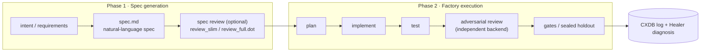
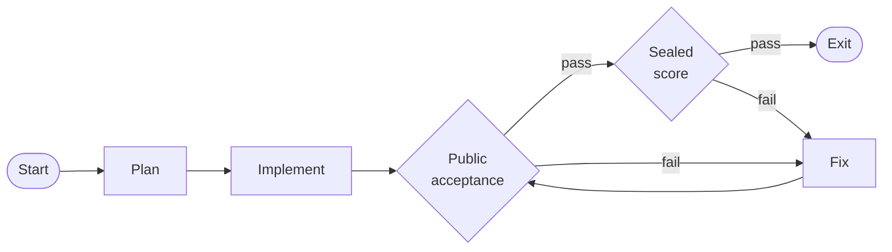
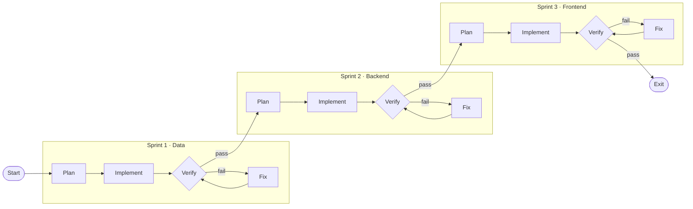
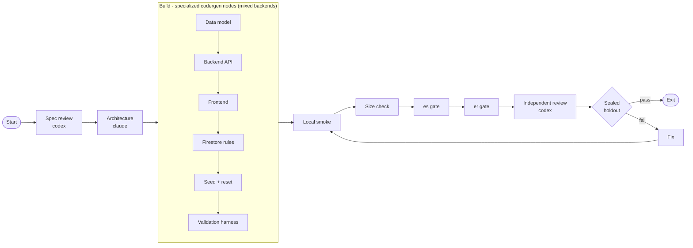
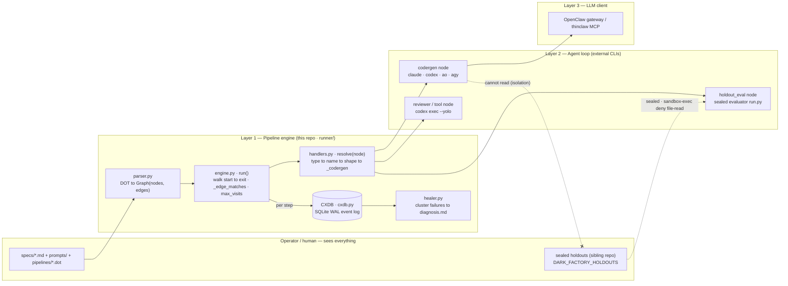
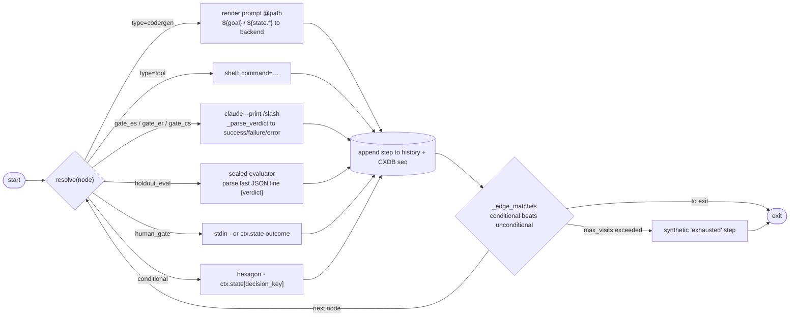

# 🏭 Dark Factory — Attractor-Pattern DOT Pipeline Runner

[](https://www.python.org/)
[](https://opensource.org/licenses/MIT)
[]()

> **📖 A prettier, diagram-rich HTML version of this README is available at
> [`README.html`](README.html).** The diagrams follow the shared color
> semantics documented in
> [`docs/diagram-color-semantics.md`](docs/diagram-color-semantics.md) — every
> color carries meaning (engine teal, agent blue, LLM purple, gate amber,
> holdout red, human slate).

A state-of-the-art Python implementation of the **Attractor pattern**: a robust, DOT-based pipeline engine designed to orchestrate complex multi-agent software engineering workflows using directed graphs. By shifting the unit of durability from ephemeral agent logs to version-controlled process graphs (`.dot`), Dark Factory enables fully autonomous, lights-out development pipelines.

---

## 📋 Executive Summary

**Dark Factory turns a natural-language spec into reviewed, tested code — with no human
reading the diff.** It is an implementation of the [Attractor pattern](#-sources--references)
where the durable artifact is a version-controlled process graph (`.dot`), not an agent
transcript. Work flows through **two phases**:



1. **Spec generation — the scarce artifact.** You author a detailed `spec.md` (under
   `specs/` or `benchmarks/<project>/`) — or let the pipeline's `plan` node generate it
   from your `--goal`. Make it complete enough that a coding agent can build with **no
   hidden product requirements**. Optionally validate it first with the spec-review
   pipeline before spending build tokens.
2. **Factory execution — agents build, agents review.** `dark-factory` walks a `.dot`
   graph sized to the project: `plan → implement → test → adversarial review → gates /
   sealed holdout`, looping through `fix` on failure. Every node visit is recorded to an
   SQLite event log (**CXDB**); the **Healer** clusters failures into an actionable
   diagnosis.

**Why it's different.** Merge confidence comes from *outcome artifacts* — sealed
holdouts, adversarial cross-review, CXDB history — not from a human reading the diff. The
implementing agent is **structurally blind** to the holdouts and evaluator
([isolation rule](#-the-operator-agent-isolation-rule)), so it cannot pass tests by
reading them. You version the `.dot` graph and the specs/holdouts/scoring contracts; the
Python under `runner/` is disposable *dorodango* — polish, discard, rebuild from spec.

### 🎯 The Ultimate Goal: Deprecating the Human Interactive Hat
The ultimate objective of the auto-factory is to automate all coding LLM work. Humans should no longer write, edit, or read code during development, nor should they interact with coding LLMs in interactive chat sessions. 

Instead:
* **Humans only define intent**: Create GitHub issues or beads with clear requirements, or write comments on Pull Requests for feedback.
* **Auto-Factory autonomously executes**: The daemon sweeps the queue, dispatches parallel coder agents, runs the verification ticks, and autonomously drives PRs to green/merged without human intervention.

| | |
|---|---|
| **Two phases** | spec generation → factory execution |
| **Runtime** | Python 3.13 (uv-managed) |
| **Entry point** | `dark-factory` binary (not `python -m runner`) |
| **Backends** | `ao` (default), `claude`, `codex`, `agy`, `mock_llm`/`echo` |
| **Durable artifacts** | `.dot` pipeline graphs + `spec.md` (process + intent) |
| **Observability** | CXDB SQLite event log + `df-healer` failure clustering |

---

## 📑 Table of Contents

1. [Executive Summary](#-executive-summary)
2. [Quick Start](#-quick-start)
3. [Example Projects at a Glance](#-example-projects-at-a-glance)
4. [The Operator-Agent Isolation Rule](#-the-operator-agent-isolation-rule)
5. [Architecture: 3-Layer Convergence](#-architecture-3-layer-convergence)
6. [How Dark Factory works](#-how-dark-factory-works)
7. [State-of-the-Art Execution Backends](#-state-of-the-art-execution-backends)
8. [Pipeline Catalog](#-pipeline-catalog)
9. [Fail-Closed Observability: CXDB + Healer](#-fail-closed-observability-cxdb--healer)
10. [Directory Layout](#-directory-layout)
11. [Recommended default: Agent Orchestrator (AO) with Antigravity](#-recommended-default-agent-orchestrator-ao-with-antigravity)
12. [Execution Cookbook](#-execution-cookbook)
13. [Sources & References](#-sources--references)

---

## ⚡ Quick Start

Dark Factory runs in **two phases — generate the spec, then execute the factory.**

**Prerequisite: [Git LFS](https://git-lfs.com/)** — this repo tracks
`artifacts/repro-developer/**/*.{tar.zst,tar.gz,gpg}` via LFS filters
(`.gitattributes`), whose checkout-time filter requires `git-lfs` on `PATH`;
`.githooks/pre-push` separately hard-gates pushes when `git-lfs` is absent.
Without it, `git clone`/`git worktree add` fails at checkout time. Install
first:
`sudo apt-get install -y git-lfs && git lfs install` (Debian/Ubuntu) or
`brew install git-lfs && git lfs install` (macOS). No sudo? Grab a static
binary from the [releases page](https://github.com/git-lfs/git-lfs/releases)
and put it on `PATH` (e.g. `~/.local/bin/git-lfs`). `install.sh` also
verifies this and fails fast with the same instructions if it's missing.

```bash
# 0. Install once (uv-managed Python 3.13 venv + binaries on PATH)
git clone https://github.com/jleechanorg/dark-factory ~/projects/dark-factory
cd ~/projects/dark-factory && ./install.sh
export DARK_FACTORY_HOME=~/projects/dark-factory
export DARK_FACTORY_HOLDOUTS=~/projects/dark-factory-holdouts
export PATH="$HOME/.local/bin:$PATH"

# Smoke test the install — echo backend, no LLM cost
dark-factory --pipeline pipelines/factory/hello.dot --goal "smoke test" --backend echo
```

**Phase 1 — generate (or author) the spec.** Write a complete natural-language spec the
coding agent can build from with no hidden requirements. Either commit it to
`specs/<feature>.md`, or let the pipeline's `plan` node generate `spec.md` from your
`--goal`. Optionally validate it before spending build tokens:

```bash
dark-factory \
  --pipeline benchmarks/attractor-spec-review/pipelines/review_slim.dot \
  --goal "Review specs/my_feature.md for completeness and ambiguity" \
  --backend ao --ao-agent antigravity
```

**Phase 2 — run the factory.** Pick the `.dot` sized to the project (see
[Example Projects](#-example-projects-at-a-glance)), run from the target repo cwd, and
record outcomes to CXDB:

```bash
cd ~/projects/my-app
dark-factory \
  --pipeline pipelines/slim/minimal_feature.dot \
  --goal "Implement specs/my_feature.md" \
  --backend ao --ao-agent antigravity \
  --feature my_feature \
  --cxdb ~/.dark-factory/cxdb.sqlite

# Cluster any failures into a Healer diagnosis
df-healer --cxdb ~/.dark-factory/cxdb.sqlite
```

> **When `--pipeline` is omitted, `/f` and `/factory` default to `pipelines/slim/two_node.dot`.** Pass `--pipeline <name>` to opt into non-default pipelines. See [Example Projects](#-example-projects-at-a-glance), the [Pipeline Catalog](#-pipeline-catalog), and the full decision table in [docs/pipeline-selection.md](docs/pipeline-selection.md).

---

## 📦 Example Projects at a Glance

**Scale the graph to the project.** A one-file utility needs a linear plan→build→score
lane; a full-stack app needs staged build nodes, multiple gates, an independent reviewer,
and a sealed holdout. All three examples below ship in `benchmarks/` as concrete,
runnable projects — each driven by its own committed spec (`benchmarks/<project>/spec.md`)
and `.dot` graph.

| Scale | Example project | Pipeline(s) | Shape |
|-------|-----------------|-------------|-------|
| **Small** | [`benchmarks/fibonacci`](benchmarks/fibonacci) — a Fibonacci CLI | `pipelines/slim.dot` | Linear: plan → implement → public acceptance → sealed score, one `fix` loop |
| **Medium** | [`benchmarks/airbnb-clone`](benchmarks/airbnb-clone) — 3-sprint app | `airbnb-clone.dot` (+ `sprint-{1,2,3}-*.dot`) | Three sealed-gated sprints (Data → Backend → Frontend), each with a `fix` loop |
| **Large** | [`benchmarks/amazon-clone`](benchmarks/amazon-clone) — full-stack commerce | `dark_factory.dot` (+ `slices_*.dot`) | Spec-review → architecture → 6 build nodes (mixed backends) → smoke/size → `/es`+`/er` → independent review → sealed holdout |

### 🟢 Small — `fibonacci` (single algorithm, single spec)



One spec, one build, two checks (a visible acceptance command plus a redacted sealed
score). Reach for this shape for scripts, single modules, and pure-logic katas.

### 🟡 Medium — `airbnb-clone` (sprinted: Data → Backend → Frontend)



Each sprint is its own plan→implement→verify loop gated by a **sealed holdout
evaluator**; a sprint must pass before the next begins. Reach for this shape for
multi-layer features and apps you want delivered in reviewable increments.

### 🔴 Large — `amazon-clone` (full-stack, multi-gate, sliced)



A built-in `spec_review` node opens the run; specialized build nodes split backend
(`codex`) from frontend (`claude`); evidence gates (`/es`, `/er`), an independent
adversarial reviewer, and a sealed holdout all guard the exit. The same project also
ships **vertical-slice** graphs (`slices_foundation → catalog → cart → checkout`) when
you'd rather ship one feature column end-to-end at a time. Reach for this shape for
production full-stack work.

---

## 🔒 The Operator-Agent Isolation Rule

To guarantee rigorous evaluation integrity, Dark Factory strictly enforces **sandboxed agent execution**:

> [!IMPORTANT]
> **Adversarial Separation Constraint:** The spawned implementing agent (the `codergen` worker running Claude Code, Codex, or an Antigravity session) is completely blind to holdout test suites (`holdouts/`, `runner/evaluator.py`, and `_holdout/` paths).
>
> *   **Operational Enforcement:** The runner CLI dynamically invokes the implementing agent under `sandbox-exec` with strict OS-level permissions denying read access to the local holdouts directory.
> *   **Environment Isolation:** All environment variables pointing to holdout files (`DARK_FACTORY_HOLDOUTS`, etc.) are actively stripped from the agent subprocess env via `_sanitized_env()`.
>
> As the **Operator**, you have full access to view tests, event logs, and holdouts. You must ensure that no holdout-derived hints or test code leaks into the prompt templates consumed by the coder nodes.

---

## 📐 Architecture: 3-Layer Convergence

Dark Factory operates as the top layer of a modern, modular agentic stack:

```
┌─────────────────────────────────────────────────────────────────────────┐
│ Layer 3: Pipeline Engine (Dark Factory)                                 │
│ ➔ Parses .dot graphs, traverses nodes, enforces rules, logs history     │
└────────────────────────────────────┬────────────────────────────────────┘
                                     │
                                     ▼
┌─────────────────────────────────────────────────────────────────────────┐
│ Layer 2: Agent Loop (CLIs & Orchestrators)                              │
│ ➔ Claude Code, Codex, Antigravity (agy), WorldArchitect (ao)            │
└────────────────────────────────────┬────────────────────────────────────┘
                                     │
                                     ▼
┌─────────────────────────────────────────────────────────────────────────┐
│ Layer 1: Unified LLM Client                                             │
│ ➔ Claude Code CLI, Antigravity (agy), Codex CLI                        │
└─────────────────────────────────────────────────────────────────────────┘
```

---

## 🧭 How Dark Factory works

### System architecture (three-layer convergence + isolation + CXDB/Healer)



The durable artifact is the `.dot` graph — version it, review it in PRs, and treat the
Python under `runner/` as disposable *dorodango* (polish, discard, rebuild from spec).
The isolation guarantee is structural: the implementing/`codergen` agent only ever sees
the spec, prompts, and its own worktree — never `holdouts/` or the sealed evaluator,
which are enforced via `sandbox-exec` file-read denial plus a sanitized subprocess env.
Every node visit is written to the **CXDB** SQLite event log, and the **Healer** reads
that log to cluster terminal failures into an actionable `diagnosis.md` — learning
accumulates in the event log, not in the runner code.

### Pipeline execution flow (one step of the walk)



`engine.run()` walks from `start`, calls the handler that `resolve(node)` picks
(`type=` → `start`/`exit` name → DOT shape → default `_codergen`), records the step to
`history` and the CXDB sequence, then chooses the next edge with `_edge_matches` —
conditional edges (`condition="key=value"` / `key!=value`) always win over
unconditional ones. A node's `max_visits` bounds loops: exceeding it emits a synthetic
`exhausted` step and routes to `exit`. Gate verdicts are normalized to
`success`/`failure`/`error` so the Healer can cluster real failures separately from
infra crashes; `holdout_eval` reads the last JSON line of the sealed evaluator's stdout.

---

## 🚀 State-of-the-Art Execution Backends

Dark Factory ships with first-class support for diverse LLM and agent backends, dynamically selected per node via DOT attributes or global flags:

1.  **`agy` (Antigravity CLI Backend) [New & Recommended]**
    *   Invokes the powerful Antigravity execution engine headlessly and non-interactively using:
        ```bash
        agy --add-dir <cwd> --dangerously-skip-permissions --print --print-timeout <s_s>
        ```
    *   Wraps prompts automatically in a headless instruction wrapper, directing Antigravity to decompose the task, spawn parallel internal subagents if useful, apply direct workspace changes, and exit cleanly without waiting for interactive input.
2.  **`claude` (Claude Code CLI)**
    *   Directly invokes `claude` with standard prompt text to run autonomous editing and execution tasks.
    *   Also the automatic fallback reviewer when an `agy` review gate hits an infra failure (missing binary, sandbox unavailable, timeout, or unparseable output).
3.  **`codex` (Codex CLI)**
    *   Uses `codex exec` to drive immediate terminal or workspace updates.
4.  **`ao` (WorldArchitect Agent)**
    *   Spawns an autonomous workspace worker mapped to an active WorldArchitect project (`--ao-project`).
5.  **`mock_llm` / `echo`**
    *   Deterministic test backends used for validation, smoke testing, and continuous integration pipelines.

---

## 📊 Pipeline Catalog

Our pipelines are designed to support a wide range of complexity, from simple test lanes to full-scale multi-stage development pipelines:

### 1. The Gates Pipeline (`pipelines/factory/gates.dot`)
An end-to-end multi-agent pipeline:
*   **Specify:** Parses natural language specs and generates target code designs.
*   **Implement:** Translates designs into physical code modifications.
*   **Gate Verification:** Executes deterministic compiler checks and runs static reviews.
*   **Holdout Evaluation:** Runs sealed verification suites to evaluate performance.

### 2. Minimal Feature & Style Sheets (`pipelines/slim/minimal_feature.dot`)
*   Demonstrates Dark Factory's support for **CSS-like model stylesheets** (`.model.css`).
*   Rather than cluttering every node with explicit models or API parameters, the runner applies custom routing rules dynamically at runtime based on selectors (e.g., matching node names, shapes, or types to specific model profiles).

### 3. Spec Review Benchmark (`benchmarks/attractor-spec-review/`)
Designed to evaluate and refine natural-language specs:
*   `review_slim.dot`: Rapid, single-pass specification audit and smoke check.
*   `review_full.dot`: In-depth spec review featuring multi-stage auditing, full-stack smoke environments, and independent reviewer audits via `codex exec --yolo`.

---

## 🩺 Fail-Closed Observability: CXDB + Healer

To build a true "Dark Factory," errors must be logged, clustered, and resolved programmatically:

```
 ┌────────────────┐       Nodes Execute       ┌────────────────┐
 │  Graph Runner  ├──────────────────────────►│   CXDB Log     │
 └────────────────┘                           └───────┬────────┘
         ▲                                            │
         │ Reads Prescription &                       │ Reads SQLite
         │ Heals Prompt/Config                        ▼ WAL Steps
 ┌───────┴────────┐                           ┌────────────────┐
 │     Human      │◄──────────────────────────┤   Healer Engine│
 └────────────────┘     Emits MD Report       └────────────────┘
```

*   **CXDB SQLite Event Log (`runner/cxdb.py`):**
    *   Every step, node transition, stdout snippet, stderr traceback, metadata chunk, and execution cost metric is recorded in a centralized SQLite database.
    *   Runs in high-concurrency **Write-Ahead Logging (WAL) mode** with a robust `5000ms` busy timeout to guarantee concurrent multi-pipeline instances write safely without database locking errors.
*   **The Healer Engine (`runner/healer.py`):**
    *   Reads the CXDB log and dynamically clusters terminal failures (e.g., `failure`, `exhausted`, `stuck`, `error`) by `(node, outcome, output_hash)`.
    *   Invokes an LLM review backend (`claude` or `echo`) to analyze the precise error context and output.
    *   Generates a structured, highly actionable Markdown report containing a tailored **prescription** (e.g., which prompt to refine, which code logic failed, or which harness configuration is broken) for every cluster.

---

## 📁 Directory Layout

```
dark-factory/
├── pipelines/                      # Durable .dot pipeline graph definitions
│   ├── factory/                    # Production factory runs (gates.dot, hello.dot)
│   └── slim/                       # Minimal templates & styling stylesheets (.model.css)
├── benchmarks/                     # Public NLSpecs, starter assets, and benchmarks
│   ├── amazon-clone/               # Full-stack E-Commerce benchmark setup
│   ├── airbnb-clone/               # Firebase emulator-backed benchmark
│   └── attractor-spec-review/      # Spec review pipelines (review_slim/full.dot)
├── specs/                          # System feature specs (visible to implementing agents)
├── prompts/                        # System-wide prompt templates referenced by DOT nodes
├── runner/                         # The Python DOT Pipeline Engine
│   ├── __init__.py
│   ├── __main__.py                 # Command line interface & parser arguments
│   ├── parser.py                   # PyDot loader & validator (verifies start/exit)
│   ├── engine.py                   # Graph traversal, state tracking, & loop limits
│   ├── handlers.py                 # Core handlers & backends (agy, claude, codex, ao)
│   ├── cxdb.py                     # SQLite WAL step recording and logging schemas
│   └── healer.py                   # Failure clustering & automatic prescription engine
├── tests/                          # Rigorous unit and integration test suite
├── CLAUDE.md                       # Agent instructions (auto-loaded by Claude Code)
├── AGENTS.md                       # Identical instructions for all other AI agents
└── README.md                       # This premium documentation
```

---

## ⭐ Recommended default: Agent Orchestrator (AO) with Antigravity

For day-to-day work, the factory runs with the `--backend ao` default (configured to use the `--ao-agent antigravity` plugin to route headlessly through the Antigravity CLI, but swappable to other agents like `--ao-agent claude-code`). When `--pipeline` is omitted, `/f` and `/factory` default to `pipelines/slim/two_node.dot` (generic worker + controller cold reviewer); pass explicit `--pipeline <name>` to opt into non-default pipelines. The full decision table is [docs/pipeline-selection.md](docs/pipeline-selection.md); the common picks:

| Task | Pipeline |
|------|----------|
| Smoke / wiring (no LLM cost) | `pipelines/factory/hello.dot` |
| New feature (full loop) | `pipelines/slim/minimal_feature.dot` |
| In-flight PR iteration | `pipelines/slim/minimal_pr.dot` |
| Diff + sealed holdout validation | `pipelines/factory/gates.dot` |

**Operating discipline:**

*   **Always record outcomes.** Pass `--cxdb ~/.dark-factory/cxdb.sqlite` and
    `--feature <name>` on every real run, then run `df-healer --cxdb ~/.dark-factory/cxdb.sqlite`
    afterward to cluster failures into a diagnosis. Merge confidence comes from
    outcome artifacts (holdouts, gates, CXDB history), not from reading the diff.
*   **Keep adversarial cross-review independent.** Every non-trivial pipeline should
    contain at least one reviewer node that is *separate* from the coder agent —
    e.g. an independent reviewer `tool` node invoking `codex exec --yolo`. Because that
    reviewer never saw the implementation prompt, its verdict is genuinely adversarial.
    The slim pipelines (`minimal_feature.dot`, `minimal_pr.dot`) now ship this **by
    default**: their `review` node pins `backend="codex"`, so the reviewer runs on a
    different backend than the coder out of the box (precedence: explicit node attr >
    `model_stylesheet` > `--backend`, so this is independent and non-overridable by the
    coder's `--backend`). Requires `codex` installed; override path is in
    [docs/pipeline-selection.md](docs/pipeline-selection.md#independent-reviewer-adversarial-by-default).
*   **Adversarial-review priority queue:** `codex > minimax > agy` (set
    `DARK_FACTORY_ADVERSARIAL_PRIORITY` env var to override). The queue is the **first**
    adversarial pass — chosen at run-config time, *not* a retry cascade. A real
    `fail|partial` from the chosen reviewer is authoritative and is never retried on a
    different model (no-reviewer-shopping rule). Use `backend_priority=...` and
    `prefer_adversarial: true` on `gate_er` / `gate_es` nodes; the resolver audit lands
    in the gate's `Result.metadata` (priority list, resolved name, skipped entries).
*   **Route models by role, not by hand.** Use a heavier model for plan/review and a
    faster one for implement. Set this per-node (`backend="…"` / `model="…"`) or, better,
    once per graph via `model_stylesheet="….model.css"` — never by editing every node.
*   **Author dynamically, run statically.** The engine executes static `.dot` graphs
    only; any "dynamic / NL-generated workflow" advantage lives at *authoring* time, not
    runtime (benchmarks show execution dispatch is a wash, ~5–9% slower for the dynamic
    harness). The one structural exception is runtime-determined fan-out. Full decision
    guide: [docs/dynamic-vs-deterministic-workflow.md](docs/dynamic-vs-deterministic-workflow.md).

Concrete copy-paste (gated run with sealed holdout, from the target repo cwd):

```bash
cd ~/projects/my-app
dark-factory \
  --pipeline pipelines/factory/gates.dot \
  --goal "<feature description>" \
  --backend ao --ao-agent antigravity \
  --feature <feature_name> \
  --cxdb ~/.dark-factory/cxdb.sqlite

# After the run, cluster any failures into a Healer diagnosis:
df-healer --cxdb ~/.dark-factory/cxdb.sqlite
```

---

## 🍳 Execution Cookbook

### ⚙️ One-time install (binary, not source)

Dark Factory runs via the **`dark-factory` binary** — not `python -m runner`
from a raw checkout. Install once with [uv](https://docs.astral.sh/uv/):

```bash
git clone https://github.com/jleechanorg/dark-factory ~/projects/dark-factory
cd ~/projects/dark-factory
./install.sh

export DARK_FACTORY_HOME=~/projects/dark-factory
export DARK_FACTORY_HOLDOUTS=~/projects/dark-factory-holdouts
export PATH="$HOME/.local/bin:$PATH"
```

This installs a uv-managed Python 3.13 venv, PyPI deps (`pydot`, `PyYAML`), and
symlinks `dark-factory` + `df-healer` into `~/.local/bin`.

Run pipelines from the **target repo** (implementation workdir = cwd). Graphs and
prompts load from `$DARK_FACTORY_HOME`. See [docs/pipeline-selection.md](docs/pipeline-selection.md)
— **pick the `.dot` for the task**, do not always use the same default.

### 💨 1. Smoke pipeline (no LLM cost)

```bash
cd ~/projects/dark-factory   # or any repo; hello resolves via DARK_FACTORY_HOME
dark-factory --pipeline pipelines/factory/hello.dot --goal "smoke test" --backend echo
```

### 🆕 2. New feature (full loop)

```bash
cd ~/projects/my-app
dark-factory \
  --pipeline pipelines/slim/minimal_feature.dot \
  --goal "Add user-facing feature X" \
  --backend ao --ao-agent antigravity \
  --feature my_feature \
  --cxdb ~/.dark-factory/cxdb.sqlite
```

### 🔁 3. In-flight PR iteration (research + holdout)

```bash
cd ~/projects/my-app
dark-factory \
  --pipeline pipelines/slim/minimal_pr.dot \
  --goal "Fix failing tests on PR branch" \
  --backend ao --ao-agent antigravity \
  --feature my_feature \
  --state 'slim.test_command=pytest tests/test_foo.py -v' \
  --cxdb ~/.dark-factory/cxdb.sqlite
```

### 🛡️ 4. Gates-only validation (diff already implemented)

```bash
cd ~/projects/my-app
dark-factory \
  --pipeline pipelines/factory/gates.dot \
  --goal "Validate JWT middleware diff" \
  --backend ao --ao-agent antigravity \
  --feature auth_middleware \
  --cxdb ~/.dark-factory/cxdb.sqlite
```

### 🩺 5. Healer failure audit

```bash
df-healer --cxdb ~/.dark-factory/cxdb.sqlite
```

### 🧪 Tests (dev)

```bash
cd ~/projects/dark-factory
.venv/bin/python -m pytest tests/
```

---

## 📚 Sources & References

Dark Factory stands on the shoulders of groundbreaking work in agentic software engineering and Level 5 automation. Our design, paradigms, and benchmark splits are inspired by the following research, reference implementations, and articles:

### 🔬 Core Specifications & Benchmarks
*   StrongDM, **AttractorBench** — [GitHub Repository](https://github.com/strongdm/attractorbench)
    *   *Defines the benchmark paradigm:* Agents ingest a public natural-language specification, while the deterministic evaluation and test suites are held out locally to prevent LLM training-data contamination.
*   jleechanorg, **AttractorBench Fork** — [GitHub Repository](https://github.com/jleechanorg/attractorbench)
    *   *Our public experimental baseline:* Sandbox for validating spec-review workflows and cross-repository agent validation mechanics.

### 📝 Paradigms & Articles
*   Dan Shapiro, **"You don't write the code"** — [Blog Post](https://www.danshapiro.com/blog/2026/02/you-dont-write-the-code/)
    *   *The philosophy of Level 5 Automation:* In the ultimate "Dark Factory," humans never read or write code. Instead, they specify intent and design outcomes. Quality is enforced via observability, automated healers, and adversarial reviews.
*   Simon Willison, **"The Software Factory"** — [Blog Post](https://simonwillison.net/2026/Feb/7/software-factory/)
    *   *The Industrialization of AI Coding:* Shifting the industry mindset from bespoke chat boxes to repeatable, high-volume automated pipeline execution.
*   2389 Research, **"The Dark Factory is a .dot file"** — [Blog Post](https://2389.ai/posts/the-dark-factory-is-a-dot-file/)
    *   *The Durable Artifact Principle:* While the pipeline runner code itself is disposable (*dorodango* — polished, discarded, and rebuilt), the pipeline `.dot` file remains the precious, versioned representation of the software engineering process.

### 🛠️ Reference Implementations
*   StrongDM, **Attractor** — [GitHub Repository](https://github.com/strongdm/attractor)
    *   The original reference harness establishing the foundational Attractor paradigms.
*   Dan Shapiro, **Kilroy** — [GitHub Repository](https://github.com/danshapiro/kilroy)
    *   A pioneering implementation of the Attractor loop.
*   2389 Research, **Smasher** — [GitHub Repository](https://github.com/2389-research/smasher)
    *   An adversarial reviewer and compiler-checked coding harness.
*   2389 Research, **Mammoth** — [GitHub Repository](https://github.com/2389-research/mammoth)
    *   An LLM orchestration and workspace synchronization harness.
*   2389 Research, **Tracker** — [GitHub Repository](https://github.com/2389-research/tracker)
    *   A high-performance pipeline and task state tracker.
*   2389 Research, **dippin-lang** — [GitHub Repository](https://github.com/2389-research/dippin-lang)
    *   A domain-specific language designed for expressing declarative dataflow pipelines.

### 🎯 Advanced Techniques & Methodologies
*   StrongDM, **Techniques** — [Techniques Directory](https://factory.strongdm.ai/techniques)
    *   A curated catalog of tactical strategies for robust agentic execution.
*   StrongDM Techniques, **Direct-to-Unit (DTU)** — [DTU Documentation](https://factory.strongdm.ai/techniques/dtu)
    *   *The DTU Pattern:* Bypassing middle layers to directly generate targeted unit tests and implementation assertions, ensuring immediate execution feedback.

---

*“The pipeline definitions encode the development process itself. Rebuild the code, polish the dorodango, but keep the graph.”*
