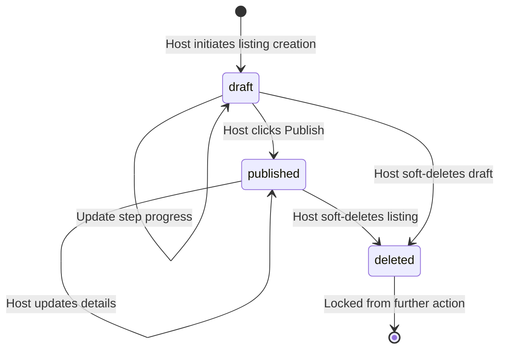
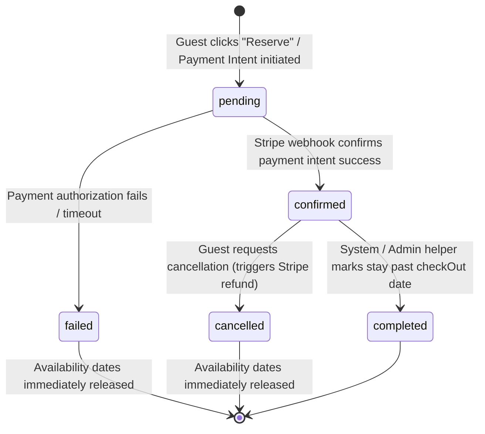

# Attractor Specification — Airbnb Clone MVP (NLSpec)

**Version:** 3.0
**Status:** Canonical Release (2026-05-27)
**Type:** Natural Language Specification (NLSpec) for coding agents
**System Target:** Full-stack short-term-rental marketplace with zero-trust role security and transactional date integrity.

---

## 1. System Overview & Goals

The **Airbnb Clone MVP** is a short-term-rental marketplace where hosts list properties and guests search, book, review, and favorite listings. All interactions must proceed without manual human intervention. 

To enable rigorous, language-agnostic benchmarking in the software factory, this specification establishes **absolute technology decoupling**:
* **Tech-Agnostic Interface Constraints:** No assumptions are made about specific database implementations (e.g. Firestore vs Postgres), server frameworks (e.g. Next.js vs SvelteKit), or file storage engines. The system must be implementable in any modern stack.
* **Contract-First Mutators:** Every state change or business transaction must proceed through strict data schemas and action contracts.
* **Deny-by-Default Security Core:** Every collection, database object, and API endpoint must reject access by default. Operations must verify valid sessions, owner attributes, and resource parameters explicitly.

---

## 2. Scope Boundaries: What We Build vs. What We Skip

### What We Build (In-Scope)
* **Authentication & Profiles:** Robust session-based registration, email/password login, simulated multi-provider OAuth, session verification guards, and Guest/Host profile configurations.
* **Listing Management:** A complete 5-step property wizard allowing hosts to create, preview, publish, modify, and soft-delete properties with high-res photos and optimized thumbnail image variants.
* **Search & Discovery:** A multi-segment search interface (where, when, who) leading to a dual-pane search results page with a listings grid synced in real-time to an interactive map with clustered price bubbles and filters.
* **Booking Lifecycle:** Atomic double-booking protection, test payment simulation, webhook confirmation flows, and guest-initiated cancellations with automated refunds.
* **Review Aggregation:** A post-stay review pipeline validating completed stays, supporting text/star reviews, host replies, and live average rating updates.
* **Favorites & Wishlists:** Heart-icon favoriting, custom named wishlist collections, and dashboard list management.
* **Unified Dashboard:** Guest (My Bookings) and Host (My Listings, Received Reservations) dashboards.
* **Platform Trust & Security:** Deny-by-default role authorization, absolute data isolation between users, and API rate-limiting stubs.

### What We Skip (Out-of-Scope / Stretch)
* **Live Third-Party Integrations:** No live production credit card charges (all payments run via simulated sandbox gateways), no real Mapbox/Google bills (all maps use mock/simulated maps), and no live SMTP servers (all emails are logged to stubs).
* **Real-time Active Cursors/Chat:** No active peer-to-peer real-time cursor tracking or custom socket chat integrations (standard review response system is used instead).
* **Multi-Currency & i18n:** Multi-currency conversions and localized translation libraries are excluded from the initial core scope.
* **Real Financial Transfers:** No real host payout integrations (e.g. Stripe Connect) or banking setups.

---

## 3. Epics & 56 User Stories

### Epic 1: User Identity, Profiles, and Authentication

#### US 1: User Registration
* **User Story:** As an anonymous visitor, I want to create an account using my email and password, so that I can access personalized booking and listing features.
* **User Acceptance Criteria (UAC):**
  * Registration requires a valid email address and a password meeting minimum security strength (minimum 8 characters).
  * System rejects duplicate registrations for the same email address.
  * Successful registration creates a clean profile state with an assigned unique User ID (UID) and triggers an immediate login.

#### US 2: User Login
* **User Story:** As a registered user, I want to sign in with my email and password, so that I can access my account history, wishlists, and host/guest consoles.
* **UAC:**
  * Login succeeds only upon entering matching credentials.
  * System displays clear, generic error messages for invalid attempts (without revealing whether the email or password was incorrect).
  * Successful login establishes a secure session.

#### US 3: Third-Party Authentication Simulation
* **User Story:** As a user, I want to sign in using a simulated OAuth provider (e.g. Google or GitHub), so that I can authenticate quickly without creating a new password.
* **UAC:**
  * System displays buttons for Google and GitHub authentication.
  * In development/emulator mode, clicking these buttons redirects to a mock OAuth login flow that succeeds deterministically and generates a valid user session.

#### US 4: Session Security & Authentication Guards
* **User Story:** As a user, I want my private data and actions protected by session guards, so that unauthorized users cannot mutate my listings or view my bookings.
* **UAC:**
  * All mutations (creating listings, booking dates, favoriting, writing reviews) must reject immediately if a valid session is not present.
  * Non-authenticated requests attempting protected routes are gracefully redirected to the authentication flow.

#### US 5: Session Termination (Logout)
* **User Story:** As an authenticated user, I want to log out of my current session, so that my account remains secure when I am away from my device.
* **UAC:**
  * Clicking "Log out" immediately destroys the active session.
  * Subsequent attempts to read or write protected data must reject until a new session is established.

#### US 6: Profile Creation & Display
* **User Story:** As a registered user, I want a customizable profile displaying my name, avatar photo, self-description, and joined date, so that hosts and guests can learn more about me.
* **UAC:**
  * Every user profile must support displaying a preferred name, self-description text, joined timestamp, and avatar image.
  * Profile details (excluding private billing information) are publicly readable by other users.
  * Users can only edit their own profile fields.

#### US 7: Host Registration Mode
* **User Story:** As a registered user, I want to toggle a hosting flag on my profile, so that I can unlock listing management and hosting features.
* **UAC:**
  * Every profile starts as a standard guest account by default.
  * Toggling "Become a Host" updates the profile with a host marker, which grants permission to access listing creation tools and dashboard sections.

---

### Epic 2: Host Console & Listing Management

#### US 8: Listing Wizard Step 1: Property Type
* **User Story:** As a host, I want to select a category type for my property (e.g. Apartment, House, Cabin), so that guests can find my property under matching filters.
* **UAC:**
  * The listing wizard begins with a category selection screen.
  * The host must choose exactly one category slug from a pre-defined set of valid amenities/types before they can advance.

#### US 9: Listing Wizard Step 2: Location Definition
* **User Story:** As a host, I want to specify the location of my property (country, city, and exact lat/lng), so that guests can discover my listing during regional searches.
* **UAC:**
  * Host must enter a country and city.
  * The system validates location inputs and maps them to a set of coordinates (latitude and longitude) to represent the listing position on interactive maps.

#### US 10: Listing Wizard Step 3: Details & Capacities
* **User Story:** As a host, I want to define the physical capacities of my property (maximum guest occupancy, beds, bedrooms, and bathrooms), so that guests can understand the size of the space.
* **UAC:**
  * Host defines maximum guests (integer >= 1), bed count (integer >= 1), bedroom count (integer >= 1), and bathroom count (integer >= 0.5).
  * System rejects values below the minimum bounds.

#### US 11: Listing Wizard Step 4: Amenity Selection
* **User Story:** As a host, I want to toggle individual amenities my property offers (e.g. WiFi, Air Conditioning, Pool, Kitchen), so that guests can search by specific requirements.
* **UAC:**
  * System presents a list of pre-defined amenity slugs grouped by categories.
  * The host can select zero or more amenities.
  * The selections must be persisted as a clean array on the listing record.

#### US 12: Listing Wizard Step 5: High-Res Photo Upload
* **User Story:** As a host, I want to upload multiple high-resolution photos of my property, so that guests can visually explore the space.
* **UAC:**
  * Host can upload multiple images.
  * The system must accept the uploads, place them in a secure storage bucket, and automatically trigger an image pipeline to produce small (sm), medium (md), and large (lg) optimized variants for responsive layouts.

#### US 13: Listing Wizard Step 6: Pricing & Verification
* **User Story:** As a host, I want to set a nightly rental price in USD cents, so that I can charge guests accurately for their stays.
* **UAC:**
  * Nightly price must be configured as a positive integer (representing USD cents, e.g., $150.00 is represented as 15000).
  * Values <= 0 are rejected as invalid.

#### US 14: Wizard Step State Persistence
* **User Story:** As a host, I want my progress in the 5-step listing form saved as a draft, so that I don't lose my entries if I close the browser or navigate away.
* **UAC:**
  * Advancing or returning between steps preserves all form state.
  * Draft state must be saved either in local storage or as a draft status record on the backend so the host can resume later.

#### US 15: Primary/Thumbnail Image Selection
* **User Story:** As a host, I want to choose which of my uploaded listing images serves as the primary cover photo, so that it appears in all search results.
* **UAC:**
  * The system designates the first uploaded image as primary by default.
  * The host can explicitly choose a different image position to serve as the cover thumbnail.
  * Listing cards in grids must always render this primary image.

#### US 16: Draft vs. Published States & Soft Delete
* **User Story:** As a host, I want to keep my listing as a draft until I am ready to publish it, or soft-delete it later, so that I control when guests can see it.
* **UAC:**
  * Initial wizard creation writes the listing with a status of `"draft"`.
  * Publishing transitions the status to `"published"`, making it readable in public searches.
  * Deleting a listing transitions the status to `"deleted"`, making it immediately unreadable to all public operations (while preserving database records for active historical booking audits).

---

### Epic 3: Discovery, Search, and Filters

#### US 17: Searchbar Location Query
* **User Story:** As a guest, I want to search for properties by typing a destination location, so that I can see listings in that region.
* **UAC:**
  * The location search accepts text.
  * The system tokenizes the query and evaluates city and country attributes to return matching prefix results.
  * Leaving the field empty defaults to a global search.

#### US 18: Date Range Selection
* **User Story:** As a guest, I want to choose my check-in and check-out dates, so that the search results only show listings that are available for that entire range.
* **UAC:**
  * System provides a date range selection interface.
  * System enforces that check-out date must be after the check-in date.
  * Listings are excluded from results if any date in the guest's range overlaps an existing confirmed blocked date.

#### US 19: Occupancy Limits & Guest Selectors
* **User Story:** As a guest, I want to select the exact number of occupants (adults, children, infants, pets), so that I only see properties that can accommodate my group.
* **UAC:**
  * Guest count is determined by `adults + children`.
  * Search filters exclude any listing where `maxGuests` is less than the requested guest count.
  * Pet selections filter out listings that do not allow pets.

#### US 20: Collapsible & Expandable Navigation Search
* **User Story:** As a guest, I want the search parameters to reside in a collapsed bar that expands smoothly when clicked, so that the interface remains clean while I browse.
* **UAC:**
  * Navigation bar displays a collapsed, summary search bar.
  * Clicking the bar expands it with a smooth transition, revealing Location, Check-in, Check-out, and Guest segments.
  * Selecting fields opens controlled popovers that manage their inputs without collapsing the parent search container.

#### US 21: Dual-Pane Search Results Page
* **User Story:** As a guest, I want to view my search results in a split-screen format showing a listing grid on one side and an interactive map on the other, so that I can explore listings both visually and geographically.
* **UAC:**
  * Viewports >= 768px display a two-pane layout: results grid (left/center) and interactive map (right).
  * Grid displays essential details (primary cover, title, price, aggregate star rating).
  * Map displays geographical markers indicating listing positions.

#### US 22: Bubble Price Markers
* **User Story:** As a guest, I want the map markers to display the nightly price directly inside a bubble, so that I can instantly evaluate pricing from the map view.
* **UAC:**
  * Geographical markers on the map must render as stylized bubbles displaying the nightly price formatted in USD.
  * Bubble background style changes dynamically when the listing is hovered or selected.

#### US 23: Marker Clustering
* **User Story:** As a guest, I want map markers close to each other to cluster at low zoom levels, so that the map view remains legible.
* **UAC:**
  * Map markers in close proximity group into a single cluster marker displaying the count of listings in that cluster.
  * Clicking a cluster zooms the map in to expand the individual listing markers.

#### US 24: Bidirectional List-to-Map Hover Syncing
* **User Story:** As a guest, I want hovering over a listing card to highlight its bubble marker on the map (and vice-versa), so that I know exactly where each property is located.
* **UAC:**
  * Hovering a listing card in the results grid changes the active style of the matching map price bubble.
  * Selecting a price bubble on the map scrolls the matching card into view in the results grid and highlights it.

#### US 25: Multi-Dimensional Filter Sheet
* **User Story:** As a guest, I want to refine my search results using a detailed filter panel (price range slider, property types, and specific amenities), so that I see only properties matching my preferences.
* **UAC:**
  * Filter panel supports filtering by nightly price range (min/max), property type categories, and amenity checklists.
  * Applying filters updates search results dynamically without resetting the page state or active destination queries.

#### US 26: Search Sorting
* **User Story:** As a guest, I want to sort search results by price (low to high, high to low) and rating, so that I can easily discover the best value properties.
* **UAC:**
  * Search results support sorting predicates: `priceAsc`, `priceDesc`, and `ratingDesc`.
  * Sorting updates the card ordering immediately.

---

### Epic 4: Listing Detail Experience

#### US 27: Carousel Image Navigation
* **User Story:** As a guest, I want to scroll through all uploaded high-resolution listing photos on the detail page using a carousel with thumbnail navigation, so that I can fully inspect the property.
* **UAC:**
  * Listing detail page renders a responsive image gallery.
  * Supports touch swipes and arrow clicks to cycle images.
  * Displays a thumbnail strip beneath the main image for direct click selection.

#### US 28: Structural Amenity Lists
* **User Story:** As a guest, I want to see the listing's amenities grouped by category with descriptive icons, so that I can easily verify included features.
* **UAC:**
  * Detail page renders a categorized grid of all selected listing amenities.
  * Each amenity is accompanied by a unique descriptive icon representing its slug.

#### US 29: Host Profile Summary Card
* **User Story:** As a guest, I want to see a summary card of the host (avatar, name, joined date, and response rating), so that I can evaluate their hosting credibility.
* **UAC:**
  * Detail page renders a summary card using denormalized host details.
  * Displays the host's avatar, name, and aggregate rating.
  * Provides a button to view the host's full profile page.

#### US 30: Location Map Placement
* **User Story:** As a guest, I want to see a static or interactive map highlighting the property's location on the detail page, so that I can understand its surrounding geography.
* **UAC:**
  * Detail page displays a map container centered on the listing's exact lat/lng coordinates.
  * Marker indicates the approximate or exact location of the property.

#### US 31: Dynamic Pricing Widget
* **User Story:** As a guest on a listing detail page, I want to see a dynamic price breakdown (nightly cost x nights, platform fees, cleaning fees, taxes, and total price) updating in real-time as I select dates, so that I know the exact cost before booking.
* **UAC:**
  * Detail page features a sticky booking widget.
  * Widget dynamically calculates: `subtotal = nights * nightlyPrice`, `fees = subtotal * feeRate`, and `total = subtotal + fees`.
  * Price values must update instantly upon selecting valid check-in and check-out dates.

#### US 32: Calendar Block Visualizer
* **User Story:** As a guest, I want to see a visual calendar in the booking widget showing which dates are already booked or blocked, so that I can easily select available dates.
* **UAC:**
  * Widget displays a monthly calendar.
  * Dates that overlap existing confirmed bookings or host blocks must display as visually disabled and prevent selection.

#### US 33: Paginated Review List
* **User Story:** As a guest, I want to see a list of reviews left by past guests with individual ratings and text, so that I can read about their firsthand experiences.
* **UAC:**
  * Listing detail page displays a dedicated reviews section.
  * Renders a rating distribution breakdown (counts of 5, 4, 3, 2, 1-star reviews).
  * Lists text reviews in reverse-chronological order.
  * If there are more than 10 reviews, it must display pagination controls.

---

### Epic 5: Booking Lifecycle & Payments

#### US 34: Atomic Availability Validation
* **User Story:** As a guest, I want to be blocked from booking dates that have already been confirmed by another guest, so that double-booking is impossible.
* **UAC:**
  * Creating a booking executes an atomic availability check.
  * If any single date in the check-in/check-out range is marked as blocked or booked, the transaction must fail immediately and return an availability conflict error.

#### US 35: Instant Booking Trigger
* **User Story:** As a guest, I want to click a "Reserve" button to immediately trigger the booking creation and checkout flow, so that I can secure my dates.
* **UAC:**
  * Clicking "Reserve" validates that dates are selected, guest count is within limits, and dates are open.
  * Generates a pending booking record in `"pending"` status and triggers the payment intent.

#### US 36: Payment Gateway Simulation
* **User Story:** As a guest, I want to enter my credit card details into a simulated payment form, so that I can pay for my reservation.
* **UAC:**
  * System initializes a simulated Stripe checkout flow using test keys.
  * Guest submits test credit card credentials.
  * System captures the payment intent and tracks the transaction ID.

#### US 37: Webhook Payment Success Flow
* **User Story:** As a host or guest, I want the pending booking to transition to confirmed automatically once payment is verified, so that our calendars are locked.
* **UAC:**
  * Simulated webhook receives a `payment_intent.succeeded` event.
  * Webhook transitions the booking record status from `"pending"` to `"confirmed"`.
  * Date availability maps are updated to block out those dates globally.

#### US 38: Automatic Calendar Block Release
* **User Story:** As a host, I want dates to become available again if a guest cancels their confirmed booking or if their payment fails, so that other guests can book them.
* **UAC:**
  * Transitioning a booking to `"cancelled"` or `"expired"` automatically removes the date blocks on the availability map.
  * The released dates immediately become searchable and bookable again.

#### US 39: Guest Cancellation Flow
* **User Story:** As a guest, I want to cancel my confirmed booking from my dashboard, so that I can release the dates if my plans change.
* **UAC:**
  * Guest selects a confirmed booking on their dashboard and clicks "Cancel Booking".
  * Booking record status transitions to `"cancelled"`.
  * System releases the calendar blocks associated with the booking.

#### US 40: Automated Refund Logic
* **User Story:** As a guest, I want my payment refunded automatically when I cancel a booking, so that I receive my money back.
* **UAC:**
  * Cancellation triggers a simulated Stripe refund API call.
  * Refund transitions the transaction status to `"refunded"`.
  * The refund transaction reference is recorded on the booking record.

---

### Epic 6: Reviews, Ratings, and Aggregate Calculations

#### US 41: Post-Stay Review Restriction
* **User Story:** As a guest, I want to only be allowed to review properties where I have had a completed stay, so that reviews remain authentic and trustworthy.
* **UAC:**
  * System checks for a confirmed booking with a check-out date in the past where `guestId == currentUser.uid` and status is `"completed"`.
  * If no such booking exists, review submission is rejected.

#### US 42: Star Rating & Text Reviews
* **User Story:** As a guest, I want to submit a 1-to-5 star rating and detailed text for my stay, so that I can share my feedback.
* **UAC:**
  * Review form requires a star rating (integer 1-5) and a non-empty text description.
  * Submitting the review saves the record with a timestamp and links it to `listingId` and `authorId`.

#### US 43: Aggregate Update Pipeline
* **User Story:** As a user browsing listings, I want to see the listing's average star rating and review count update immediately after a new review is posted, so that I see accurate ratings.
* **UAC:**
  * Adding, updating, or deleting a review triggers an aggregate pipeline calculation.
  * Re-calculates `totalStars / reviewCount` and writes the updated `rating` and `reviewCount` to the listing record.

#### US 44: Host Review Reply
* **User Story:** As a host, I want to write a public response to a review left on my listing, so that I can thank the guest or clarify details.
* **UAC:**
  * Host can click "Respond" on reviews left on listings they own.
  * Response text is saved in a nested field on the review record and displays immediately under the guest's review on the listing detail page.

#### US 45: Review Pagination
* **User Story:** As a guest, I want to view reviews in pages of 10, so that the listing details page load remains fast even for highly-reviewed properties.
* **UAC:**
  * The reviews list renders 10 items at a time.
  * Clicking "Next" loads the next 10 reviews in place without resetting or reloading the entire page.

---

### Epic 7: User Favorites & Wishlists

#### US 46: Toggle Favorite Listing
* **User Story:** As a guest, I want to click a heart icon on any listing card or detail page to save it as a favorite, so that I can find it easily later.
* **UAC:**
  * Listings render a heart icon button for logged-in users.
  * Clicking the heart toggles its state.
  * Toggling saves a favorite marker document linking the user's ID to the listing ID.

#### US 47: Named Wishlists
* **User Story:** As a guest, I want to save a favorited listing to a specific named wishlist collection (e.g. "Paris Summer 2026"), so that I can organize my travel ideas.
* **UAC:**
  * Toggling a favorite prompts the user to select an existing wishlist or create a new named wishlist.
  * Listing is added to the selected wishlist collection.

#### US 48: Wishlist Management
* **User Story:** As a guest, I want to view, rename, and delete my wishlists on my dashboard, so that I can manage my saved properties.
* **UAC:**
  * Dashboard provides a dedicated "Wishlists" tab.
  * Displays named wishlists with card layouts of included listings.
  * User can rename wishlists or delete them (releasing favorited listing associations).

#### US 49: Shared Wishlists
* **User Story:** As a guest, I want to share a link to one of my wishlists with a travel partner, so that they can see the properties I've selected.
* **UAC:**
  * Each wishlist has a unique shareable link.
  * Anyone visiting the link can view the wishlist's listings (read-only view) without having permission to edit the collection.

---

### Epic 8: Unified User Dashboard

#### US 50: Unified Dashboard Portal
* **User Story:** As a logged-in user, I want a single dashboard interface to manage my profile, listings, and reservations, so that I don't have to navigate different pages.
* **UAC:**
  * Portal `/dashboard` is accessible to authenticated users.
  * Provides visual tabs for Profile, My Listings, My Bookings, and Wishlists.
  * Renders graceful empty-state layouts if no data is present in a tab.

#### US 51: My Bookings Portal
* **User Story:** As a guest, I want to see all my bookings organized by upcoming, past, and cancelled status, so that I can manage my travel schedule.
* **UAC:**
  * "My Bookings" tab groups bookings by status: Upcoming (confirmed, checkout in future), Past (completed, checkout in past), and Cancelled.
  * Each booking card displays check-in/check-out dates, listing title, and a link to view details or initiate cancellations.

#### US 52: My Listings Console
* **User Story:** As a host, I want to view all my properties and see all incoming guest bookings in a single place, so that I can manage my hosting duties.
* **UAC:**
  * "My Listings" tab shows all properties created by the host.
  * Displays a separate "Reservations Received" sub-section listing all guest bookings booked against the host's listings, showing guest name, date range, total payout, and status.

#### US 53: Profile Management Tab
* **User Story:** As a user, I want a profile tab in my dashboard to manage my avatar, name, and password, so that my account details remain up to date.
* **UAC:**
  * "Profile" tab exposes forms to update user profile metadata.
  * Mutations validate immediately and update across all publicly visible host/guest cards.

---

### Epic 9: Trust, Isolation, & Platform Resilience

#### US 54: Role Authorization & Path Security
* **User Story:** As a user, I want strict security authorization protecting listing mutations, so that malicious users cannot edit or delete properties they do not own.
* **UAC:**
  * System validates listing ownership for all update, delete, and image upload operations.
  * Unauthorized mutations must immediately fail with a permission denied error.

#### US 55: Guest-to-Guest Data Isolation
* **User Story:** As a guest, I want absolute privacy for my bookings and payments, so that other guests cannot see my travel history or transaction references.
* **UAC:**
  * Bookings and payment transactions can only be read or queried by the booking guest, the listing host, or administrative stubs.
  * Any attempt to read foreign booking details must fail immediately.

#### US 56: Token-Bucket Rate Limiter Stubs
* **User Story:** As a platform operator, I want protection against automated spam queries and rapid checkout transactions, so that the platform remains stable.
* **UAC:**
  * Rate-limiting stubs enforce maximum operation counts (e.g. max 60 searches per minute, max 5 checkout intents per minute) per user profile session.
  * Exceeding limits returns a rate limit error envelope.

---

## 4. Logical Data Models

To guide conformant system layouts, the following outlines the logical, platform-agnostic models. Implementations may map these fields to JSON documents, database columns, or object properties.

### User
```typescript
interface User {
  uid: string;            // Unique identifier
  email: string;          // User email address
  displayName?: string;   // Visual name
  photoUrl?: string;      // Profile avatar URL
  isHost: boolean;        // Host capability flag
  joinedAt: Date;         // Creation timestamp
}
```

### Listing
```typescript
interface Listing {
  listingId: string;      // Unique listing identifier
  hostId: string;         // Owning User.uid
  title: string;          // Headline
  description: string;    // In-depth detail
  category: string;       // E.g. "cabin", "apartment", "mansion"
  country: string;        // Country name
  city: string;           // City name
  latitude: number;       // Exact float map placement
  longitude: number;      // Exact float map placement
  nightlyPrice: number;   // Positive integer representing USD cents (e.g. 15000 = $150.00)
  maxGuests: number;      // Max capacity
  bedrooms: number;       // Physical count
  beds: number;           // Physical count
  bathrooms: number;      // Float (e.g., 1.5 baths)
  amenities: string[];    // Array of amenity slugs (e.g. ["wifi", "pool"])
  rating: number;         // Calculated float rating (1.00 - 5.00)
  reviewCount: number;    // Count of published reviews
  status: "draft" | "published" | "deleted";
  createdAt: Date;
  updatedAt: Date;
}
```

### Booking
```typescript
interface Booking {
  bookingId: string;      // Unique booking identifier
  listingId: string;      // Booked listing ID
  guestId: string;        // Booking User.uid
  hostId: string;         // Listing host User.uid
  checkIn: string;        // ISO Date String: "YYYY-MM-DD"
  checkOut: string;       // ISO Date String: "YYYY-MM-DD"
  nights: number;         // Total stay duration
  guests: number;         // Occupancy count
  subtotal: number;       // stay cost in USD cents (nights * nightlyPrice)
  fees: number;           // cleaning + service + taxes in USD cents
  total: number;          // subtotal + fees in USD cents
  status: "pending" | "confirmed" | "cancelled" | "completed";
  stripePaymentIntentId?: string; // Captured intent ID
  createdAt: Date;
}
```

### Availability Map
```typescript
interface AvailabilityDate {
  listingId: string;
  date: string;           // "YYYY-MM-DD"
  isBlocked: boolean;     // Date locked out
  bookingId?: string;     // Associated booking ID if blocked by booking
}
```

### Review
```typescript
interface Review {
  reviewId: string;
  listingId: string;
  authorId: string;       // Reviewer User.uid
  rating: number;         // Integer 1 - 5
  text: string;           // Review description
  hostResponse?: string;  // Optional response from the host
  createdAt: Date;
}
```

### Favorite
```typescript
interface Favorite {
  uid: string;            // User.uid
  listingId: string;      // Favorited listingId
  wishlistName?: string;  // Name of the custom collection (e.g. "Paris Stays")
}
```

---

## 5. Lifecycle State Machines

Any conformant implementation must enforce the following strict status transitions. Unauthorized status updates or invalid paths must immediately fail.

### 5.1 Listing Status Lifecycle


### 5.2 Booking Status Lifecycle


---

## 6. Action Interface & API Contracts

All backend mutations, actions, and API integrations must satisfy the following structured formats.

### 6.1 Unified Response Envelope
Every backend API endpoint, controller action, or RPC server action must return a consistent payload envelope structure:

* **On Success:**
  ```json
  {
    "ok": true,
    "data": { ... } // Result payload
  }
  ```
* **On Failure:**
  ```json
  {
    "ok": false,
    "error": {
      "code": "UNAUTHORIZED" | "PERMISSION_DENIED" | "INVALID_INPUT" | "AVAILABILITY_CONFLICT" | "RATE_LIMITED",
      "message": "Human-readable description of the error."
    }
  }
  ```

### 6.2 Search Listing Query Parameters
The search API contract accepts an explicit parameter schema:
```typescript
interface SearchQuery {
  city?: string;          // Exact city filter (e.g., "Paris")
  country?: string;       // Country prefix
  checkIn?: string;       // "YYYY-MM-DD"
  checkOut?: string;      // "YYYY-MM-DD"
  guests?: number;        // Filter out listings where maxGuests < guests
  priceMin?: number;      // Nightly price USD cents lower bound
  priceMax?: number;      // Nightly price USD cents upper bound
  amenities?: string[];   // Array of required amenity slugs
  sortBy?: "priceAsc" | "priceDesc" | "ratingDesc";
  cursor?: string;        // Pagination cursor
  limit?: number;         // Default 20
}
```

---

## 7. System Failure Modes & Resilience Contracts

Conformant codebases must handle environmental and concurrent errors with robust resilience rules.

### 7.1 Double-Booking Overlap Prevention (Atomic date locking)
* **Error Trigger:** Two users concurrently attempt to book the exact same listing for overlapping check-in/check-out date windows.
* **Resilience Standard:** The date-locking mutation must run in a serialized, single transaction or atomic check-and-set database operation. The first request must secure all dates; the second request must fail cleanly with `"code": "AVAILABILITY_CONFLICT"` and trigger zero payment authorizations.

### 7.2 Webhook Signature Validation & Retries
* **Error Trigger:** Payment success notifications are received via a public webhook endpoint (`/api/webhooks/stripe`) but contain an invalid signature or network failure during state capture.
* **Resilience Standard:** Webhook endpoints must validate cryptographic signatures explicitly before acting on payloads. Stale, duplicate, or replayed webhooks must be handled idempotently, checking current booking status before applying transition states.

### 7.3 Token-Bucket Rate Limiter
* **Error Trigger:** Rapid API calls are received on the Search or Booking endpoints.
* **Resilience Standard:** A token-bucket rate limiter tracks requests per User Session. High-volume endpoints reject requests exceeding limits with `"code": "RATE_LIMITED"`.

---

## 8. Conformance Checklist & Definition of Done (DoD)

To achieve a **Pass** verdict in the Attractor scoring harness, the codebase must meet the following metrics:

1. **Security Rule Integrity:**
   * Demonstrates strict zero-trust rules. Positive tests verify hosts can write their listings and users can view their bookings. Negative tests assert that unauthenticated calls or foreign users are blocked from reading bookings or modifying listings.
2. **Atomic Consistency:**
   * Concurrent overlaps successfully block double bookings at the database lock level.
3. **Behavioral happy path E2E run:**
   * A programmatic flow executes completely without errors: anonymous registration → host list → upload photos → mock checkout payment webhook confirms booking → completed stay review → verify aggregate calculation.
4. **Performance & Access Constraints:**
   * Core results page and details page render cleanly across desktop (viewport 1440x900) and mobile (viewports 360, 414, 768) without horizontal scroll, satisfying basic rendering constraints.
