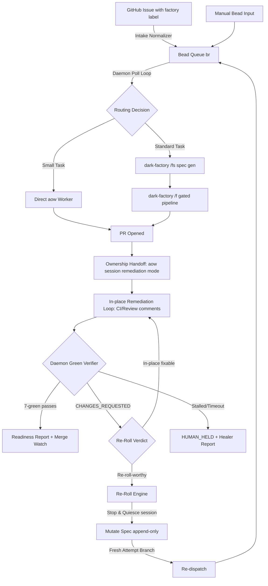

# Auto-Factory Daemon — Architectural Specification (No-Code)

**Status:** Draft r4 — two adversarial review rounds + `/advice` panel integrated; ready for operator review
**Code status:** Declarative blueprint only — zero implementation code
**Derived from:** ASF-SR-2.3 (Dynamic Spec-Mutation & Automated Re-Roll Engine), openai/symphony `SPEC.md`, dark-factory runner architecture
**Owner repo:** dark-factory (`$DARK_FACTORY_HOME`)

---

## 1. Mission

Close the last manual gap in the Level-5 dark factory: the **backward-recovery path**. Today the factory converts goals into PRs through deterministic gates, but when a human or reviewer-bot rejects a PR (`CHANGES_REQUESTED`), an engineer drops back to an interactive terminal to reset branches and re-prompt agents. This spec defines a **polling daemon** that:

1. Polls the bead queue (with GitHub Issues as an external intake surface) for dispatchable work.
2. Dispatches work through an execution stack that creates PRs.
3. Independently **verifies** every PR against the full 7-green definition.
4. Treats review rejection as machine-readable input: extracts constraints, mutates the spec, abandons the rejected attempt for a clean re-roll branch, and re-dispatches — the **re-roll loop**.

Human engineers manage work items; they do not supervise agents.

**Prior-art positioning.** Industry agents (Devin, Copilot coding agent, Sweep, Jules) converge on one agent iterating **in place** on the same PR branch; per-attempt fresh branches (OpenHands resolver) and regenerate-from-spec are minority positions. This spec deliberately uses **both**, conditioned on rejection type: mechanical feedback iterates in place (mainstream behavior, owned by the execution layer), while semantic/architectural rejection — where context debt has genuinely accumulated — triggers regeneration from the mutated spec on a fresh branch. The documented failure mode of the regeneration camp is **spec staleness**, which §5.5's RECOVERY validation guards explicitly.

## 2. Component Stack and the Single-Remediation-Owner Rule

The stack composes three existing systems plus one new thin daemon. The composition is governed by one rule that resolves the otherwise-fatal overlap between them:

> **Single remediation owner.** At any moment, exactly one control plane may write to a PR's branch. **Every open factory PR is owned by exactly one `aow` session** (§4.1) that performs all *in-place* remediation — CI fixes, review-comment responses, merge conflicts — natively. The daemon never pushes fixes alongside AO; it owns exactly two things: **read-only verification** (7-green assessment, evidence floor) and the **re-roll decision** (structural rejection → stop the AO session and confirm quiescence → fresh branch → re-dispatch). A re-roll supersedes the attempt entirely, so the two owners never interleave on one branch.
> 
> **AO Native SCM Reactions.** The `agent-orchestrator`'s internal `scm.Observer` and `reactions.go` natively poll SCM PRs and dispatch nudges to the active session when CI fails or review comments are received. The daemon explicitly relies on these built-in loops for all in-place fixes rather than implementing its own prompt injection mechanisms.

| Layer | System | Role | Provenance |
|---|---|---|---|
| Intake | GitHub Issues → beads (`br`) | Issues are the external human-facing surface; a pre-poll normalizer converts them to beads. **Beads are the only queue the daemon polls.** | Existing |
| Orchestration | **New thin daemon**, implemented to the Symphony spec subset (§7 claim states, §8 poll loop, §11 tracker contract) | Poll beads, claim, route, dispatch, verify, re-roll. | New (small by design; see §2.1) |
| Execution | **AgentWrapper/agent-orchestrator** (upstream, Go) | Spawns and manages coding agents in its own worktrees/terminals; natively iterates on CI failures, review comments, merge conflicts. Owns workspace lifecycle and in-place remediation. | Existing upstream — installed locally as **`aow`** (`~/.local/bin/aow`) from `~/projects/agent-orchestrator-mirror` (= `jleechanorg/agent-orchestrator-mirror` fast-forwarded to upstream `main`). Named `aow` to avoid colliding with the operator's normal `ao` CLI; the heavily-modified `jleechanorg/agent-orchestrator` fork is explicitly **excluded**. |
| Spec & verification | dark-factory | `/fs` spec generation (always), `/f` full gated pipeline (optional per routing), `/es`+`/er` evidence gates, sealed holdouts, CXDB, Healer. | This repo |

### 2.1 Symphony as spec, not as runtime

Symphony's `SPEC.md` (~79KB, normative RFC-2119 language) defines the daemon this document needs: poll loop (§8), issue orchestration state machine (§7), tracker integration contract (§11), and its README explicitly invites reimplementation from spec. **However, its reference runtime is not reusable here:** the Symphony worker is hard-wired to the Codex app-server protocol — it launches `codex app-server` (SPEC §10.1, `codex.command` is a REQUIRED preflight field per §6.3) and drives streaming turns over that protocol (§10.2–10.4). Delegating execution to AO would require emulating an app-server around AO — building the hardest part to reuse the easiest.

So the adoption decision is:

- **Baseline: implement the minimal Symphony subset** — §7 claim states, §8 poll loop (tick: reconcile → preflight → fetch candidates → sort → dispatch into slots), §11 tracker contract normalized to beads — as a thin poller that shells out to `aow` and dark-factory. This is the new code this spec authorizes, and its smallness is a design goal: execution, workspaces, and gates all belong to the layers below.
- **Symphony's §9 workspace-safety and §8.5 reconciliation-kill invariants transfer to AO, not to the daemon:** AO owns worktrees and agent processes, so stall detection and cancellation are specified against AO's session surface (`aow session ls / send / stop`), not against a subprocess the daemon launched. The daemon's reconciliation asks AO for session state; it never kills processes it does not own.
- The Elixir reference runtime remains an option only for a hypothetical codex-app-server-only lane, recorded as an open question (§11), not part of the pilot.

### 2.2 AO is wrapped, never modified

Upstream-first, made explicit for this project: **all AO integration is wrapper code living in dark-factory** — the daemon drives `aow` exclusively through its public CLI/session surface (`spawn`, `session`, `send`, `stop`, `status`, `review`). The upstream tree at `~/projects/agent-orchestrator-mirror` stays byte-identical to `AgentWrapper/agent-orchestrator` main and is updated only by fast-forward syncs. If AO lacks a capability the daemon needs, the gap is closed by (in order): a wrapper/adapter in this repo, an AO plugin mechanism if upstream provides one, or an upstream contribution PR — never by patching the mirror. If upstream later ships what a wrapper does, the wrapper is deleted in favor of upstream (fork-adjustment ledger discipline).

### 2.3 Default Coder & Fallback Configuration

- **Default Coder**: The primary executing agent for implementing tasks is the **Claude Code** (`claude-code`) agent harness, running inside an **AO worker** (`aow`) session and configured to use the **Minimax** (`minimax`) model provider/backend.
- **Fallback Chain**: In the event that the primary Minimax backend hits API rate limits, quota exhaustion, or execution failures, AO's native fallback chain handler (`fork-reaction-agent-fallback.ts`) automatically respawns the session using the next model in the configured fallback chain (e.g. `claude-sonnet`), preserving the active session context on the PR branch.

### 2.4 Discardable Component & Plugin Design

In alignment with the "dorodango" architecture (polish, discard, rebuild), the daemon's integration adapters are designed as loosely coupled, disposable wrappers. If Claude Code improves its built-in workflows or `agent-orchestrator-mirror` merges new features (such as first-class multi-agent review coordination, automatic SCM observers, or dashboard views), the corresponding daemon component/plugin is discarded and replaced by the new upstream implementation. Standard interface boundaries (JSON payloads over CLI/IPC) are maintained to allow plug-and-play swaps of intake, execution, or review components.


## 3. Topology & Data Flow

```
[GitHub Issue (label: factory)]
              │  (pre-poll Intake Normalizer: issue → bead, idempotent;
              │   bead ID posted back to issue)
              ▼
[bead queue (br)]  ◀── beads may also be created directly (internal path)
              │
              ▼
[Daemon poll loop — Symphony §8 subset]   tick: reconcile (via aow session state)
              │                            → preflight → fetch candidate beads
              │                            → sort (priority asc, created_at asc)
              │                            → dispatch into free slots
              │                            Tiered cadence: fast tick for beads with
              │                            an open PR (ATTESTED), slow tick for intake.
              ▼
[Routing decision: task size/shape]   ← model judgment (ZFC), not keywords
              │
     ┌────────┴─────────┐
     ▼                  ▼
[small task]     [standard/large task]
aow worker,      dark-factory /fs → spec.md + attractor_spec.md,
direct           then /f (full gated pipeline) unless waived by routing verdict
     │                  │
     │                  │ (/f is one-shot: it exits when the PR opens)
     └────────┬─────────┘
              ▼
       [PR opened] → bead overlay state: ATTESTED
              ▼
[PR ownership handoff §4.1]  ← standard path: daemon attaches an aow session
              │                to the /f-produced branch. Small path: the
              │                dispatching aow session already owns it.
              ▼
[AO session = in-place remediation owner]  ← CI fixes, review comments,
              │                              merge conflicts (aow native loop)
              ▼
[Daemon green VERIFIER]  ← read-only each tick: 7-green assessment,
              │            evidence floor, independent-reviewer check
              │
     ┌────────┼──────────────────────────────┐
     ▼        ▼                              ▼
[7-green]  [CHANGES_REQUESTED:          [AO session stalled /
 ready +    cooldown 1 tick, then        cumulative time-box hit]
 merge-     model verdict in-place       ▼
 watch      vs re-roll]                 [HUMAN_HELD + Healer report]
             ▼ (re-roll-worthy)
            [Re-Roll Engine §5]
```



### 3.1 Intake contract (adapted from Symphony §11)

**The daemon's tracker adapter targets beads exclusively** (Symphony's model is single-tracker; GitHub is not a second poll target). REQUIRED operations, normalized to Symphony's domain model:

1. `fetch_candidate_issues()` — `br list --status open --label factory --json`, one configured target repo.
2. `fetch_issues_by_states(state_names)` — startup terminal cleanup.
3. `fetch_issue_states_by_ids(ids)` — active-run reconciliation.

Normalization (Symphony §11.3): labels lowercased, `blocked_by` from bead dependency edges, `priority` integer-or-null, ISO-8601 timestamps.

**GitHub intake is a separate pre-poll normalizer step**, not a tracker adapter: it lists labeled issues via authenticated `gh`, converts each to a bead, and posts the bead ID back as a comment. Conversion is idempotent: the bead's **`external-ref` field** (a real `br` field) is set to `<owner>/<repo>#<issue_number>` at creation and checked before any create — a crash between `br create` and the comment must not produce a second bead; the missing comment is posted on the next tick.

**Manual Bead Input.** The daemon natively supports dispatching manually created beads directly from the `br` queue. If a bead has no `external-ref` (meaning it was created directly by a human operator and is not backed by a GitHub issue), the daemon bypasses GitHub comment updates and issue-state tracking for that bead, but still performs full routing, dispatching, PR creation, 7-green verification, and re-rolling. When a re-roll occurs on a manual bead, the daemon appends to the local spec file and creates a new branch, skipping the PR closure comment.

**AO Intake Integration.** Although `agent-orchestrator` has a native `trackerintake` module that polls GitHub issues and spawns sessions, it lacks human-facing queue management (bead prioritization, sorting, dependencies). To avoid duplication, the daemon's pre-poll normalizer maps GitHub issues to beads, and the daemon serves as the scheduler. AO's native `trackerintake` is disabled for factory projects to prevent duplicate spawning, while AO's session database acts as the single source of truth for active worker sessions.

**Write boundary** (Symphony §11.5 — the daemon is a scheduler and reader; dispatched agents write through their own tools). The daemon's own writes, exhaustively:
(a) the normalizer's bead-ID comment;
(b) re-roll writes to spec files and bead status (§5);
(c) clarification/escalation comments (§5.6, §5.7);
(d) **independent-reviewer invocations** (§3.3): the daemon may trigger a reviewer (codex cold review, CodeRabbit re-request, or equivalent), and that reviewer may post its review to the PR — the daemon records the verdict + head SHA in its CXDB state regardless, and the verifier reads the CXDB record, not the comment.

### 3.2 Claim states, concurrency, and the durable-state split

`Unclaimed → Claimed → Running | RetryQueued → Released`, adopted verbatim from Symphony §7.1. Candidate sorting is Symphony's fixed order — priority ascending, then `created_at` oldest-first, then identifier tiebreak. A re-dispatched bead keeps its original `created_at`, so it naturally sorts to the front of its priority band; no re-entry priority semantics are invented. Concurrency per Symphony §8.3, with one factory-specific hard limit layered on top: **total concurrent AO workers across all daemon activity ≤ 20** (the operator's standing AO spawn-safety cap), dispatched in batches ≤ 10.

**Durable-state split (two stores, one owner each).**

- **Beads (`br`) hold what humans manage:** status, priority, labels, assignee, `external-ref`, dependencies. `br` has a fixed field set with no arbitrary metadata and no atomic counters — the daemon does not pretend otherwise.
- **CXDB (the daemon's SQLite, already used by the factory) holds all machine state**, keyed by bead ID under a reserved daemon namespace: overlay states (§5.5), the re-roll cycle counter, the cumulative autonomy clock, reviewer verdicts (§3.1d), and the branch-creation registry (§5.3.6). SQLite transactions give the atomic read-modify-write that overlay transitions and the cycle counter require.

On startup, reconciliation rebuilds in-memory state from: CXDB (machine state), `br` (human-facing status), `aow` session listing (live executions), and `gh` PR/review state (ground truth). The daemon reclaims active AO sessions natively on startup by querying `aow session ls` and verifying process status rather than maintaining a duplicate daemon process tree. Reconciliation **reclaims** any per-bead lock file with no live holder immediately (it does not wait for the weekly sweep) to prevent deadlock on daemon crash. Any bead whose recorded state contradicts observed reality (e.g. RECOVERY recorded but no re-roll branch exists) goes to HUMAN_HELD with a report rather than being "repaired" by guesswork.

### 3.3 Routing decision (ZFC-compliant)

Whether a task takes the small path (direct `aow` worker) or the standard path (`/fs` → `/f`) is a **model judgment call**: the daemon sends the work item (title, body, linked spec, repo context) to an LLM with a routing rubric and receives a structured verdict. Keyword matching, regex intent detection, and hand-tuned scoring are forbidden (ZFC). The verdict, its rationale, and the model identity are recorded in CXDB. `/fs` is mandatory on the standard path; `/f` runs unless the routing verdict explicitly waives it.

**Every PR requires an independent reviewer.** The standard path gets adversarial review inside `/f` (reviewer nodes, holdout eval). The small path has no pipeline, so before it can report ready, at least one independent reviewer signal (codex cold review, CodeRabbit APPROVED, or a reviewer run the daemon triggers per §3.1d) must exist for the current head SHA. A PR with zero independent review never reaches ready-to-merge, on either path (repo operating rule: every non-trivial pipeline has a reviewer separate from the implementing agent).

### 3.4 Local Bead Communication Fail-Safe (Offline Mode)

When GitHub is down (manifesting as API timeouts, DNS resolution failures, or HTTP 5xx responses during pre-poll or verification checks), the daemon and the executing agents fall back to a **local bead-state communication protocol**:

1. **Bead-Centric Coordination**: Instead of relying on GitHub Issues, PR state changes, or webhooks, agents read, write, and transition task states directly using the local bead queue files (`.beads/` state).
2. **Parallel Offline Handoffs**: Multiple executing agent sessions can update the beads in parallel to communicate intermediate review verdicts, test outcomes, or remediation status.
3. **Queue Prioritization Focus**: During a GitHub outage, the daemon stops checking remote issues and focuses exclusively on the local bead queue, scheduling and executing local tasks, and dispatching workers against local branches. Once GitHub connection is restored, the daemon reconciles the local state with GitHub SCM.

## 4. PR Ownership, Verification, and Remediation


### 4.1 Ownership handoff at PR-open

The single-owner rule requires every open factory PR to have exactly one AO session owner — but the two dispatch paths produce PRs differently:

- **Small path:** the dispatching `aow` session created the branch and PR; it simply keeps ownership and its native loop runs.
- **Standard path:** `/f` is a one-shot pipeline that exits when the PR opens — it leaves no persistent session. At PR-open, the daemon **attaches an `aow` session to the `/f`-produced branch** (spawned with the bead's spec as context, in remediation mode: respond to CI failures, review comments, and conflicts on this branch; do not expand scope). This is the named in-place owner for standard-path PRs; §4.3's stall detection keys on it like any other session.

Under the hood, the daemon leverages the AO daemon's native `scm.Observer` loop which registers ETags, performs diffs, and fires reaction nudges for PRs owned by active sessions. The daemon does not duplicate these SCM reads; it reads PR metadata directly from GitHub via the verifier loop (§4.2). The AO native loop stays enabled for all daemon-dispatched sessions — it *is* the in-place owner. Exclusivity at the re-roll boundary is enforced by the handover protocol (§5.3.3), not by disabling AO's loop.

### 4.2 Daemon green verifier (reader)

Each fast-tick, the daemon independently evaluates the PR against the full 7-green definition — CI conclusions via check-runs, `mergeable`, `reviewDecision`, review-thread resolution via GraphQL `isResolved`, evidence gate. `gh pr checks` alone is never trusted. Additional floors, enforced regardless of target-repo tooling:

- **Evidence floor:** production diffs over 100 non-test LOC require at least Layer-2 integration evidence (real callstack, mocks only at external API boundaries). Unit-only proof is insufficient for such diffs, in every target repo.
- **Independent-reviewer floor** (§3.3).

### 4.3 Verifier outcomes

1. **All gates pass** → the daemon posts a readiness summary (head SHA, gate table, evidence links) and **stops driving but not observing**: a lightweight merge-watch (cheap state read per tick) continues until merge or close, because decommissioning (§8) triggers on that observation. Merging itself is out of scope: repos with a merge-approval policy (e.g. `worldarchitect.ai`'s literal-phrase gate) always terminate at ready-to-merge; the daemon never runs `gh pr merge`.
2. **`CHANGES_REQUESTED` observed** → **cooldown of one full poll tick** (the owning AO session gets its bounded in-place window and rapid review-event bursts settle), then a model call judges the feedback: *in-place fixable* (mechanical, scoped — leave it to the owning session and keep verifying) versus *re-roll-worthy* (architectural misalignment, accumulated context debt, repeated failure). Re-roll-worthy → §5. This judgment is the daemon's, not AO's, because only the daemon holds the bead's cross-attempt history.
3. **AO session stalled or dead** (via `aow session` state, not process inspection) or **cumulative time-box exceeded** (§6) → HUMAN_HELD with a Healer report.

## 5. Re-Roll Engine (ASF-SR-2.3, adapted)

### 5.1 Trigger: polling, not webhooks

ASF-SR-2.3 assumes a webhook ingestion listener. This daemon runs on a workstation behind NAT; it instead detects `CHANGES_REQUESTED` during the verifier's poll tick (authenticated `gh` API — provenance is the API's authenticated response, replacing webhook signature verification). Duplicate/rapid review events collapse naturally: the §4.3 cooldown absorbs bursts, each tick reads current review state, and the per-bead lock (§5.3) serializes processing.

**Freshness guard:** immediately before executing a re-roll (after lock acquisition), the engine re-reads the PR's current aggregate review state. If it is no longer `CHANGES_REQUESTED` (e.g. the reviewer approved or dismissed the review in the interim), the re-roll aborts, the lock is released, and the bead returns to ATTESTED. Accepted work is never scrubbed by a stale rejection.

### 5.2 Constraint extraction (ZFC-compliant)

Reviewer comments are unstructured text. Extraction of constraints is delegated to a model call — never regex or keyword parsing. The model returns a structured set of:

- **Positive assertions** — actions the next attempt must take.
- **Inhibition specs** — architectures, imports, or patterns the next attempt must avoid. These get priority: they shrink the agent's solution space, which is the highest-leverage correction for generation drift.

**Harness-First Focus.** In alignment with the "fix the system, not the prompt" design principle, constraint extraction prioritizes identifying changes to the factory environment (codebase skills, tests, or workspace configs) rather than just appending prompt-level constraints for the agent.

Where an inhibition spec expresses a mechanically checkable boundary (e.g. "no imports from `src/harness/` inside `src/modules/`"), the extractor **additionally** emits a deterministic verifier rule — a machine-readable lint policy written beside the spec — so the constraint is enforced by a gate, not just by prompt. Deterministic *enforcement* of a model-extracted rule is not a ZFC violation; deterministic *extraction* would be.

**Holdout-leak screen.** Reviewer text is untrusted content: a human, a bot, or the sealed evaluator's report could quote holdout expectations into a PR comment. Before any reviewer text (extracted constraints or the raw snapshot of §5.4) is written into an artifact the implementing agent will read, a model screening call checks it for content that reveals holdout test internals (exact expected values, holdout file paths, scenario names). Flagged spans are redacted from the implementing-agent-visible copy; the unredacted original is retained in CXDB (operator-visible only) with the screening verdict. This preserves the Agent Isolation guarantee: nothing structurally hidden from the implementing agent may reach it via the review channel.

### 5.3 Clean re-roll branches (no history rewrite)

Iterative patching accumulates context debt: each successive fix commit adds noise the next agent must reconcile. ASF-SR-2.3's answer is a hard reset + force-push; that conflicts with the standing force-push policy (explicit per-push human approval naming the branch — which an autonomous daemon structurally cannot obtain) and is rejected. The same clean-slate property is achieved without any history rewrite:

1. **Lock.** Acquire the per-bead lock (atomic transaction in the CXDB SQLite state database or atomic file lock in the daemon state directory). The verifier consults the same lock before treating a bead as ATTESTED-stable. Lock discipline: released on every exit from the re-roll path — success (REDISPATCHED), abort (freshness guard), failure (any step non-zero), and hold states (§5.5). Startup reconciliation reclaims orphaned locks immediately (§3.2) to prevent deadlock on daemon crash; the weekly sweep (§8) is a backstop, not the primary reclaim path.
2. **Freshness guard** (§5.1). Abort if review state changed.
3. **Stop the AO session and confirm quiescence.** The owning `aow` session is stopped through AO's own session interface. Stopping is not enough: the engine then actively queries the live `aow` process state (e.g., checks runtime PID status/exit codes or run file logs) rather than relying on state polling, confirming that the session reports a terminal state **and** the branch head SHA is stable across a confirmation read (an in-flight push racing the stop must land or fail before branch work begins). Only then is the handover from in-place owner to re-roll owner complete.
4. **Baseline computation.** Fetch and compute the new baseline as the current head of the configured `base_branch` (per-repo config key, §7 — never implicit). Mainline drift needs no special case: nothing is reset; every re-roll cuts from current mainline by construction. The mutation layer records the baseline SHA.
5. **Fresh attempt branch.** Create `factory/<bead_id>-r<n>` (n = re-roll cycle number) from the baseline. The rejected attempt branch `factory/<bead_id>-r<n-1>` is left untouched (the closed PR links it for audit) and is deleted only by decommissioning (§8) after the bead reaches a terminal state. No branch is ever reset or force-pushed, so the force-push policy is satisfied by construction, not by exception.
6. **Ref registry.** Every branch the daemon creates is recorded (repo, ref, bead, cycle, created-at) in the CXDB branch registry at creation time. Deletion (§8) is permitted **only** for refs present in the registry — the `factory/*` name prefix is a convention, never an authorization. Enabling a new target repo requires a preflight assert that no non-daemon refs already exist under the configured namespace; collision aborts enablement with an operator report.
7. **Old PR closure.** The superseded PR is closed with a comment linking the new attempt branch/PR and the mutation-layer block that superseded it.
8. **Structured Telemetry.** Emit a structured lifecycle event (e.g., Cloud-Events-compatible payload) to the observability dashboard containing the bead ID, cycle index, baseline SHA, old PR URL, and next branch name.

### 5.4 Spec mutation grammar

The spec file for the bead (created by `/fs` at dispatch, under the target repo's spec directory) is **append-only**: existing blocks are never edited, ever (supersession is expressed by later blocks — §5.6). Each re-roll appends one block:

```markdown
## Mutation Layer: Remediation Iteration <ISO-8601>
* Source event: PR review rejection (<PR URL>, review ID)
* Attesting reviewer: <handle>
* Superseded attempt: <old branch> ; new attempt: <new branch> @ <baseline SHA>
* Supersedes constraints: <IDs of earlier constraints this layer overrides, if any>

### Extracted Operational Constraints
1. Positive assertion: <extracted requirement>            [constraint ID]
2. Inhibition spec: <negative constraint> [constraint ID] [+ verifier rule reference if emitted]

### Raw Feedback Snapshot (holdout-screened, §5.2)
> <reviewer text after the leak screen — semantic baseline retention>
```

**Atomicity.** The append is write-temp → fsync → rename. A torn or malformed block discovered by the RECOVERY validation guard (§5.5) halts the bead (HUMAN_HELD) with an operator alert; the engine never "repairs" a spec file heuristically.

Constraint IDs are stable (`<bead>-c<seq>`) so later layers can reference exactly what they supersede.

### 5.5 Review-lifecycle states (bead-level overlay, stored in CXDB)

These overlay the Symphony claim states — a bead can be `Released` from a claim while sitting in `RE_ROLL` awaiting re-dispatch. Per §3.2, every overlay state transition is written (transactionally, in CXDB) before the work it authorizes begins, so restart reconciliation can always resume from durable state.

```
ATTESTED ──(CHANGES_REQUESTED + cooldown + model re-roll verdict; cycle counter ++)──▶ RE_ROLL
RE_ROLL ──(freshness guard fails)──────────────────────────▶ ATTESTED   (abort, lock released)
RE_ROLL ──(AO session stopped & quiesced; new attempt branch pushed, exit 0;
           spec mutated atomically; verifier rules written)─▶ RECOVERY
RE_ROLL ──(any step fails after bounded retries)───────────▶ HUMAN_HELD
RECOVERY ──(mutated spec validates, incl. staleness check; budget check passes)──▶ REDISPATCHED
RECOVERY ──(budget insufficient)───────────────────────────▶ BUDGET_HELD
RECOVERY ──(positive-vs-positive conflict, §5.6)───────────▶ HUMAN_HELD
BUDGET_HELD ──(budget replenishes at daily reset; re-run guard)──▶ REDISPATCHED
HUMAN_HELD ──(explicit human action on the bead)───────────▶ RE_ROLL or closed
REDISPATCHED = bead becomes candidate-eligible again; selected by the standard
               sort — original created_at places it at the front of its
               priority band naturally.
```

Guard details:

- **Cycle counter** lives in CXDB (single authoritative store), incremented in the same transaction that records `ATTESTED → RE_ROLL`. Every entry into RE_ROLL consumes a cycle. A crash after the transaction but before completion re-enters RE_ROLL without a second increment (recovery resumes, not restarts).
- `ATTESTED → RE_ROLL`: review state read from the authenticated API, cooldown elapsed, model verdict = re-roll-worthy (§4.3), **and** bead currently `ATTESTED` (stale/duplicate events no-op).
- `RE_ROLL → RECOVERY`: gated on the **push** of the new attempt branch succeeding (zero exit from the push, not merely local branch creation). Push failure retries with backoff; exhausted retries → HUMAN_HELD, lock released, alert posted.
- `RECOVERY → REDISPATCHED`: the mutated spec passes the repo's spec validation **plus a model staleness check** — do the spec's assumptions still hold against the current `base_branch` head (APIs it names still exist, constraints not already satisfied/obsoleted by mainline drift)? Stale → HUMAN_HELD with the staleness report (regeneration from a stale spec is the documented failure mode of this pattern — §1). And remaining token budget covers a full execution sweep.
- HOLD states release the per-bead lock on entry (nothing is mid-flight while held) and record their wake condition in CXDB.

### 5.6 Conflict resolution — REJECTED math, ADOPTED behavior

ASF-SR-2.3 §6.1 defines an exponential context-decay weighting formula (`W(c) = α·I(c) + β·F(c)·e^{−λ(n−m)}`). This is hand-tuned scoring over semantic content — a **ZFC violation** — and is rejected. The behavior it was buying is kept, via two rules:

1. **Recency precedence, structurally.** Mutation layers are appended in order and later layers explicitly supersede earlier ones on the same subject. Whether two constraints address "the same subject", and whether a new constraint contradicts an older one, are **both model calls** at extraction time. When the extractor finds a new inhibition spec contradicting an older positive assertion, the new layer's `Supersedes constraints:` field names the overridden constraint ID (append-only supersession — the old block is never edited), and a `CONSTRAINT_OVERRIDE` event is logged to CXDB. Prompt assembly presents non-superseded constraints as active and superseded ones as historical context.
2. **Positive-vs-positive conflicts fail safe.** Detection of a structural conflict between two positive requirements is likewise a model call (no hand-rolled comparison). On a detected conflict, the engine halts that bead in HUMAN_HELD, posts a clarification request on the PR/issue, and waits for a human — it does not burn tokens guessing.

### 5.7 Ping-pong defuser

Maximum **5 re-roll cycles per bead** (counter semantics in §5.5). On the fifth `ATTESTED → RE_ROLL` transition, the engine completes the transition into HUMAN_HELD instead of RE_ROLL processing: it runs `df-healer` over the bead's CXDB history to produce a diagnosis and assigns the item to a human with the Healer report attached.

**Relationship to the existing cross-run circuit breaker:** the breaker (PR #102) keys its streak query on *pipeline name* and fires on consecutive `exhausted` finals — it neither sees re-roll churn (re-rolls are triggered by `CHANGES_REQUESTED`, not exhaustion) nor distinguishes beads sharing one pipeline. The per-bead defuser above is therefore the sole re-roll bound; the breaker continues to guard pipeline-level exhaustion independently. Because many daemon beads will share pipelines like `gates.dot`, the streak query needs a per-bead scope key so unrelated beads cannot trip each other. This is one of exactly **two runner changes** this spec requires — the other is Healer awareness of the reserved daemon namespace (§7) — named here rather than hidden behind a "zero new tooling" claim.

## 6. Safety Envelope

All existing operator policies bind the daemon; none are relaxed:

- **AO spawn cap:** ≤ 20 concurrent workers, batches ≤ 10.
- **Autonomy time-box, cumulative per bead:** wall-clock autonomous processing time accumulates across a bead's entire chain — initial dispatch, AO's in-place fix rounds, and every re-roll cycle. When the cumulative clock exceeds 3 hours, the bead enters HUMAN_HELD pending explicit re-approval. **Nothing on the automated path resets the clock** — not re-roll boundaries, not the rejection that triggers a re-roll, and never a bot review (a bot-reject→auto-re-roll chain must not be self-extending). The only reset is an explicit out-of-band human action on the bead: the human re-approval that releases HUMAN_HELD, or a deliberate human bead-level extension. The daemon *process* runs indefinitely — it is a scheduler; the time-box binds each bead's unattended work chain. The clock lives in CXDB (§3.2).
- **Force-push: never.** The re-roll design (§5.3) creates fresh branches instead of rewriting any ref; there is no force-push code path at all.
- **Branch deletion:** only refs in the daemon's own creation registry (§5.3.6); the namespace prefix is never treated as ownership.
- **Merge:** never. Terminal state is ready-to-merge + readiness report (+ merge-watch, §4.3).
- **Session control:** the daemon stops only `aow` sessions it dispatched or attached (§4.1), through AO's session interface; it never signals processes directly.
- **Holdout isolation:** dispatched implementing agents inherit the existing sandbox rules (`sandbox-exec` deny on the holdouts path, sanitized env), and the review channel is screened for holdout leakage before any reviewer text reaches implementing-agent-visible artifacts (§5.2).
- **Token budget:** per-bead budget checked at the `RECOVERY → REDISPATCHED` guard; global daily budget checked at dispatch preflight (mirrors Symphony §6.3 preflight).

## 7. Deployment — Two-Stage Pilot

- **Runtime:** macOS launchd agent on the operator's workstation. The plist template lives in this repo (per the launchd-plist-template policy) with `@HOME@` placeholders and an install step in the repo's installer; launchd keeps the thin poller (§2.1 baseline) alive.
- **Stage 1 — verifier plane only (re-roll disabled).** Intake, routing, dispatch, ownership handoff, and the read-only green verifier + merge-watch run for real; `CHANGES_REQUESTED` handling stops at recording the model's in-place/re-roll verdict in CXDB (no re-roll executes — the owning AO session handles everything in place, and re-roll-worthy verdicts park the bead in HUMAN_HELD). This plane has near-zero blast radius and bakes the poll/reconcile/verify loop, the CXDB state store, and the AO seam against real PRs.
- **Stage 2 — enable the re-roll writer plane** once Stage 1's recorded verdicts and reconciliation behavior have been audited by the operator. The switch is a config flag, not a code change.
- **Pilot scope:** exactly **one target repo** at launch, named in a single config file. Per-repo config keys: repo, intake label, branch namespace, **`base_branch`** (the baseline target for §5.3 — never implicit), budgets, concurrency, poll intervals (fast/slow tiers, §3), stage flag. Additional repos are a config change plus the namespace preflight (§5.3.6), not a code change.
- **Logs & observability:** every dispatch, state transition, verdict, and re-roll event is recorded to CXDB and the factory's structured perf-log tree. Daemon events are not pipeline node visits, so they use a **reserved namespace** (a dedicated synthetic pipeline/node prefix, following the existing `__cross_run_circuit__` precedent) — keeping Healer clustering over real pipeline failures unpolluted while still giving the Healer visibility into daemon-level failure patterns (the second of the two runner changes, §5.7).
  
  **Detailed Telemetry Log**: In addition to CXDB events, the daemon logs structured JSON payloads for every steering action, containing:
  - Timestamp, bead ID, and active attempt branch.
  - Steering classification: **human-initiated** (e.g., human PR reviews, manual bead actions, manual re-roll commands) vs. **automated** (e.g., bot reviews, automated test suite failures, or automated model-judged re-rolls).
  - Model verdict (in-place vs. re-roll) with the raw reasoning block.
  - In-place remediation logs: the exact prompt/nudge dispatched by the SCM loop and the agent's stdout/stderr response.
  - Spec mutation diffs: the old spec vs. mutated spec.
  - Reviewer comments and extracted constraints (both positive and inhibition).
  This log is stored locally under `~/Library/Logs/dark-factory/daemon.jsonl`.

## 8. Lifecycle Decommissioning & Hygiene (ASF §8, adapted)

On merge or close of a factory PR (observed by the merge-watch poll, §4.3):

1. The `aow` session and its worktree for the run are cleaned up through AO's own interface.
2. All remote attempt branches for the bead (`factory/<bead>-r*`) are deleted — registry-verified refs only (§5.3.6).
3. The bead is closed with a reason linking the merged PR; beads are archived by the `br` tool's own lifecycle, not a parallel archive tree.

A daily harness audit job (same launchd domain, runs daily):

- **Harness Violation Scan**: Shells out to `claude --print /harness --audit` or runs a script that processes the last 24 hours of the detailed telemetry log (`daemon.jsonl`).
- **Failure Classification**: Identifies and groups recurrent re-rolls, manual interventions, or long-running remediation loops.
- **Root-Cause Analysis (5 Whys)**: Executes the `/harness` 5-whys protocol for the most frequent failure clusters to determine why the current skills, prompts, or test templates failed to prevent the errors.
- **Auto-remediation**: Automatically updates the global instructions in `~/.claude/CLAUDE.md` or repo-local skills to close harness gaps (using `harness --fix`), and commits these changes to the tracking branch to continuously reduce the need for steering.

A weekly hygiene sweep (same launchd domain, separate low-frequency job):

- Flags verifier rules referencing files/modules that no longer exist, for removal.
- **Constraint Pruning**: Re-evaluates and prunes accumulated negative assertions/lint rules against the upgraded baseline models and mainline architecture to prevent rule-bloat and context-window congestion. This includes auditing rules against newly deployed model updates, pruning constraints that the upgraded models natively satisfy without prompting.
- Compacts per-run telemetry into the run-summary index, preserving metrics and dropping per-tool trace rows.
- Backstop-reclaims any stale per-bead locks that startup reconciliation hasn't already reclaimed (§3.2); reports stale claims for operator review.

## 9. Non-Goals

- **Merging PRs** — always a human act (and policy-gated per repo).
- **Replacing dark-factory's `.dot` engine** — the daemon schedules around it; graph shape, specs, holdouts, and scoring contracts remain the durable assets.
- **Duplicating AO's in-place remediation** — the daemon never pushes fixes to a branch an AO session owns (single-owner rule, §2).
- **Modifying upstream AO** — wrapper code only (§2.2).
- **Webhook infrastructure** — polling only, by design, for a NAT-ed workstation.
- **Multi-tracker generality beyond beads (+ GitHub intake)** — Symphony's contract permits more later; the pilot does not build it.
- **Rewriting review comments into code patches directly** — the unit of correction is the spec, never the diff (spec-mutation over code modification, ASF §2).

## 10. Review Agent Fleet & Parallel Review Orchestration

To optimize performance and minimize token usage, the daemon supports running review gates either through hardcoded sequential nodes in the `.dot` graph (which can be slow and run in isolated sandboxes) or by delegating them to a fleet of specialized review agents executing as parallel AO workers.

### 10.1 Review Fleet Composition
The default review fleet consists of the following `agy` CLI-based reviewer agents:
1.  **`/zfc` (Zero Framework Cognition Reviewer)**: Audits the PR diff against framework cognition guidelines. It flags dependency bloat, unnecessary third-party package imports, or excessive abstraction wrappers, recommending native standard-library alternatives.
2.  **`/code-standards` (Code Standards Reviewer)**: Enforces formatting consistency, codebase architecture, import direction rules (e.g. prohibiting imports from the test harness into the module implementation), and comment/docstring preservation.
3.  **`correctness` (Codex Reviewer)**: The primary logic correctness agent. It evaluates the implementation against edge cases, exception handling, data parsing, and concurrency safety.
4.  **`alignment` (General Reviewer)**: Checks global alignment between the updated `spec.md`, the implementation code, the design goals, and the telemetry evidence.
5.  **`/er` (Evidence Reviewer)**: Audits the evidence bundle (JSONL log, videos, test outputs) to ensure it satisfies the evidence standard (matching SHA, LLM-layer pass rate > 0%, clear provenance).

### 10.2 Combined Reviewer Execution (Skeptic Mode) & Test Allowance
- **Combined Skeptic Flow**: The fleet of reviewers runs together as a single combined skeptic-like execution flow (mirroring the original `ao skeptic` behavior) in parallel tmux panes (`review-<worker-id>`) sharing the active worker's existing workspace, managed via the native AO `Reviewer` framework.
- **Test Execution Allowance (No Read-Only Hard-Block)**: Unlike hard sandboxed environments that block execution, reviewers are permitted to run tests and verification scripts locally. Protection against workspace corruption is enforced by instructing the reviewer agents via system prompts never to edit files or commit changes, rather than blocking tool execution.
- **Verdict Submission Loop**: The reviewer agents post their reviews to GitHub as comments via `gh api`, then submit the final verdict back to the orchestrator using `ao review submit`.
- **Reviewer Fallback Chain**: Review execution integrates with the `agent-orchestrator` fallback chain handler (`fork-reaction-agent-fallback.ts`). If a primary reviewer experiences rate-limiting, quota exhaustion, or timeout, AO automatically falls back to the next model/agent in the chain (e.g. Claude or Gemini), preventing a blocked PR.
- **Remediation Iteration Capping**: The PR remediation loop iterates under a combined ceiling of `max_visits` (in-place fixes, default 3) and `max_cycles` (durable re-rolls, default 5). A PR is considered green only when all fleet reviews pass and `7-green` is achieved.


## 11. Accept / Adapt / Reject Ledger (vs. ASF-SR-2.3 and Symphony)

| Source element | Verdict | Disposition |
|---|---|---|
| ASF: rejection-as-input, closed loop | **Accept** | Core mission (§1) |
| ASF: inhibition specs prioritized | **Accept** | §5.2 |
| ASF: mutation grammar, append-only + raw snapshot | **Accept** (+ leak screen, + atomic append) | §5.4 |
| ASF: ping-pong defuser (5 cycles) | **Accept** | §5.7 (sole re-roll bound; breaker relationship stated honestly) |
| ASF: lifecycle decommissioning | **Accept** | §8 |
| ASF: immutable branch reset (hard reset + force-push) | **Adapt** | Same clean-slate property via fresh branch per re-roll; zero history rewrite (§5.3) — force-push conflicts with standing policy |
| ASF: mainline-drift drop-and-regenerate | **Adapt** | Subsumed: fresh branches always cut from current `base_branch` head (§5.3.4) + spec staleness check (§5.5) |
| ASF: webhook ingestion + signature verification | **Adapt** | Polling + authenticated API (§5.1) |
| ASF: `.factory/specs`, `.factory/tasks` file trees | **Adapt** | Existing `specs/` + beads + CXDB (§3.1, §3.2) |
| ASF: `ATTESTED/RE_ROLL_LN/RECOVERY_LN/EXPLODED` states | **Adapt** | Renamed overlay on Symphony claim states, + hold states, durable in CXDB (§5.5) |
| ASF: verifier rule JSON schema | **Adapt** | Model-extracted, deterministically enforced (§5.2) |
| ASF: triage **parser** for review text | **Reject** | Parsing judgment must be a model call (ZFC) — §5.2 |
| ASF: context-weighting decay formula `W(c)` | **Reject** | Hand-tuned semantic scoring is a ZFC violation; behavior kept via §5.6 |
| ASF: distributed lock manager | **Reject** | Single-workstation daemon; atomic file locks with defined release/reclaim discipline suffice (§5.3, §3.2, §8) |
| Symphony: §7 claim states, §8 poll loop, §11 tracker contract | **Accept** | Implemented as the thin-poller subset (§2.1), beads-only adapter (§3.1) |
| Symphony: tracker-as-durable-store (§7.4, no orchestrator DB) | **Adapt** | `br` lacks arbitrary metadata/atomic counters; machine state goes to CXDB (which the factory already runs), human-facing status stays in beads (§3.2) |
| Symphony: Elixir reference runtime | **Reject** (for pilot) | Hard-wired to Codex app-server protocol; emulating it around AO builds the hard part to reuse the easy part (§2.1) |
| Symphony: §9 workspace safety, §8.5 reconcile-kill | **Adapt** | Transferred to AO's session surface — AO owns worktrees and processes (§2.1) |
| Symphony: §8.2 candidate sort | **Accept verbatim** | Original `created_at` fronts re-dispatched beads naturally (§3.2, §5.5) |

## 11. Open Questions (tracked, not blocking)

1. ~~Whether `aow`'s native review-response loop should be disabled for daemon-dispatched sessions~~ — **Resolved (r4):** the loop stays enabled; AO *is* the in-place owner, and exclusivity is enforced at the re-roll boundary by stop-and-quiesce (§5.3.3) plus the §4.3 cooldown.
2. Per-repo spec-directory convention for `/fs` output in non-dark-factory target repos.
3. Whether a codex-app-server-only lane justifies running Symphony's Elixir reference runtime alongside the thin poller.
4. Exact shape of the per-bead scope key for the circuit-breaker streak query and the Healer namespace handling (§5.7, §7) — the two runner changes.
5. `aow` session-attach semantics for a branch the session didn't create (§4.1) — verify against the real `aow` CLI during Stage 1; if attach isn't supported, the wrapper spawns a session whose first instruction is to adopt the existing branch.

## Appendix A — Adversarial Review Ledger

| Round | Lens | Findings | Disposition |
|---|---|---|---|
| 1 | Internal consistency (12) | Lock lifecycle, append-only contradiction, verifier/re-roll race, push-failure guard, non-atomic append, drift/cycle accounting, approval-mid-re-roll, RECOVERY dead-ends, counter storage, stop-vs-observe, intake idempotency, undefined base branch | All 12 integrated in r2 |
| 1 | Policy & ZFC (8) | Force-push standing-auth invalid, namespace ≠ provenance, time-box loophole, holdout-leak via reviewer text, positive-conflict detection undelegated, evidence floor, small-path reviewer gap, re-roll priority starvation | All 8 integrated in r2 |
| 1 | Feasibility vs real systems (8) | Symphony runtime = Codex-app-server-only (zero-code claim false), two-masters control-plane overlap, invented re-entry priority, circuit-breaker composition wrong (pipeline-keyed), workspace/kill invariants target wrong process, no durable store for overlay state, CXDB schema over-fit, dual-tracker polling unmodeled | All 8 integrated in r3 |
| 2 | Verification regression pass (6) | Standard-path PR had no in-place owner, clock-restart rule reopened the time-box loophole, `br` has no arbitrary metadata/atomic counters (machine state → CXDB), daemon-triggered reviewer was an unenumerated write, runner changes undercounted (2 not 1), orphaned locks blocked beads until the weekly sweep | All 6 integrated in r4 (§3.1, §3.2, §4.1, §5.7, §6, §7) |
| 2 | `/advice` panel — Opus reviewer | Approve; stage the pilot (verifier-only first, re-roll behind a flag); quiesce check at session stop | Integrated in r4 (§5.3.3, §7) |
| 2 | `/advice` panel — cross-vendor (cursor) | Sound; resolve AO-loop ownership before pilot; cooldown after rejection; tiered poll cadence; bot reviews must not reset the 3h clock; atomic state semantics | Integrated in r4 (§3, §4.3, §5.3.3, §6, §11.1; atomicity via CXDB transactions §3.2) |
| 2 | `/advice` panel — prior-art research | Tracker-as-store + single-owner strongly validated (Symphony near-exact match); fresh-branch re-roll diverges from mainstream in-place bias — correct only if conditioned on rejection type; spec staleness is the documented failure mode | Integrated in r4 (§1 positioning, §4.3 conditional split affirmed, §5.5 staleness check) |
