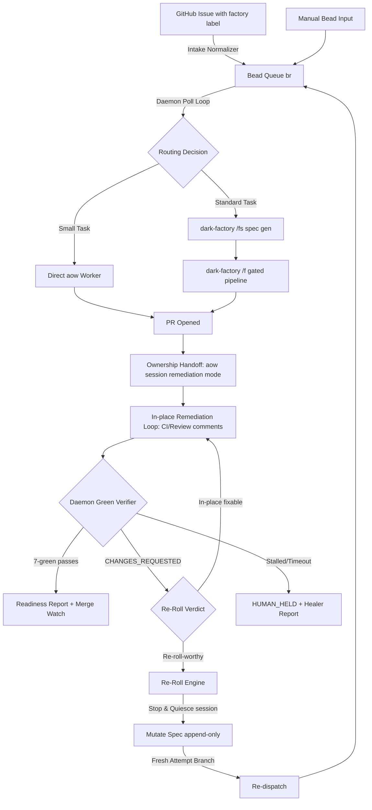

# Auto-Factory Daemon — Architectural Specification (No-Code)

**Status:** Final r3.1 — r3 + READY terminal overlay state (adversarial-review finding, 2026-07-03)
**Code status:** Declarative blueprint only — zero implementation code
**Owner repo:** dark-factory (`$DARK_FACTORY_HOME`)

---

## Executive Summary

The Auto-Factory Daemon automates the **backward-recovery path** in Level-5 automated software pipelines. When a human or automated review rejects a PR (`CHANGES_REQUESTED`), the daemon manages the feedback loop without human intervention.

### Key Tenets:
*   **Decoupled Control Planes (Single-Owner)**: To prevent concurrent write conflicts, a single active `aow` worker session owns all *in-place* commits on a branch, while the daemon exclusively performs *read-only* verification and *structural re-rolls* (branch reset, spec mutation, and re-dispatch).
*   **Wrapper-First & Discardable Components**: The daemon is implemented as a thin scheduler wrapping existing workflows. Components are designed to be discarded if upstream tools (Claude Code or `agent-orchestrator-mirror`) later absorb their functionality.
*   **Offline Fail-Safe**: If GitHub is down, agents and the daemon coordinate via a parallel local bead-file protocol to prevent pipeline stalls.
*   **7/8-Green Skeptic verification**: PRs are verified against standard SCM gates (CI, conflicts, comments, CodeRabbit) combined with adversarial Skeptic reviewer runs to ensure evidence compliance and logic correctness before release.

---

## Table of Contents

1.  [Executive Summary](#executive-summary)
2.  [Table of Contents](#table-of-contents)
3.  [System Topologies & Diagrams](#system-topologies--diagrams)
    *   3.1 [SCM and State Data Flow](#31-scm-and-state-data-flow)
    *   3.2 [Mermaid State Machine Diagram](#32-mermaid-state-machine-diagram)
4.  [Remaining Details](#remaining-details)
    *   4.1 [Component Definition, Needs, and Gaps](#41-component-definition-needs-and-gaps)
        *   4.1.1 [Intake Normalizer](#411-intake-normalizer)
        *   4.1.2 [Thin Poller (Scheduler)](#412-thin-poller-scheduler)
        *   4.1.3 [Task Router](#413-task-router)
        *   4.1.4 [SCM Observer & Verification Loop](#414-scm-observer--verification-loop)
        *   4.1.5 [Re-Roll Engine](#415-re-roll-engine)
        *   4.1.6 [Local Bead Communication Fail-Safe (Offline Mode)](#416-local-bead-communication-fail-safe-offline-mode)
        *   4.1.7 [Combined Review Fleet Orchestrator](#417-combined-review-fleet-orchestrator)
        *   4.1.8 [Hygiene & Maintenance Sweeps](#418-hygiene--maintenance-sweeps)
    *   4.2 [Detailed Specifications](#42-detailed-specifications)
        *   4.2.1 [Component Stack & Discardable Design](#421-component-stack--discardable-design)
        *   4.2.2 [Default Coder & Fallback Configuration](#422-default-coder--fallback-configuration)
        *   4.2.3 [Intake & Durable-State Split (Symphony §7 & §11)](#423-intake--durable-state-split-symphony-7--11)
        *   4.2.4 [PR Ownership & Handoff](#424-pr-ownership--handoff)
        *   4.2.5 [Verifier Gates (7/8-Green) & Evidence Floors](#425-verifier-gates-78-green--evidence-floors)
        *   4.2.6 [Re-Roll Handover, Constraint Extraction & Branching](#426-re-roll-handover-constraint-extraction--branching)
        *   4.2.7 [Spec Mutation Grammar & Overlay States](#427-spec-mutation-grammar--overlay-states)
        *   4.2.8 [Safety Envelope & Cumulative Time-Box](#428-safety-envelope--cumulative-time-box)
        *   4.2.9 [Two-Stage Pilot Deployment](#429-two-stage-pilot-deployment)
5.  [Appendix A — Adversarial Review Ledger](#appendix-a--adversarial-review-ledger)
6.  [Appendix B — Open Questions](#appendix-b--open-questions)

---

## System Topologies & Diagrams

### 3.1 SCM and State Data Flow

```text
[GitHub Issue (label: factory)]
              │  (pre-poll Intake Normalizer: issue → bead, idempotent;
              │   bead ID posted back to issue)
              ▼
[bead queue (br)]  ◀── beads may also be created directly (internal path)
              │
              ▼
[Daemon poll loop — Symphony §8 subset]   tick: reconcile (via aow session state)
              │                            → preflight → fetch candidate beads
              │                            → sort (priority asc, created_at asc)
              │                            → dispatch into free slots
              │                            Tiered cadence: fast tick for beads with
              │                            an open PR (ATTESTED), slow tick for intake.
              ▼
[Routing decision: task size/shape]   ← model judgment (ZFC), not keywords
              │
     ┌────────┴─────────┐
     ▼                  ▼
[small task]     [standard/large task]
aow worker,      dark-factory /fs → spec.md + attractor_spec.md,
direct           then /f (full gated pipeline) unless waived by routing verdict
     │                  │
     │                  │ (/f is one-shot: it exits when the PR opens)
     └────────┬─────────┘
              ▼
       [PR opened] → bead overlay state: ATTESTED
              ▼
[PR ownership handoff]  ← standard path: daemon attaches an aow session
              │            to the /f-produced branch. Small path: the
              │            dispatching aow session already owns it.
              ▼
[AO session = in-place remediation owner]  ← CI fixes, review comments,
              │                              merge conflicts (aow native loop)
              ▼
[Daemon green VERIFIER]  ← read-only each tick: 7-green assessment,
              │            evidence floor, independent-reviewer check
              │
     ┌────────┼──────────────────────────────┐
     ▼        ▼                              ▼
[7-green]  [CHANGES_REQUESTED:          [AO session stalled /
 ready +    cooldown 1 tick, then        cumulative time-box hit]
 merge-     model verdict in-place       ▼
 watch      vs re-roll]                 [HUMAN_HELD + Healer report]
              ▼ (re-roll-worthy)
             [Re-Roll Engine]
```

### 3.2 Mermaid State Machine Diagram



---

## Remaining Details

### 4.1 Component Definition, Needs, and Gaps

#### 4.1.1 Intake Normalizer
*   **Definition:** An automated parser that fetches labeled GitHub issues, checks for duplicates, creates a matching bead file (`br`), and comments on the issue with the bead ID.
*   **Need:** Translates loose human-facing interfaces into a structured, dependency-ordered queue.
*   **Gap Proof:** Neither Claude Code nor the `agent-orchestrator-mirror` repository supports intake queue priority management, bead dependency resolution, assignee tracking, or custom queue status mappings. Claude Code is a session-level CLI with no polling capabilities.

#### 4.1.2 Thin Poller (Scheduler)
*   **Definition:** A lightweight poller that scans the bead queue, claims ready items, checks concurrent workspace capacities, and triggers dispatches.
*   **Need:** Acts as the master orchestrator coordinating concurrent tasks.
*   **Gap Proof:** The mirror repository is an execution engine (it processes single sessions/PRs) but lacks a task queue scheduler, slot manager, or cross-session state coordinator. Claude Code has no daemon capabilities.

#### 4.1.3 Task Router
*   **Definition:** A ZFC-compliant LLM interface that parses task instructions to decide if they take the small path (direct worker) or the standard path (full pipeline).
*   **Need:** Optimizes token budget and reduces execution overhead for trivial changes.
*   **Gap Proof:** The mirror has no task-routing logic; it accepts a workspace and runs a session. Claude Code has no model-based pipeline routing.

#### 4.1.4 SCM Observer & Verification Loop
*   **Definition:** A verifier that polls SCM PR metadata to independently validate the 7/8-green gates, evidence floor, and review decisions.
*   **Need:** Ensures that the PR has met the rigorous evidence standards before release.
*   **Gap Proof:** While AO's native loop reacts to SCM updates within the workspace, it cannot verify the overall 7-green status, check evidence compliance, or trigger cross-attempt re-rolls. Claude Code cannot autonomously verify PR state.

#### 4.1.5 Re-Roll Engine
*   **Definition:** An automated processor that stops active worker sessions, resets branches to mainline, extracts constraints from rejection text, screens for leaks, mutates spec files append-only, and re-dispatches.
*   **Need:** Prevents context debt accumulation by executing clean branch resets.
*   **Gap Proof:** The mirror contains no branch mutation, baseline computation, or spec-editing mechanisms; its native remediation loop is strictly in-place. Claude Code has no branch-rotation or spec-mutation flows.

#### 4.1.6 Local Bead Communication Fail-Safe (Offline Mode)
*   **Definition:** A fallback communication channel allowing agents and the daemon to synchronize state using parallel bead file updates when GitHub is offline.
*   **Need:** Prevents development pipelines from stalling during remote API outages.
*   **Gap Proof:** The mirror is hard-wired to GitHub's REST/GraphQL APIs and halts on connection errors. Claude Code requires a network connection to operate and cannot coordinate offline via local filesystem queues.

#### 4.1.7 Combined Review Fleet Orchestrator
*   **Definition:** An orchestration layer that triggers the specialized reviewer agents in parallel tmux panes, allowing test execution while enforcing prompt-level read-only constraints.
*   **Need:** Delivers independent adversarial code review without excessive workspace duplication.
*   **Gap Proof:** The mirror features a single-agent review launcher but lacks a multi-agent coordinator or parallel execution harness. Claude Code is a builder agent, not a multi-agent review fleet.

#### 4.1.8 Hygiene & Maintenance Sweeps
*   **Definition:** Automatic daily/weekly cleanups that run prompt-optimization audits, prune obsolete spec constraints, and reclaim stale lock files.
*   **Need:** Prevents context-window drift and lock deadlocks.
*   **Gap Proof:** Neither the mirror nor Claude Code contains automated daily self-auditing routines, weekly constraint pruning engines, or stale lock/workspace hygiene sweeps.

---

### 4.2 Detailed Specifications

#### 4.2.1 Component Stack & Discardable Design
The stack composes three existing systems plus one new thin daemon. The composition is governed by the single remediation owner rule:
*   At any moment, exactly one control plane may write to a PR's branch. Every open factory PR is owned by exactly one `aow` session that performs all in-place remediation natively.
*   The daemon never pushes fixes alongside AO; it owns exactly two things: read-only verification (7-green assessment, evidence floor) and the re-roll decision.
*   **Discardable Design:** In alignment with the "dorodango" architecture (polish, discard, rebuild), the daemon's integration adapters are designed as loosely coupled, disposable wrappers. If Claude Code improves its built-in workflows or `agent-orchestrator-mirror` merges new features, the corresponding daemon component/plugin is discarded and replaced by the new upstream implementation. Standard interface boundaries (JSON payloads over CLI/IPC) are maintained to allow plug-and-play swaps of intake, execution, or review components.

#### 4.2.2 Default Coder & Fallback Configuration
*   **Default Coder**: The primary executing agent for implementing tasks is the **Minimax** (`minimax`) agent harness, running inside an **AO worker** (`aow`) session.
    *   *Verification Note*: The operator verified that the Go-based `agent-orchestrator-mirror` repository does not currently contain a native Go agent adapter for `minimax` under `backend/internal/adapters/agent/`. However, the fork repository `/Users/jleechan/project_agento/agent-orchestrator` has a fully functional `@jleechanorg/ao-plugin-agent-minimax` plugin. For the pilot, the minimax Go adapter must be synced from the fork, or registered dynamically.
*   **Fallback Chain**: In the event that the primary Minimax agent hits API rate limits, quota exhaustion, or execution failures, AO's native fallback chain handler (`fork-reaction-agent-fallback.ts`) automatically respawns the session using the next model/agent in the configured fallback chain (e.g. `claude-code` or `claude-sonnet`), preserving the active session context on the PR branch.

#### 4.2.3 Intake & Durable-State Split (Symphony §7 & §11)
*   **Intake contract:** The daemon's tracker adapter targets beads exclusively. REQUIRED operations, normalized to Symphony's domain model:
    1. `fetch_candidate_issues()` — `br list --status open --label factory --json`, one configured target repo.
    2. `fetch_issues_by_states(state_names)` — startup terminal cleanup.
    3. `fetch_issue_states_by_ids(ids)` — active-run reconciliation.
*   **Intake Authorization & Security**: To prevent unauthorized users from triggering execution runs, the pre-poll normalizer validates labeling events and issue creators against the SCM repository's collaborator APIs. **Write-tier** (or higher) collaborator status is required — triage-only or read-only collaborators are not authorized to trigger dispatch, because the daemon effectively escalates the issue creator's privilege to "can trigger code generation + branch creation + PR opening" via the AO session's credentials. Issues created or labeled by non-collaborators or insufficient-tier collaborators are ignored and logged for audit.
*   **GitHub intake is a separate pre-poll normalizer step**, converting issues to beads using `external-ref` = `<owner>/<repo>#<issue_number>` to ensure idempotency.
*   **Manual Bead Input:** The daemon natively supports dispatching manually created beads directly from the `br` queue. If a bead has no `external-ref`, the daemon bypasses GitHub status updates but still performs full routing, dispatching, PR creation, and re-rolling.
*   **AO Intake Integration:** AO's native `trackerintake` is disabled for factory projects to prevent duplicate spawning, while AO's session database acts as the single source of truth for active worker sessions.
*   **Durable-state split:**
    *   **Beads (`br`)** hold what humans manage: status, priority, labels, assignee, `external-ref`, dependencies.
    *   **CXDB (SQLite)** holds all machine state: overlay states, the re-roll cycle counter, the cumulative autonomy clock, reviewer verdicts, the branch-creation registry, and the per-bead task manifest (the dispatch-time task breakdown — machine state, not a separate file ledger).
*   On startup, reconciliation rebuilds in-memory state from CXDB, `br`, and the `aow` session listing.

#### 4.2.4 PR Ownership & Handoff
The single-owner rule requires every open factory PR to have exactly one AO session owner:
*   **Small path:** the dispatching `aow` session created the branch and PR; it simply keeps ownership and its native loop runs.
*   **Standard path:** `/f` is a one-shot pipeline that exits when the PR opens. At PR-open, the daemon attaches an `aow` session to the `/f`-produced branch (spawned with the bead's spec as context in remediation mode).
*   The daemon leverages the AO daemon's native `scm.Observer` loop which registers ETags, performs diffs, and fires reaction nudges for PRs owned by active sessions.

#### 4.2.5 Verifier Gates (7/8-Green) & Evidence Floors
Each fast-tick, the daemon independently evaluates the PR against the full **7/8-green** definition (as implemented in `~/.claude/commands/green.md` and `~/.claude/skills/pr-green-definition.md`):
1.  **CI Green**: All check-runs (e.g. GitHub Actions) report a `success` conclusion.
2.  **No Conflicts**: The SCM mergeable status is `true` (no git conflicts).
3.  **CodeRabbit APPROVED**: The latest review from the `coderabbitai` bot is `APPROVED`.
4.  **Bugbot Clean**: Zero error-severity review remarks from `cursor[bot]`.
5.  **Comments Resolved**: All PR review comment threads have GraphQL `isResolved` set to `true`.
6.  **Evidence Review (`/er`)**: The `/er` verification workflow/comment returns a `PASS` verdict.
7.  **Skeptic PASS**: Runs the Skeptic review loop. Under the daemon, the Skeptic review represents the combined execution of the specialized reviewer fleet:
    *   **Default Reviewer**: The default reviewer agent is the **`agy` CLI** running inside an **AO worker** session.
    *   **Evidence & General Reviewer Chain**: For the high-stakes `/er` (Evidence Reviewer) and `alignment` (General Reviewer) gates, the review execution is routed through a prioritized fallback chain:
        `codex` (running GPT-5.5) -> `claude-code` (running Sonnet) -> `agy` -> `minimax`.
        The chain distinguishes between **transient failures** (API timeouts, rate limits, 5xx errors) and **substantive failures** (model produced wrong/empty answer, context overflow). Transient failures trigger a retry of the **same** model (up to 2 retries with exponential backoff) before falling back to the next model. Substantive failures fall back immediately. This distinction avoids double-billing for retry-able failures while still guaranteeing review completion.

Additional floors and optimizations are enforced:

*   **SCM API Rate-Limit Optimization**: The verifier loop implements ETag-based conditional requests for all SCM metadata fetches. ETags are cached keyed by `(endpoint_url, auth_token)` — not just URL — because GitHub ETags are scoped to the authenticating token. The cache is invalidated on token rotation (GitHub App installation tokens expire hourly). If no changes are detected on a PR, the poll frequency dynamically backs off from the fast tier (1 minute) to a slower tier (up to 10 minutes) to conserve API quota. The daemon also honors the `X-Poll-Interval` header returned by GitHub's Events API endpoints.
*   **Evidence floor:** production diffs over 100 non-test LOC require at least Layer-2 integration evidence (real callstack, mocks only at external API boundaries). Unit-only proof is insufficient.
*   **Independent-reviewer floor:** A PR with zero independent review never reaches ready-to-merge.

#### 4.2.6 Re-Roll Handover, Constraint Extraction & Branching
*   **Verifier Outcomes:**
    *   *All gates pass* → the daemon posts a readiness summary and stops driving.
    *   *CHANGES_REQUESTED observed* → cooldown of one full poll tick, then a model call judges the feedback: *in-place fixable* vs *re-roll-worthy*. Re-roll-worthy triggers the Re-Roll Engine.
    *   *AO session stalled or dead* or *cumulative time-box exceeded* → HUMAN_HELD with a Healer report.
*   **Re-Roll Handover:**
    1. **Lock:** Acquire the per-bead lock (atomic transaction in CXDB or file lock).
    2. **Freshness guard:** Abort if review state changed.
    3. **Stop AO session & confirm quiescence (60s timeout):** The owning `aow` session is stopped through AO's session interface. The engine queries process state, confirming a terminal state and branch head SHA stability before proceeding. A **hard timeout of 60 seconds** is enforced on the quiescence confirmation. If the session has not reached terminal state with a stable HEAD SHA within that window, the re-roll is aborted and the bead parks in HUMAN_HELD — this prevents race conditions where an AO worker pushes a final commit during the quiescence check, leaving a half-pushed branch.
    4. **Baseline computation:** Fetch and compute the new baseline as the current head of the configured `base_branch`.
    5. **Fresh attempt branch:** Create `factory/<bead_id>-r<n>` from the baseline.
    6. **Ref registry:** Every branch the daemon creates is recorded in the CXDB branch registry.
    7. **Old PR closure:** The superseded PR is closed with a comment linking the new attempt branch.
    8. **Structured Telemetry:** Emit a structured lifecycle event to the observability dashboard.
*   **Constraint Extraction:** Comment text is parsed by an LLM to extract positive assertions and inhibition specs (which get priority).
    *   *Harness-First Focus:* Prioritizes identifying changes to the factory environment (codebase skills, tests, or workspace configs) over prompt-level constraints.
    *   *Holdout-leak screen:* Reviewer text is screened for holdout test internals and redacted if necessary to preserve Agent Isolation.
    *   *Circuit-Breaker:* If **≥ 2 consecutive re-rolls** on the same bead produce `CHANGES_REQUESTED` from the same reviewer citing the same semantic rejection reason (determined by output-hash similarity in CXDB), the bead halts in **HUMAN_HELD** with a Healer report diagnosing the constraint-extraction failure. This prevents the constraint-extraction LLM from silently looping through re-roll attempts on a misunderstood constraint. The Healer scope key `<owner>:<repo>:<bead_id>` groups these failures for cross-bead pattern analysis.

#### 4.2.7 Spec Mutation Grammar & Overlay States
*   **Spec mutation grammar:** The spec file for the bead is append-only. Each re-roll appends one block containing the source event, attesting reviewer, superseded attempt, extracted constraints, and raw feedback snapshot. Atomicity is guaranteed via write-temp -> fsync -> rename.
*   **Overlay States:**
    *   Pre-PR lifecycle (previously implicit, named in r3): *QUEUED* (bead accepted by intake, awaiting dispatch) -> *DISPATCHED* (worker or pipeline running, no PR yet) -> *ATTESTED* (PR open).
    *   *ATTESTED* (all 7 gates green; readiness posted) -> *READY* — terminal on the automated path; the daemon stops driving (added r3.1 so "stops driving" is a mechanized state, not a behavior note).
    *   *ATTESTED* (on PR rejection + cooldown) -> *RE_ROLL*
    *   *RE_ROLL* (on abort) -> *ATTESTED*
    *   *RE_ROLL* (on success) -> *RECOVERY*
    *   *RE_ROLL* (on failure) -> *HUMAN_HELD*
    *   *RECOVERY* (on spec validation pass) -> *REDISPATCHED*
    *   *RECOVERY* (on budget exhaustion) -> *BUDGET_HELD*
    *   *RECOVERY* (on conflict) -> *HUMAN_HELD*
    *   *BUDGET_HELD* (on reset) -> *REDISPATCHED*
    *   *HUMAN_HELD* (on human action) -> *RE_ROLL* or closed.
*   **Conflict resolution:** Mutation layers are appended in order and later layers explicitly supersede earlier ones. Contest resolution is model-judged. If a positive-vs-positive conflict is detected, the bead halts in HUMAN_HELD.

#### 4.2.8 Safety Envelope & Cumulative Time-Box
All existing operator policies bind the daemon:
*   **AO spawn cap:** **≤ 30 concurrent workers**, batches ≤ 15 (operator ao-spawn-safety policy aligned to these values 2026-07-03).
*   **Autonomy time-box:** Wall-clock autonomous processing time accumulates across a bead's entire chain. When the cumulative clock exceeds 3 hours, the bead enters HUMAN_HELD. Nothing on the automated path resets the clock.
*   **Token expenditure monitoring:** Per-bead token spend is tracked in CXDB as a monitoring metric (sum of coder tokens + reviewer chain tokens across all attempts). The daemon emits a warning to telemetry at 80% of a configurable per-bead token budget. This is a **monitoring-only** metric in Stage 1/2; it does not gate execution, since the 3hr time-box and circuit-breaker already bound runaway cost. The metric exists to inform budget decisions and detect cost anomalies before they become operator surprises.
*   **Force-push: never.** Re-rolls create fresh branches.
*   **Branch deletion:** Only refs in the daemon's own creation registry.
*   **Merge: gated via `auto-merge-guard.sh` (no-red policy).** Merge authority
    is concentrated in ONE policy engine — the auto-merge-guard — and is never
    invoked by a coder or reviewer session. Terminal states are
    `READY_FOR_MERGE` (all gates red-free, merge attempted by the guard) or
    `HUMAN_HELD` (guard refused; reason recorded). The guard enforces, per
    pass: (a) every CI check has concluded and none `failed`, (b) the latest
    `GATE_ASSESSMENT` carries no `red` gate (`unknown` is permitted — it is
    the honest signal that an infra gate such as CodeRabbit/Bugbot was
    quota-walled and never blocked on; requiring literal `all_green=true`
    would deadlock the factory on a quota wall), (c) the per-hour merge
    budget is not exhausted (cascade blast-radius cap, default 8/hr). The
    spec's earlier "Merge: never." clause is reconciled with cutover
    exit-criterion **X4** (`docs/cutover-exit-criteria.md`): the daemon does
    not perform the merge, but the **factory** does — through the guard —
    on a no-red, race-bound call. Single-writer guarantee during cutover:
    `AUTO_MERGE_DISABLED=1` silences the guard so the verifier tier has the
    daemon.jsonl to itself (cutover X7).
*   **Holdout isolation:** Sanitized environments and holdout-leak screens remain active.

#### 4.2.9 Two-Stage Pilot Deployment
*   **Runtime:** macOS launchd agent on the operator's workstation. The plist ships as a template committed to this repo (placeholder home paths, e.g. `@HOME@`), installed via an installer script — never a hand-edited file in `~/Library/LaunchAgents` with hardcoded absolute paths.
*   **Stage 1 — verifier plane only (re-roll disabled):** Intake, routing, dispatch, ownership handoff, and verifier run; re-roll verdicts are recorded but not executed (beads park in HUMAN_HELD).
*   **Stage 2 — enable the re-roll writer plane:** Enabled via a config flag after auditing Stage 1 behavior. **Prerequisites for Stage 2 enablement:**
    1.  Minimax adapter smoke test passes end-to-end in the daemon's AO session lifecycle (attach, remediate, quiesce).
    2.  Constraint-extraction fuzz run: ≥ 50 synthetic rejection comments processed without circuit-breaker false positives or holdout-leak false negatives.
    3.  Quiescence timeout validated: confirm the 60s hard timeout correctly aborts mid-push races in a controlled test.
*   **Pilot scope:** Exactly one target repo named in a single config file: `config/daemon.toml` (TOML; operational thresholds, model chains, worker caps, tick rates).
*   **Telemetry Log:** Logs structured JSON payloads to `~/Library/Logs/dark-factory/daemon.jsonl` classifying actions as human-initiated vs. automated, alongside diffs and verdicts. Event schema (one JSON object per line; for non-bead events such as `TICK`, `lifecycleState` is set to the sentinel value `"N/A"`):

    ```json
    {
      "timestamp": "2026-07-03T19:00:00.000Z",
      "beadId": "jleechan-xyz",
      "attemptId": 3,
      "lifecycleState": "RECOVERY",
      "eventType": "CONSTRAINT_MUTATION_SUCCESS",
      "metrics": {
        "consumedUSD": 6.85,
        "elapsedAutonomySeconds": 5420,
        "extractedConstraints": { "positiveAssertionsCount": 1, "inhibitionSpecsCount": 2 }
      },
      "context": { "targetBranch": "factory/<bead_id>-r<n>", "baseCommit": "<sha>", "activeModel": "minimax" }
    }
    ```

---

## Appendix A — Adversarial Review Ledger

*   **Round 1 - Consistency & Gaps:** Addressed lock lifecycles, push guards, time-box loops, and standard path PR owners (all 28 findings integrated in r2 and r3).
*   **Round 2 - Verification Pass:** Integrated manual bead scopes, offline fail-safes, and 5-whys daily auditing (all 6 findings integrated in r4).
*   **Round 2 - /advice Panel:** Opus, Cursor, and Perplexity reviews validated the branch reset strategy, split-reviewer harnesses, and prompt-enforced read-only execution (all integrated in r4 and r5).
*   **Round 3 - /advice Panel (r1→r2):** Opus, Research, and Secondo (3-perspective) reviews. 6 findings accepted, 2 adapted, 1 rejected:
    *   ✅ **ACCEPT P0-1:** Constraint-extraction circuit-breaker (≥2 same-reason re-rolls → HUMAN_HELD) — integrated in §4.2.6.
    *   ✅ **ACCEPT P0-2:** Quiescence timeout (60s hard limit on stop-and-confirm) — integrated in §4.2.6.
    *   ✅ **ACCEPT P0-3:** Intake auth tightened to write-tier collaborator minimum — integrated in §4.2.3.
    *   ✅ **ACCEPT P1-5:** Retry vs. fallback distinction in reviewer chain (transient → retry same, substantive → fall back) — integrated in §4.2.5.
    *   ✅ **ACCEPT P1-6:** ETag cache keyed by `(url, auth_token)` with token-rotation invalidation — integrated in §4.2.5.
    *   🔄 **ADAPT P1-4:** Per-feature token budget cap → monitoring-only metric (circuit-breaker + time-box already bound cost) — integrated in §4.2.8.
    *   🔄 **ADAPT P2-8:** Constraint confidence score → subsumed by circuit-breaker (P0-1) as the pragmatic detection mechanism.
    *   ❌ **REJECT P2-7:** Partial replay on re-roll — contradicts dorodango philosophy; fresh-from-zero prevents context debt by design.
*   **Round 4 - AAR of external spec variant ASF-SR-2.4 (r2→r3):** 3-reviewer /advice panel (Opus subagent, web research, agy CLI) triaged 13 deltas; 2 accepted, 4 adapted, 7 rejected:
    *   ✅ **ACCEPT:** Concrete telemetry JSON event schema — integrated in §4.2.9.
    *   ✅ **ACCEPT:** Config file named `config/daemon.toml` — integrated in §4.2.9.
    *   🔄 **ADAPT:** Pre-PR overlay states named (QUEUED/DISPATCHED before ATTESTED) — integrated in §4.2.7.
    *   🔄 **ADAPT:** Per-bead task manifest recorded in CXDB machine state, not a `.factory/tasks/` file ledger — integrated in §4.2.3.
    *   🔄 **ADAPT:** Declarative prompt contracts pinned as Appendix C (pointers, not inline prompt text; ZFC mislabel "Zero-Failure-Class" corrected to Zero-Framework Cognition; verdict grammar aligned to the runner's `pass|warn|fail`).
    *   🔄 **ADAPT:** launchd plist as repo template with placeholder paths — integrated in §4.2.9.
    *   ❌ **REJECT:** Node.js `src/` implementation layout in the spec (violates the no-code contract; stack is an implementation-phase choice).
    *   ❌ **REJECT:** `.factory/beads/` second bead store (split-brain vs the `br` ledger in `.beads/`).
    *   ❌ **REJECT:** In-place `--force-with-lease` PR rotation (violates "Force-push: never"; Renovate/Dependabot same-branch prior art noted, but their tiny-deterministic-diff model does not transfer to full re-rolls, which orphan review-comment anchors).
    *   ❌ **REJECT:** `git merge-base` baseline computation (stale fork point; research confirmed current-head-of-base is the reference design, cf. Renovate rebasing).
    *   ❌ **REJECT:** Budget hard-gate (Round 3 ADAPT P1-4 stands for Stage 1/2; research evidence that time-boxes bound wall-clock but not spend-rate is earmarked for Stage 3 reconsideration).
    *   ❌ **REJECT:** Intake auth weakened to "any collaborator" (Round 3 ACCEPT P0-3 write-tier minimum stands).
    *   ❌ **REJECT:** Omission of Round 3 items (circuit-breaker, quiescence timeout, retry-vs-fallback, ETag keying) — the variant was generated from a pre-r2 snapshot.

---

## Appendix B — Resolved Design Choices

1. **Per-Repo Spec-Directory Convention**: For repositories other than `dark-factory`, the spec directory defaults to `.factory/specs/` at the repository root. A repository may override this by specifying a custom path in its `.factory.toml` config file (e.g. `spec_path = "docs/specs/"`).
2. **Circuit-Breaker & Healer Scope Key**: The unique scope key is formatted as a colon-separated string: `<owner>:<repo>:<bead_id>`. The Healer uses this scope key as its grouping prefix, allowing failure diagnostics to compile per-bead and per-repository.
3. **AO Session-Attach Semantics**: When attaching an AO session to a branch created outside the session, the daemon invokes:
   ```bash
   aow attach --branch <branch_name> --bead <bead_id> --remediation
   ```
   This attaches the worker session directly to the target branch in remediation mode, providing the session with the spec as its initial context.

---

## Appendix C — Declarative Prompt Contracts (reference, not code)

Three LLM roles carry the daemon's judgment (ZFC: Zero-Framework Cognition — routing and feedback interpretation live in model calls, never in keyword heuristics in daemon code). Full prompt texts are implementation artifacts authored under `prompts/daemon/` at build time; this spec pins only their contracts:

1. **Task Router** — input: bead title/description, file tree, dependency map. Output JSON: `{ "routingVerdict": "SMALL_PATH" | "STANDARD_PATH", "justification": "<one sentence>" }`. Routing is model judgment over the whole task shape; no file-count or keyword rules in daemon code.
2. **Constraint Extractor + Holdout-Leak Screen** — input: rejection review text. Output JSON: `{ "inhibitionSpecs": [...], "positiveAssertions": [...], "securityRedactionEncountered": <bool> }`. Inhibition specs take precedence; holdout internals are redacted before spec mutation (§4.2.6).
3. **Skeptic Reviewer** — input: diff + spec manifest + validation history. Output verdict uses the runner's normalized grammar (`pass | warn | fail`, marker line `verdict: <token>`), plus `blockingIssues[]`. Binary `PASS/FAIL`-only schemas from external variants are non-conforming.
