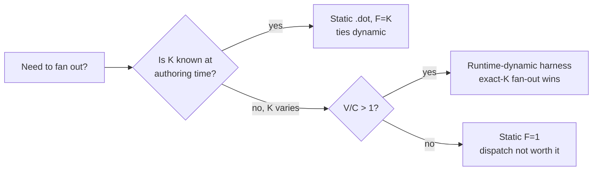

# Dynamic vs. deterministic workflow: when does a generated workflow beat a `.dot`?

The Dark Factory engine runs **static `.dot` graphs only**. Graph shape — node
count, edges, prompts — is fixed at *design time* (authored by a human or
generated once by Claude and then committed); the engine never synthesizes or
resizes a graph at *runtime*. See CLAUDE.md → "Durable artifacts vs. dorodango"
and the pipeline-execution-model notes: `.dot` files are the versioned artifact,
the runner is disposable.

So the real question is not "static vs. dynamic engine" — there is only a static
engine. The question is **where in the lifecycle dynamism pays off**, and the
honest answer, grounded in this repo's own benchmarks, is: *almost always at
authoring time, almost never at runtime, with exactly one structural exception.*

This page separates three distinct value-props for "dynamic / Claude-generated
workflow," shows which the benchmarks actually validated, and gives a concrete
recommendation. Evidence: [`benchmarks/FINDINGS.md`](../benchmarks/FINDINGS.md),
[`benchmarks/workflow_graphgen/RESULTS.md`](../benchmarks/workflow_graphgen/RESULTS.md),
[`benchmarks/dynamic_fanout/RESULTS.md`](../benchmarks/dynamic_fanout/RESULTS.md),
[`benchmarks/dynamic_fanout/SWEEP.md`](../benchmarks/dynamic_fanout/SWEEP.md).

## TL;DR — the decision table

| Situation | Approach |
|---|---|
| You will run this process more than once, or want it reviewed / versioned | **Deterministic `.dot`** (Mode A). Commit it; run it. |
| One-off / exploratory; you don't want to hand-author edges from scratch | **NL → generate, then crystallize.** Let Claude emit the graph, validate it, then save the good graph as a committed `.dot` and run that deterministically thereafter. |
| First-pass, self-contained coding task (build a file, implement a spec) | **Deterministic `.dot`.** Dynamic dispatch buys *nothing* here — benchmark-confirmed null (see value-prop 1). |
| A node needs its predecessor's output | **Deterministic `.dot`** with `${state._last_output}` in the prompt. Free today — no engine change. |
| The **number of nodes** is knowable only at runtime (fan out to exactly K discovered endpoints/columns/services) | **Runtime-dynamic harness.** The *only* case where a static graph structurally cannot do the job (value-prop 2). |
| Genuinely imperative mid-run control (escalate model on 2nd failure, branch on a parsed numeric value) | **Python / Claude harness** — plausible but **unmeasured** here; treat as a hypothesis, not a proven win (value-prop 3). |

## The three value-props (and the evidence for each)

### 1. Design-time NL→graph generation — authoring velocity, NOT runtime speed

Generating a graph from a natural-language description is a faster way to
*author* a one-off pipeline than hand-writing nodes and edges. That convenience
is real — but it is a **design-time** benefit, and it comes with two costs:

- You trade away the durable, reviewable, reusable artifact. The whole Dark
  Factory thesis (CLAUDE.md → dorodango) is that the `.dot` graph is the asset
  worth versioning; a graph that only ever exists transiently inside a generator
  call is not reviewable in a PR and not reproducible.
- You add a hallucination surface: a generator can emit invalid or contradictory
  edges. (`workflow_graphgen`'s `graph_ir.py` exists precisely to give the
  generated graph a typed, `validate()`-able IR rather than trusting raw output.)

Crucially, generation does **not** make execution faster or cheaper. See
value-prop 2's correction.

### 2. Runtime-adaptive shape (G3) — the one structurally-required case

A statically authored `.dot` has a fixed node count. If a feature exposes **K**
endpoints/columns/services discoverable only at runtime, a static graph authored
with `F` fan-out nodes can only cover `min(F, K) / K`. It cannot size itself to
K. This is the single case where dynamic dispatch is **structurally required**,
not merely stylistic.

The `dynamic_fanout` benchmark isolates this with a deterministic coder shared by
both modes (so the only variable is dispatch). Concrete measured numbers, from
[`benchmarks/dynamic_fanout/RESULTS.md`](../benchmarks/dynamic_fanout/RESULTS.md)
(n=5/cell, deterministic ⇒ conclusive):

- **`validate_k6` (K=6 > authored F=3):** static Mode A covers **0.50** conformance;
  dynamic Mode A+B covers **1.00** — but A+B spends K calls (**8 100** tokens) vs A's
  **4 050**, so A wins the *cost* axis. The trade is real and goes both ways.
- **`validate_k2` (K=2 < F=3):** both reach 1.00 conformance, but static A *wastes*
  its 3rd dispatch (**4 050** tokens) while dynamic A+B spends only **2 700** — A+B
  wins on cost by not over-provisioning.

**The breakeven rule** (from [`SWEEP.md`](../benchmarks/dynamic_fanout/SWEEP.md),
value model `net = V·covered − C·calls`):

- **Constant K (spread 0):** the best static `F = K` *ties* dynamic exactly for all
  V/C. If the endpoint count is known at authoring time, dynamic earns nothing —
  stay static.
- **K varies at runtime (spread ≥ 1):** dynamic beats the best static `F` for **any
  V/C > 1**. The knob is **K-spread, not a high value/cost ratio**: once a covered
  endpoint is worth more than one coder dispatch, exact-K fan-out wins.

So the rule is: **use a runtime-dynamic harness iff K is runtime-determined *and*
V/C > 1.** Otherwise author the static graph.

### 3. Rich per-node imperative control — plausible but UNMEASURED

The `.dot` edge language is intentionally minimal: `condition="key=value"` or
`key!=value`, with conditional edges winning over unconditional ones (CLAUDE.md →
pipeline-execution-model). Genuinely imperative mid-run logic — *escalate the
model on the 2nd failure*, *branch on a parsed numeric value*, *fan out
conditionally* — is more naturally written in a Python/Claude harness than
encoded in edges.

This is **plausible but not measured in this repo.** Both benchmarks deliberately
disabled retry/fix wiring to keep the dispatch path the only variable
(`workflow_graphgen`'s `assert_no_retry_wiring`). Treat per-node imperative
control as a hypothesis worth testing, not a validated win. Stating it honestly
is the point.

## The critical correction: the benchmark measured DISPATCH, not authoring

It is tempting to claim "dynamic workflows are faster." **At runtime that is
false**, and this repo measured it.

`workflow_graphgen` ran **real Sonnet (`claude-sonnet-4-6`) at n=10**, two
features × two modes = 40 runs, over a **byte-identical shared IR** (`graph_ir.py`
generates the middle graph once, both modes consume it). The only variable was
the *execution dispatcher*: Mode A = the static engine walking the `.dot`; Mode
A+B = a Python harness looping the same IR and calling `_codergen` per node. The
result was **no separation on any axis**
([RESULTS.md](../benchmarks/workflow_graphgen/RESULTS.md)):

- **conformance:** tied — `hello` 50/50 vs 50/50, `roman` 90/90 vs 90/90.
- **tokens:** ranges overlap (`hello` A 281 910 ± 27 175 vs A+B 281 398 ± 38 755).
- **wall_ms:** Mode A+B was **~5–9% SLOWER** (+5.3% hello, +9.2% roman) — the extra
  Python dispatch loop overhead — though sd is large so it is not formally credited.

The n=1 pilot's apparent "dynamic is cheaper" token win was **model variance**;
the `MIN_N_FOR_WINNER = 5` guard correctly refused to crown it.

So for first-pass, self-contained coding tasks, *who runs the middle* is a wash —
and if anything the dynamic dispatcher is marginally slower. **Any speed/velocity
advantage of "dynamic" lives at AUTHORING time, and it costs you the durable
`.dot` artifact.** Do not overstate runtime benefits.

Scope caveats (stated in the benchmarks, repeated here):

- `workflow_graphgen`'s null is scoped to first-pass build tasks with `${goal}`-only
  prompts. It does **not** claim equivalence on multi-pass / repair-loop / runtime-shape
  tasks — those are exactly value-props 2 and 3.
- `dynamic_fanout` token figures are a **dispatch-count model**, not metered Sonnet
  billing — they model number-of-dispatches, the quantity that actually differs.

## How to actually work: NL-bootstrap, then crystallize

The practical workflow that captures the authoring-velocity upside without
sacrificing the durable artifact (this is *dorodango*: polish, keep, version):

1. **Bootstrap with NL → graph.** For a new or exploratory pipeline, let Claude
   generate the graph from a natural-language description instead of hand-authoring
   every node and edge.
2. **Validate.** Run the generated graph through the IR `validate()` / parser
   (`parse` enforces `start` + `exit`); reject contradictory or invalid edges
   before trusting it. This closes the hallucination surface.
3. **Crystallize.** Save the good graph as a committed `.dot` under `pipelines/`,
   review it in a PR, and run it deterministically thereafter. Now it is
   reproducible, diffable, and reusable.
4. **Stay static unless you hit G3.** Thread adjacent state with
   `${state._last_output}` (free today). Reach for a runtime-dynamic harness
   *only* when node count is runtime-determined (K-spread ≥ 1) and V/C > 1.

In short: **dynamic to author, static to run** — except for the one structural
case (runtime-determined fan-out) where the engine genuinely cannot size itself
and a harness is required.
