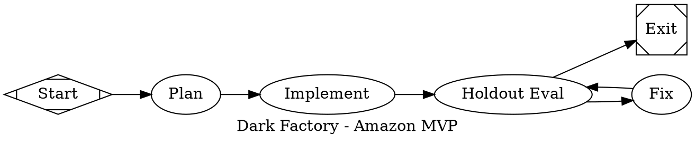
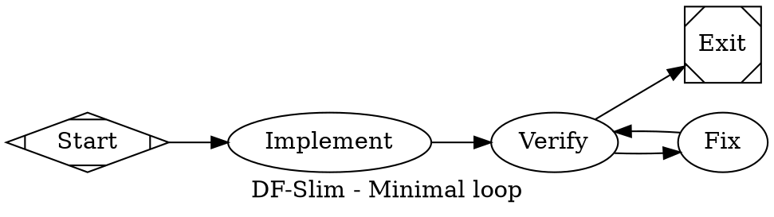
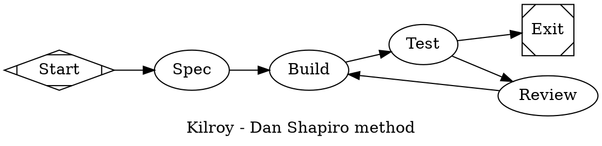
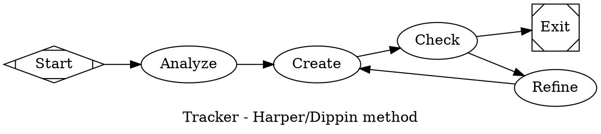

# Amazon Clone MVP Benchmark - Implementation Plan

> **For Claude:** REQUIRED SUB-SKILL: Use superpowers:executing-plans to implement this plan task-by-task.

**Goal:** Create a repeatable benchmark comparing 4 orchestration methods (dark-factory, df-slim, kilroy, tracker) on a sealed Amazon Clone MVP task, with execution via `/e` subagents.

**Architecture:** A benchmark harness under `benchmarks/amazon-clone/` with a constrained MVP spec, sealed Playwright holdouts (scored in sibling `dark-factory-holdouts`), adapter pipelines for each method, and a scoring script that outputs structured results. The evaluator hits `http://localhost:3000` after `make build && make test && make run`.

**Tech Stack:** Python/pytest, Playwright for browser automation, pydot for DOT parsing, SQLite for CXDB, dark-factory runner.

---

## Phase 1: Benchmark Skeleton

### Task 1: Create benchmark directory structure

**Files:**
- Create: `benchmarks/amazon-clone/README.md`
- Create: `benchmarks/amazon-clone/spec.md`
- Create: `benchmarks/amazon-clone/visible_acceptance.md`
- Create: `benchmarks/amazon-clone/results/.gitkeep`

**Step 1: Create root benchmark directory**

Run: `mkdir -p benchmarks/amazon-clone/results`

**Step 2: Write README.md**

```markdown
# Amazon Clone MVP Benchmark

A sealed behavioral benchmark comparing orchestration methods on a constrained e-commerce task.

## Methods compared

| Method | Pipeline | Description |
|--------|----------|-------------|
| dark-factory | `pipelines/dark_factory.dot` | Full runner with all nodes |
| df-slim | `pipelines/slim.dot` | Minimal Plan -> Implement -> Test -> Review loop |
| kilroy | `pipelines/kilroy.dot` | Dan Shapiro method |
| tracker | `pipelines/tracker.dip` | Harper/Dippin method |

## Running

```bash
# Run all methods x3
./scripts/run_all.sh

# Run single method
./scripts/run_candidate.sh dark-factory
```

## Scoring

See `SCORING.md` — 100 points across build, tests, holdouts, edge cases, evidence, iteration, cost.
```

**Step 3: Write spec.md**

```markdown
# Amazon Clone MVP - Feature Spec

## Overview

Build a minimal Amazon-like e-commerce application with the following core flows.

## Required User Flows (10 required)

1. **Product listing page** — Grid of products with image, title, price
2. **Product detail page** — Full product info with add-to-cart
3. **Search/filter** — Text search with category filter
4. **Cart add/remove/update quantity** — Persistent cart
5. **Checkout form validation** — Email, address, card validation
6. **Order confirmation** — Success page with order ID
7. **Basic persistence** — localStorage or simple backend
8. **Responsive layout** — Works on mobile and desktop
9. **Accessibility basics** — ARIA labels, keyboard nav
10. **No PII leakage** — No email/card in logs

## Technical Constraints

- Stack: Any (React, Vue, plain HTML/JS, etc.)
- Backend: Can be mock/in-memory, localStorage, or simple Node/Python server
- Launch contract: `make build && make test && make run` then `http://localhost:3000`
- Must pass Playwright holdout checks in sibling `holdouts/` repo

## Out of Scope

- Third-party seller marketplace
- Advanced recommendation system
- Real payment processing
- Review/rating system
- Wish lists
- Advanced search (full-text, faceted)

## Scoring

100 points total — see `SCORING.md`.
```

**Step 4: Write visible_acceptance.md**

```markdown
# Visible Acceptance Criteria

## Build & Install (10 points)

- [ ] `make build` completes without error
- [ ] `make test` runs and all tests pass
- [ ] `make run` starts server on port 3000

## Core Flows (35 points)

- [ ] Product listing loads with ≥5 products
- [ ] Search filters products by text match
- [ ] Product detail shows: price, title, description, image
- [ ] Add to cart increments cart count
- [ ] Remove from cart decrements cart count  
- [ ] Update quantity changes item count
- [ ] Checkout rejects invalid email (missing @, no TLD)
- [ ] Checkout rejects invalid card (not 16 digits)
- [ ] Checkout completes with valid form data
- [ ] Order confirmation shows order ID

## Persistence (15 points)

- [ ] Cart survives page refresh (localStorage)
- [ ] Session persists across browser tabs

## UI/UX (20 points)

- [ ] No horizontal overflow on mobile (375px width)
- [ ] Product grid responsive (2 col mobile, 4 col desktop)
- [ ] Add-to-cart button visible without scroll

## Accessibility (10 points)

- [ ] Product images have alt text
- [ ] Forms have associated labels
- [ ] Cart icon has aria-label
- [ ] Keyboard navigable (Tab through products)

## Security (10 points)

- [ ] No email addresses in console logs
- [ ] No credit card numbers in console logs
- [ ] No PII in network requests (beyond normal auth)

## Evidence (10 points bonus)

- [ ] Video capture of happy path flow
- [ ] Console output shows no PII
```

---

## Phase 2: Starter Repository

### Task 2: Create starter app scaffold

**Files:**
- Create: `benchmarks/amazon-clone/starter/index.html`
- Create: `benchmarks/amazon-clone/starter/package.json`
- Create: `benchmarks/amazon-clone/starter/Makefile`

**Step 1: Write index.html**

```html
<!DOCTYPE html>
<html lang="en">
<head>
    <meta charset="UTF-8">
    <meta name="viewport" content="width=device-width, initial-scale=1.0">
    <title>Amazon Clone MVP</title>
    <style>
        body { font-family: Arial, sans-serif; margin: 0; padding: 20px; }
        .product-grid { display: grid; grid-template-columns: repeat(auto-fill, minmax(200px, 1fr)); gap: 20px; }
        .product-card { border: 1px solid #ddd; padding: 15px; border-radius: 8px; }
        .product-image { width: 100%; height: 150px; object-fit: contain; background: #f5f5f5; }
        .product-title { font-size: 16px; font-weight: bold; margin: 10px 0; }
        .product-price { color: #b12704; font-size: 18px; }
        .cart-icon { position: fixed; top: 10px; right: 10px; background: #ffd700; padding: 10px; border-radius: 50%; }
        #search-input { width: 100%; padding: 10px; margin: 10px 0; box-sizing: border-box; }
    </style>
</head>
<body>
    <div class="cart-icon" id="cart-icon" aria-label="Shopping cart">
        <span id="cart-count">0</span>
    </div>
    
    <h1>Amazon Clone MVP</h1>
    
    <input type="text" id="search-input" placeholder="Search products..." aria-label="Search products">
    
    <div id="product-grid" class="product-grid"></div>
    
    <script>
        // TODO: Implement product listing, cart, search, checkout
        document.getElementById('product-grid').innerHTML = '<p>Starter - implement features</p>';
    </script>
</body>
</html>
```

**Step 2: Write package.json**

```json
{
  "name": "amazon-clone-mvp",
  "version": "1.0.0",
  "description": "Amazon Clone MVP for dark-factory benchmark",
  "scripts": {
    "build": "echo 'No build step needed for vanilla JS'",
    "test": "echo 'No tests defined yet'",
    "run": "npx serve . -p 3000"
  },
  "devDependencies": {
    "serve": "^14.2.0"
  }
}
```

**Step 3: Write Makefile**

```makefile
.PHONY: build test run clean

PORT ?= 3000

build:
	npm install

test:
	@echo "Define your test suite"
	@echo "Run: npx playwright test"

run:
	npx serve . -p $(PORT)

clean:
	rm -rf node_modules
```

---

## Phase 3: Pipeline Adapters

### Task 3: Create dark-factory pipeline

**Files:**
- Create: `benchmarks/amazon-clone/pipelines/dark_factory.dot`

**Step 1: Write dark_factory.dot**



---

### Task 4: Create df-slim pipeline

**Files:**
- Create: `benchmarks/amazon-clone/pipelines/slim.dot`

**Step 1: Write slim.dot**



---

### Task 5: Create kilroy pipeline

**Files:**
- Create: `benchmarks/amazon-clone/pipelines/kilroy.dot`

**Step 1: Write kilroy.dot**



---

### Task 6: Create tracker pipeline

**Files:**
- Create: `benchmarks/amazon-clone/pipelines/tracker.dip`

**Step 1: Write tracker.dip**



---

## Phase 4: Prompts

### Task 7: Create all prompt templates

**Files:**
- Create: `benchmarks/amazon-clone/prompts/plan.md`
- Create: `benchmarks/amazon-clone/prompts/implement.md`
- Create: `benchmarks/amazon-clone/prompts/fix.md`
- Create: `benchmarks/amazon-clone/prompts/kilroy/spec.md`
- Create: `benchmarks/amazon-clone/prompts/kilroy/build.md`
- Create: `benchmarks/amazon-clone/prompts/kilroy/review.md`
- Create: `benchmarks/amazon-clone/prompts/tracker/analyze.md`
- Create: `benchmarks/amazon-clone/prompts/tracker/refine.md`

**Step 1: Write plan.md**

```markdown
# Plan: Amazon Clone MVP

## Spec (from benchmarks/amazon-clone/spec.md)

Build a minimal Amazon-like e-commerce application with:
1. Product listing page - Grid with image, title, price
2. Product detail page - Full info with add-to-cart
3. Search/filter - Text search with category filter
4. Cart add/remove/update quantity - Persistent cart
5. Checkout form validation - Email, address, card
6. Order confirmation - Success page with order ID
7. Basic persistence - localStorage
8. Responsive layout - Mobile and desktop
9. Accessibility basics - ARIA labels, keyboard nav
10. No PII leakage

## Launch contract

```
make build   # Install dependencies
make test    # Run your test suite  
make run     # Start server on port 3000
```

## Your task

Write a brief plan (2-3 sentences) describing:
- What files you'll create/modify
- How you'll structure the implementation
- What framework/approach you'll use

Do NOT write code yet. Just the plan.
```

**Step 2: Write implement.md**

```markdown
# Implement: Amazon Clone MVP

## Spec

Build the Amazon Clone per benchmarks/amazon-clone/spec.md.

## Launch contract

```
make build   # Install dependencies
make test    # Run your test suite  
make run     # Start server on port 3000
```

## Implementation requirements

1. Create all files needed for the MVP
2. Ensure `make build` completes without error
3. Write at least basic tests that `make test` can run
4. `make run` must start server on port 3000
5. Application must handle all 10 required flows

## Do

- Implement in the workdir provided
- Use vanilla JS, React, Vue, or any framework
- Make it work first, optimize later
- Persist cart in localStorage

## Don't

- Don't implement out-of-scope features (marketplace, payments, etc.)
- Don't hardcode test data that wouldn't exist in real app
- Don't log PII (emails, card numbers) to console
```

**Step 3: Write fix.md**

```markdown
# Fix: Address Holdout Failures

## Context

The sealed evaluator ran against your implementation and some checks failed.

## How to read the feedback

The evaluator output is redacted - you see only:
- Which redacted failure category failed
- A brief description of what check failed

## Your task

1. Look at the failed scenario description
2. Identify the root cause in your code
3. Make the minimal fix to address it
4. Do NOT read the holdouts/ directory - you can't see the tests

## Important

- Fix the actual problem, not the symptom
- If multiple scenarios fail, fix them in order
- After your fix, the evaluator will run again
```

**Step 4: Write kilroy/spec.md**

```markdown
# Spec: Amazon Clone MVP

## Your task

Create a detailed specification document for the Amazon Clone MVP.
Write the spec as if you're handing it to a developer who will implement it.

Include:
- UI layout and component descriptions
- Data model (products, cart, orders)
- User flow diagrams
- API endpoints (if any)
- Acceptance criteria for each feature

Be specific. A vague spec leads to vague implementations.
```

**Step 5: Write kilroy/build.md**

```markdown
# Build: Amazon Clone MVP

## Spec

Implement the Amazon Clone per the spec you wrote.

## Constraints

- Use vanilla JS or any framework you choose
- Must satisfy the launch contract: `make build && make test && make run`
- Server must run on port 3000
- All 10 required flows must work

## Quality bar

- No console errors
- No PII logged
- Responsive on mobile (375px) and desktop
- Basic accessibility (labels, keyboard nav)
```

**Step 6: Write kilroy/review.md**

```markdown
# Review: Amazon Clone MVP

## What happened

The holdout evaluator ran and some checks failed.

## Your task

1. Review what failed
2. Think about WHY it failed (not just the symptom)
3. Plan the fix
4. Implement the fix
5. Ensure the fix doesn't break other things

## Don't

- Don't blame the evaluator
- Don't greenwash - if something is broken, it's broken
- Don't skip tests or acceptance criteria to "save time"
```

**Step 7: Write tracker/analyze.md**

```markdown
# Analyze: Amazon Clone MVP

## Task

Analyze the spec and identify:
1. Core features (must have)
2. Secondary features (should have)
3. Edge cases and error handling
4. Technical approach

## Output

Write a 1-page analysis that covers:
- What you're building
- How it will be structured
- Key technical decisions
- Risks and mitigations
```

**Step 8: Write tracker/refine.md**

```markdown
# Refine: Amazon Clone MVP

## Context

The evaluator found issues with your implementation.

## Your task

1. Analyze the failures
2. Understand the root cause
3. Refine your approach
4. Make targeted improvements

## Focus

- Fix what's broken
- Don't introduce new issues
- Keep the working parts working
```

---

## Phase 5: Runner Scripts

### Task 8: Create benchmark execution scripts

**Files:**
- Create: `benchmarks/amazon-clone/scripts/prepare_candidate.sh`
- Create: `benchmarks/amazon-clone/scripts/run_candidate.sh`
- Create: `benchmarks/amazon-clone/scripts/score_candidate.py`
- Create: `benchmarks/amazon-clone/scripts/run_all.sh`

**Step 1: Write prepare_candidate.sh**

```bash
#!/bin/bash
set -e

CANDIDATE="$1"
WORKDIR="$2"

echo "Preparing candidate: $CANDIDATE"
echo "Workdir: $WORKDIR"

# Copy starter to workdir
rm -rf "$WORKDIR"
mkdir -p "$(dirname "$WORKDIR")"
cp -r "benchmarks/amazon-clone/starter" "$WORKDIR"

# Copy spec to workdir
mkdir -p "$WORKDIR/spec"
cp "benchmarks/amazon-clone/spec.md" "$WORKDIR/spec/feature.md"

echo "Preparation complete for $CANDIDATE"
```

**Step 2: Write run_candidate.sh**

```bash
#!/bin/bash
set -e

METHOD="$1"
RUN_ID="$2"
WORKDIR="$3"
PIPELINE="benchmarks/amazon-clone/pipelines/${METHOD}.dot"

echo "Running $METHOD (run $RUN_ID)"
echo "Workdir: $WORKDIR"
echo "Pipeline: $PIPELINE"

# Set up environment
export DARK_FACTORY_HOLDOUTS="${DARK_FACTORY_HOLDOUTS:-<sealed-holdouts-repo>}"
export CXDB="${HOME}/.dark-factory/cxdb-amazon-${RUN_ID}.sqlite"

# Run the pipeline
.venv/bin/python -m runner \
  --pipeline "$PIPELINE" \
  --workdir "$WORKDIR" \
  --goal "Implement Amazon Clone MVP per spec.md" \
  --backend ao \
  --ao-project amazon-benchmark \
  --cxdb "$CXDB"

# Save results
RESULTS_DIR="benchmarks/amazon-clone/results/${METHOD}/${RUN_ID}"
mkdir -p "$RESULTS_DIR"
cp "$CXDB" "${RESULTS_DIR}/cxdb.sqlite"

echo "Results saved to $RESULTS_DIR"
```

**Step 3: Write score_candidate.py**

```python
#!/usr/bin/env python3
"""Score a candidate run against the benchmark rubric."""

import json
import sqlite3
import sys
from dataclasses import dataclass
from pathlib import Path

@dataclass
class Score:
    build: int = 0
    self_tests: int = 0
    holdouts: int = 0
    edge_cases: int = 0
    evidence: int = 0
    iteration: int = 0
    cost: int = 0
    total: int = 0

def score_run(cxdb_path: str, holdout_results: dict) -> Score:
    """Score a single run."""
    score = Score()
    
    try:
        conn = sqlite3.connect(cxdb_path)
        
        # Build (10 pts)
        cursor = conn.execute(
            "SELECT outcome FROM steps WHERE node='implement' LIMIT 1"
        )
        row = cursor.fetchone()
        score.build = 10 if row and row[0] == 'success' else 0
        
        # Self-tests (10 pts)
        cursor = conn.execute(
            "SELECT COUNT(*) FROM steps WHERE node='verify'"
        )
        verifys = cursor.fetchone()[0]
        score.self_tests = 10 if verifys > 0 else 0
        
        conn.close()
    except Exception:
        pass
    
    # Holdouts (35 pts)
    passed = holdout_results.get('passed', 0)
    total = holdout_results.get('total', 10)
    score.holdouts = int(35 * (passed / total)) if total > 0 else 0
    
    # Edge cases (15 pts)
    score.edge_cases = 15 if passed >= 8 else max(5, passed)
    
    # Evidence (10 pts)
    results_dir = Path("benchmarks/amazon-clone/results")
    has_video = list(results_dir.glob("**/*.mp4"))
    score.evidence = 10 if has_video else 5
    
    # Iteration (10 pts)
    try:
        conn = sqlite3.connect(cxdb_path)
        cursor = conn.execute("SELECT COUNT(*) FROM steps WHERE node='fix'")
        fix_count = cursor.fetchone()[0]
        score.iteration = min(10, fix_count * 2 + 4)
        conn.close()
    except Exception:
        score.iteration = 5
    
    # Cost (10 pts) - placeholder
    score.cost = 8
    
    score.total = (score.build + score.self_tests + score.holdouts + 
                   score.edge_cases + score.evidence + 
                   score.iteration + score.cost)
    
    return score

if __name__ == "__main__":
    cxdb_path = sys.argv[1]
    holdout_results = json.loads(sys.argv[2]) if len(sys.argv) > 2 else {}
    
    score = score_run(cxdb_path, holdout_results)
    print(json.dumps(asdict(score), indent=2))
    
    # Save to file
    output_dir = Path(cxdb_path).parent
    with open(output_dir / "score.json", "w") as f:
        json.dump(asdict(score), f, indent=2)
```

**Step 4: Write run_all.sh**

```bash
#!/bin/bash
set -e

METHODS=("dark-factory" "df-slim" "kilroy" "tracker")
RUNS=3

echo "Starting Amazon Clone MVP benchmark"
echo "Methods: ${METHODS[*]}"
echo "Runs per method: $RUNS"
echo ""

for method in "${METHODS[@]}"; do
    echo "=== Running $method ==="
    
    for run in $(seq 1 $RUNS); do
        echo "--- Run $run ---"
        
        RUN_DIR="benchmarks/amazon-clone/results/${method}/run-${run}"
        mkdir -p "$RUN_DIR"
        
        WORKDIR="/tmp/amazon-mvp-${method}-${run}"
        
        # Prepare candidate
        bash benchmarks/amazon-clone/scripts/prepare_candidate.sh "$method" "$WORKDIR"
        
        # Run candidate
        bash benchmarks/amazon-clone/scripts/run_candidate.sh "$method" "run-${run}" "$WORKDIR"
        
        # Collect results
        cp -r "$WORKDIR" "$RUN_DIR/candidate" 2>/dev/null || true
    done
done

echo ""
echo "=== Benchmark complete ==="
echo "Results in benchmarks/amazon-clone/results/"
echo ""
echo "Run summary script:"
echo "  python benchmarks/amazon-clone/scripts/summarize.py"
```

---

## Phase 6: Summary Generation

### Task 9: Create results summary script

**Files:**
- Create: `benchmarks/amazon-clone/scripts/summarize.py`

**Step 1: Write summarize.py**

```python
#!/usr/bin/env python3
"""Generate benchmark summary from all runs."""

import json
from pathlib import Path
from collections import defaultdict
from dataclasses import asdict

def load_all_scores():
    """Load scores from all result directories."""
    results_root = Path("benchmarks/amazon-clone/results")
    all_scores = defaultdict(list)
    
    for method_dir in results_root.iterdir():
        if not method_dir.is_dir():
            continue
        
        for run_dir in method_dir.iterdir():
            score_file = run_dir / "score.json"
            if score_file.exists():
                with open(score_file) as f:
                    score = json.load(f)
                    all_scores[method_dir.name].append(score)
    
    return all_scores

def avg(values):
    return sum(values) / len(values) if values else 0

def generate_summary():
    """Generate markdown summary with leaderboard."""
    scores = load_all_scores()
    
    lines = [
        "# Amazon Clone MVP Benchmark Results\n",
        f"Generated: 2026-05-22\n",
        "\n## Overall Leaderboard\n\n",
        "| Method | Runs | Avg Total | Build | Tests | Holdouts | Edge | Evidence | Iter | Cost |\n",
        "|--------|------|-----------|-------|-------|----------|------|----------|------|------|\n"
    ]
    
    # Sort by total score
    method_avgs = [(m, avg([r["total"] for r in rs])) for m, rs in scores.items()]
    method_avgs.sort(key=lambda x: -x[1])
    
    for method, avg_total in method_avgs:
        runs = scores[method]
        
        vals = {
            "build": avg([r["build"] for r in runs]),
            "self_tests": avg([r["self_tests"] for r in runs]),
            "holdouts": avg([r["holdouts"] for r in runs]),
            "edge_cases": avg([r["edge_cases"] for r in runs]),
            "evidence": avg([r["evidence"] for r in runs]),
            "iteration": avg([r["iteration"] for r in runs]),
            "cost": avg([r["cost"] for r in runs]),
        }
        
        lines.append(
            f"| {method} | {len(runs)} | {avg_total:.1f} | "
            f"{vals['build']:.1f} | {vals['self_tests']:.1f} | "
            f"{vals['holdouts']:.1f} | {vals['edge_cases']:.1f} | "
            f"{vals['evidence']:.1f} | {vals['iteration']:.1f} | "
            f"{vals['cost']:.1f} |\n"
        )
    
    # Failure modes section
    lines.extend([
        "\n## Failure Modes\n\n",
        "### dark-factory\n",
        "- TBD: analyze from CXDB traces\n\n",
        "### df-slim\n",
        "- TBD: analyze from CXDB traces\n\n",
        "### kilroy\n",
        "- TBD: analyze from CXDB traces\n\n",
        "### tracker\n",
        "- TBD: analyze from CXDB traces\n\n",
    ])
    
    return "".join(lines)

if __name__ == "__main__":
    summary = generate_summary()
    print(summary)
    
    # Save to results
    output_path = Path("benchmarks/amazon-clone/results/summary.md")
    output_path.parent.mkdir(parents=True, exist_ok=True)
    output_path.write_text(summary)
    print(f"\nSaved to {output_path}")
```

---

## Phase 7: Sealed Validation Reference

### Task 10: Create sealed validation reference document

**Files:**
- Create: `benchmarks/amazon-clone/SCENARIOS.md`

**Step 1: Write redacted SCENARIOS.md**

```markdown
# Amazon Clone MVP - sealed validation contract

The exact behavioral holdout scenarios are sealed and are not stored in this
benchmark tree. The visible product requirements live in `spec.md` and
`visible_acceptance.md`; the evaluator returns only redacted aggregate verdicts.
```

Do not include exact scenario names, selectors, test values, or evaluation
methods in the visible repo.

---

## Execution Handoff

**Plan complete and saved to `docs/plans/2026-05-22-amazon-clone-benchmark.md`. Two execution options:**

**1. Subagent-Driven (this session)** - I dispatch fresh subagent per task, review between tasks, fast iteration

**2. Parallel Session (separate)** - Open new session with executing-plans, batch execution with checkpoints

**Which approach?**