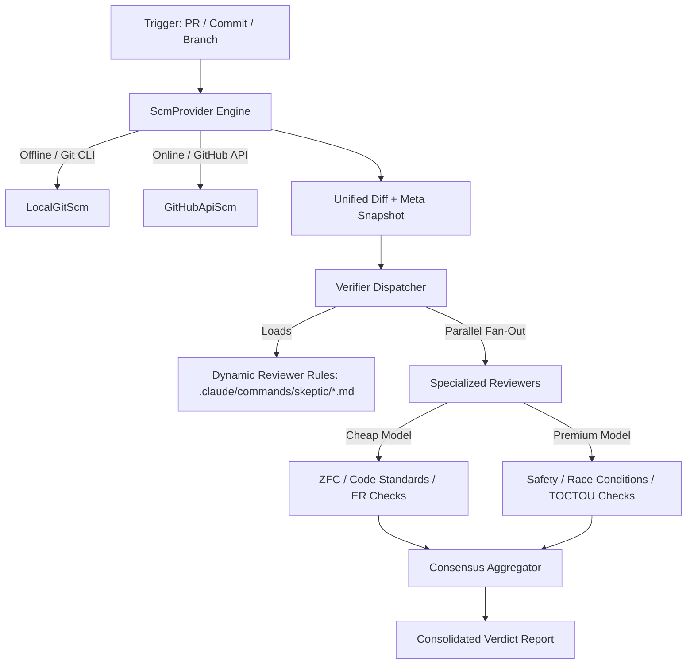

# Multi-Skeptic Reviewer Subsystem Design

**Date:** 2026-07-20
**Status:** Approved

---

## 1. Architecture Overview

To support async reviews across **PRs, local commits, or remote branches** with offline fallback and dynamic model routing, we introduce a new subsystem consisting of the following key architectural layers:



1. **ScmProvider Interface:** Declares methods to fetch the workspace diff, file lists, head commits, and metadata.
2. **LocalGitScm (Offline/Local) & GitHubApiScm (Online):** Concrete implementations of `ScmProvider`. If API calls error out or rate limits are exceeded, the provider transparently falls back to local Git operations (`git diff`, `git show`, `git log`) to generate the change context.
3. **Dynamic Rule Loader:** Parses checker files under `.claude/commands/skeptic/*.md`. Each file defines the check scope, target file globs, prompt instructions, and required model intelligence tier (e.g. `cheap` or `premium`).
4. **Verifier Dispatcher:** Spawns parallel, async checker runs routing to designated model tiers.
5. **Consensus Aggregator:** Collects the individual checker verdicts (`pass|warn|fail`) and compiles a unified `## Coder Handoff` report.

---

## 2. Components and Data Flow

### SCM Context Resolution
The `ScmProvider` accepts a target specifier (`PR:<number>`, `COMMIT:<sha>`, or `BRANCH:<name>`).
* **Online Mode (PR):** Resolves base/head refs via GitHub REST or GraphQL API and fetches the PR diff (`gh pr diff`).
* **Offline / Commit / Branch Mode:** Automatically executes:
  * `git merge-base main HEAD` to resolve the base branch ancestor.
  * `git diff <base>..<head>` to retrieve the diff content.
  * `git show <commit>` or `git show <branch>` to fetch target metadata.
* If a GitHub API call fails due to rate limits or network issues, the provider raises a transient fallback error, catching it to gracefully downgrade the SCM data source to local git commands.

### Dynamic Rule Parsing (Approach C)
The dispatcher scans `.claude/commands/skeptic/*.md`. Each file contains frontmatter metadata:
```yaml
---
id: zfc-reviewer
name: "Zero Framework Cognition Checker"
target_globs: ["**/*.rs", "**/*.py"]
model_tier: "cheap"
description: "Audit changes against ZFC guidelines"
---
```
The file body contains the prompt instructions.

### Execution & Model Routing
The dispatcher processes the rules in parallel:
* **File Filtering:** Matches changed files against the `target_globs`. Rules with zero matching files are skipped.
* **Model Selection:** 
  * `cheap` runs on lower-cost models (e.g. standard Fast/Flash models).
  * `premium` runs on reasoning/smart models (e.g. Pro/Opus-tier models).
* **Adversarial Checks:** Reviewers execute using non-self models to avoid author-bias.

### Consensus Aggregation
Each reviewer yields a structured verdict (`pass|warn|fail`). The aggregator compiles these findings:
* **Fail-Closed:** If any specialized reviewer returns `fail`, the overall gate is `Red(reasons)`.
* **Consolidated Handoff:** Generates a unified output containing blockings, warnings, and code references.

---

## 3. Error Handling and Resilience

### Error Handling and Resilience
* **Transient API Failures:** If a call to GitHub's REST/GraphQL API fails with rate limits (403/429) or network timeouts, the dispatcher automatically switches to **Offline mode** via local Git command execution, raising warnings in telemetry instead of crashing the run.
* **Model Outages & Unparseable Verdicts:** If a reviewer model times out or returns an unparseable response, it does not fail the review. Instead, the dispatcher catches the error, retries with the next vendor in the priority queue (e.g. falling back from `claude` to `gemini`), or logs an `Unknown` verdict.
* **Circuit Breakers:** We implement a change-hash tracking system. If the PR diff and reviewer feedback have not changed compared to the prior attempt, the circuit breaker halts further async reviews and parks the task as `HUMAN_HELD` to prevent infinite token-maxing loops.

### Testing Strategy
* **Unit Tests:** 
  * Mock `ScmProvider` implementations to test that the dispatcher handles correct file filters, target globs, and model-tier mapping.
  * Unit tests validating that frontmatter parser correctly extracts `model_tier` and `target_globs`.
* **Integration Tests:** 
  * Run reviews on a local test git repository branch to verify SCM provider resolves local diffs correctly without any network or API dependencies.
  * Simulate API rate-limiting errors to assert transparent fallback to local Git commands.
* **Dry-Run CLI Interface:** 
  * Run `ao skeptic verify --dry-run` or similar CLI wrapper to output the parsed prompts and targeted models to stdout for human inspection without committing reviews.

---

## 4. Rule Scoping & Multi-Repo Configurations

To support both **standard (global) reviewers** and **repo-specific reviewers**, the rule loader will merge rules from two distinct directories:

### Directory Structure
1. **Global Reviewers (Standard):** Placed in the `dark-factory` repository under a central configuration directory:
   * Location: `$DARK_FACTORY_HOME/config/skeptic/*.md`
   * These enforce standard, universal checks (e.g. ZFC, basic test coverage, and documentation rules).
2. **Repo-Specific Reviewers:** Placed in the target repository being reviewed:
   * Location: `<target-repo-root>/.claude/commands/skeptic/*.md`
   * These enforce repository-specific constraints (e.g. project conventions, custom mutation settings, or framework-specific guidelines).

### Merging & Overriding Logic
* **Discovery:** The verifier scans both the global directory and the local workspace directory.
* **ID Resolution & Deduplication:** Rules are keyed by their unique `id` defined in the frontmatter.
* **Override Priority:** If a local repository defines a rule with the same `id` as a global rule, the repo-specific rule takes priority and overrides the global one. This allows individual repositories to customize or relax standard checks (e.g. customized ZFC rules or target-glob adjustments).
* **Merging Strategy:** If no ID conflict exists, the loader merges the rule lists, executing both standard and custom reviews in parallel.
