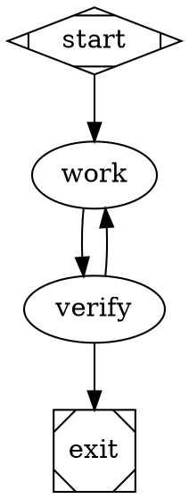
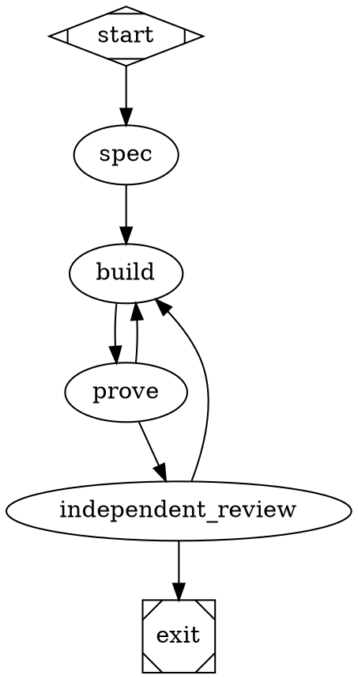

# Slim and Feature Repo-Contract Factory Design

**Date:** 2026-07-30

**Status:** Approved for implementation planning after adversarial contract review

**Owning repository:** `jleechanorg/dark-factory`

**First consumer:** `jleechanorg/worldarchitect.ai`

**WorldArchitect tracking bead:** `rev-k2x14`

## Summary

Dark Factory will provide a repo-agnostic controller that selects one of two
small, bounded pipelines:

- a four-node `slim` pipeline for simple work; and
- a six-node `feature` pipeline for new or higher-risk features.

The target repository owns its commands, evidence requirements, and graph
selection policy in a checked-in manifest. Dark Factory owns orchestration,
typed receipts, exact-head validation, ownership fencing, bounded repair,
suspension, and checkpoint/resume.

The primary design constraint is termination. A run gets at most one repair
pass. External waits suspend without consuming that pass, and no agent process
polls while suspended. A second coder-caused failure produces
`BLOCKED_WITH_PROOF`, not another loop.

This design replaces an implicit, agent-driven collection of hooks and prose
instructions with a small state machine whose transitions are backed by
machine-validated receipts.

## Problem

The level-up lane represented by
[WorldArchitect PR 8489](https://github.com/jleechanorg/worldarchitect.ai/pull/8489)
demonstrated that guidance alone cannot coordinate a long-running PR safely.
Repeated head movement, duplicate writers, stale worktree-to-PR mappings,
external reviewer throttling, and evidence that existed but explicitly failed
all allowed the coding loop to continue without approaching a merge-ready
state.

The failure was not simply "the agent needed a better prompt." The system
lacked durable ownership, a finite transition budget, typed failure ownership,
and a distinction between work that needs a code repair and work that is
waiting on an external actor.

## Goals

1. Give simple changes a short, inexpensive path with no unnecessary nodes.
2. Give new features separate specification, behavioral proof, and independent
   review stages.
3. Let each target repository define its own executable quality contract
   without copying orchestration code.
4. Prevent duplicate writers and stale-head evidence from being accepted.
5. Bound coding to an initial pass plus one repair pass.
6. Suspend external waits without keeping an agent alive or spending the
   repair budget.
7. Resume from durable checkpoints without repeating completed work.
8. Produce a complete, inspectable blocker package when the run cannot finish.

## Non-goals

- Replacing repository-specific test, evidence, or review systems.
- Inferring success from prose, linked artifacts, or process exit status alone.
- Encoding semantic intent with keyword routing or hand-tuned scoring.
- Automatically merging a pull request.
- Supporting arbitrary unbounded graph loops.
- Replacing existing pipelines before replay and live rollout prove this
  controller.
- Using a long-lived agent to poll GitHub or other external services.

## Ownership Boundary

### Dark Factory owns

- structured model routing to `slim` or `feature`;
- the explicit `--pipeline` override;
- manifest parsing and version validation;
- generic node handlers for `work`, `spec`, `build`, `prove`, and
  `independent_review`;
- run admission and target identity resolution;
- durable PR ownership and fencing tokens;
- typed receipt validation;
- exact-head binding and head freeze/unfreeze transitions;
- attempt and budget accounting;
- checkpointing, suspension, resumption, and terminal states; and
- stable error codes and blocker artifacts.

### The target repository owns

For WorldArchitect, the first checked-in contract is:

```text
dark-factory/
├── factory.toml
└── pipelines/
    ├── factory_slim.dot
    └── factory_feature.dot
```

The target repository manifest names executable actions, expected receipt
classes, retry policy, and profile composition. The target repository's `.dot`
files declare the approved topology. Repository instructions continue to
define what "test," "behavioral proof," "evidence," and "independent review"
mean.

The acceptance contract is loaded from the target PR's trusted base SHA, not
from the writer-controlled head. Dark Factory stores the manifest and graph
digests in the run checkpoint and every receipt. A writer may change the files
on its branch, but those changes cannot weaken the active run's contract.
Policy changes take effect only after they land on the trusted base and a new
run is admitted. The PR that introduces these files is therefore verified by
the prior trusted policy, not by the policy it proposes.

The target repository does not implement its own ownership, retry, or resume
controller.

## Pipeline Selection

The user-facing slash command is a thin adapter:

```text
/f [--pipeline slim|feature] <goal>
```

It performs syntax parsing only and invokes the new controller namespace:

```text
dark-factory controller run --profile auto|slim|feature ...
```

The existing `dark-factory --pipeline <dot-path>` interface remains unchanged
for legacy graphs. The slash adapter maps its `--pipeline` spelling to the
controller's `--profile`; it does not resolve a literal `.dot` path or classify
the goal.

Selection has two inputs:

1. an optional explicit operator override; and
2. a structured model decision when no override is present.

The explicit override wins:

```text
/f --pipeline slim
/f --pipeline feature
```

Without an override, the Dark Factory controller calls the configured model
backend once. The router receives the requested change, trusted repository
instructions, changed-file context when available, and the two profile
definitions. It returns only:

```json
{
  "pipeline": "slim",
  "rationale": "Localized behavior-preserving change with a narrow proof surface."
}
```

`pipeline` must be exactly `slim` or `feature`. The router call uses the
existing backend/provider resolution, a versioned prompt, a strict output
schema, and the controller's normal model timeout. Provider failure, timeout,
invalid output, or unparseable output fails closed before a writer is launched.
The rationale is recorded for audit but is not parsed to control the run.

The application must not add keyword lists, regex intent detection, weighted
scoring, file-count thresholds, or other deterministic semantic classifiers
for this choice.

## Pipeline Topology

Admission, identity resolution, ownership, and checkpoint operations are
run-boundary mechanics. They are deliberately not graph nodes.

### Slim: exactly four nodes



Node sequence:

```text
start -> work -> verify -> exit
```

`work` may be visited at most twice: the initial coding pass and one repair
pass. Handler-level retries are disabled. `verify` executes the manifest's
ordered `profiles.slim.verify` actions and validates their receipts.

The controller consumes the shared repair budget before returning
`outcome=failure` to the graph. If the budget is already consumed, or if the
result is suspended or terminal, the controller persists that state and stops
before edge selection. `max_visits="2"` is a second, graph-level safety net.

### Feature: exactly six nodes



Node sequence:

```text
start -> spec -> build -> prove -> independent_review -> exit
```

`build` may be visited at most twice and has no handler-level retry.
`prove` and `independent_review` share one controller-owned repair counter; a
failure in either stage cannot create a second repair allowance. The consumed
counter survives resume, takeover, policy invalidation, and process restart.
The reviewer must be independent of the writer.

`verify` and `prove` are composite node handlers, not hidden agent loops. Their
manifest actions execute in order, each action emits its own receipt, and the
composite stops at the first non-pass. Graph audit expands each composite into
its ordered action list and applies the same holdout, evidence, reviewer, and
cycle rules it applies to explicit nodes. The operator-facing graphs retain
exactly four and six nodes, including `start` and `exit`; implicit nodes and
subgraph-added nodes are forbidden.

Writer nodes (`spec`, `work`, and `build`) have a narrower output contract.
Only a controller-validated deliverable receipt—spec artifact for `spec`, or a
commit proposal for `work`/`build`—returns `outcome=success` and reaches the
unconditional next edge. A non-success writer result is intercepted before
edge selection and becomes a bounded infrastructure retry, a human blocker,
or `BLOCKED_WITH_PROOF` according to an independent structured ownership
decision. It never advances and does not consume the proof-stage repair
budget. `spec` has one visit; only repairable implementation writers
`work`/`build` have two visits.

## Repository Manifest

WorldArchitect's initial manifest shape is:

```toml
schema_version = 1
controller_api_version = 1

[actions.test]
kind = "tool"
argv = ["./run_tests.sh"]
cwd = "."
timeout_seconds = 600
receipt_class = "test"

[actions.holdout]
kind = "holdout_eval"
timeout_seconds = 600
receipt_class = "behavioral_proof"

[actions.evidence]
kind = "slash"
name = "es"
timeout_seconds = 600
receipt_class = "evidence"

[actions.review]
kind = "slash"
name = "er"
timeout_seconds = 600
receipt_class = "independent_review"

[controller]
infra_retry_attempts = 1
suspension_max_age_seconds = 86400
artifact_retention_days = 30

[profiles.slim]
verify = ["test", "holdout", "evidence", "review"]
repair_passes = 1

[profiles.feature]
prove = ["test", "holdout", "evidence"]
review = ["review"]
repair_passes = 1
```

This is a contract, not a shell-script dumping ground:

- every referenced action must exist;
- `schema_version` must be supported;
- `controller_api_version` must match a behavioral API major supported by the
  running controller;
- each action has a known execution kind;
- each action names the receipt class it must produce;
- a profile may not request more than one repair pass in v1; and
- the controller rejects unknown keys that could silently change safety
  behavior.

`tool` actions use an argv array, a repository-relative working directory, a
controller-enforced timeout, a sanitized environment, and an explicit
environment-variable allowlist when needed. Shell command strings are
forbidden. `slash` names resolve only through controller-owned slash adapters.
`holdout_eval` has no target-controlled command or path: it invokes Dark
Factory's sealed holdout handler, and the writer cannot read its definitions or
expected results.

The slim profile retains the holdout-always rule. It also includes evidence so
it cannot bypass WorldArchitect's `/es` requirement for production changes.
For an eligible docs-only, test-only, or otherwise non-production change, the
evidence adapter may issue a typed `PASS` receipt with
`claim_class="non_production"` and a policy-grounded `N/A` rationale; the gate
is still executed and recorded.

The manifest identifies actions and receipt classes. It does not decide
whether behavior is correct. That semantic judgment remains with the
repository's test, evidence, holdout, and independent-review implementations.
This v1 controller manifest is distinct from the existing `.factory.toml`,
`dark-factory.yaml`, and `.dark-factory/evidence.yaml` contracts. Those files
continue to serve legacy handlers until an explicit migration; no filename is
silently reinterpreted.

Legacy pipelines remain entirely outside the new controller receipt path.
Their existing `Result` objects retain their current semantics, but a generic
`Result(outcome="success")` can never be converted into a v1 typed `PASS`.
The new profiles use dedicated controller adapters for every action and writer
node. Migration of an existing handler requires a class-specific adapter with
trusted capture, semantic validation, issuer provenance, and explicit failure
mapping; a generic compatibility adapter is forbidden.

## Run Admission and Ownership

V1 requires an existing non-default branch. A PR is optional at admission so a
new feature can run `spec` and `build` before its first draft PR exists. The
active subject is keyed by canonical repository plus branch ref; when a draft
PR exists or is created after the first controller-mediated push, its number is
atomically bound to the same run and also becomes unique.

Before the graph starts, Dark Factory:

1. resolves the canonical repository identity;
2. resolves the branch, optional PR number, base SHA, and current head SHA;
3. loads and validates the target repository manifest and graph from the base;
4. selects the profile or validates the explicit override; and
5. in one CXDB transaction, creates the initial checkpoint, acquires the unique
   active-subject row, and allocates a monotonically increasing fencing token.

The transaction has unique constraints for active `(repository, branch)` and
active `(repository, pull_request)` subjects. It uses compare-and-swap on the
fencing generation. A crash cannot publish ownership without a resumable
checkpoint.

Duplicate invocation behavior is explicit:

| Existing state | Same goal/profile/digests | Different goal/profile/digests |
| --- | --- | --- |
| active | attach read-only to live run | reject; require explicit takeover |
| suspended | resume from checkpoint | reject; require explicit takeover or new run |
| terminal success | display terminal artifact | require `--new-run` |
| `BLOCKED_WITH_PROOF` | display blocker artifact | require `--new-run` |

An explicit takeover requires an authenticated operator principal and a
recorded reason. It is legal only after the current owner explicitly releases
the run, the active owner's controller-issued lease expires without a valid
heartbeat, or the run is suspended. The lease expiry and heartbeat sequence
are machine fields in CXDB, not a prose or process-list heuristic. Takeover
increments the fencing token but never resets `repair_passes_used`. Terminal
runs are tombstoned and release the active-subject row; they remain queryable
and are not silently resumed.

Workers receive no remote-write credentials. They may edit only their isolated
worktree. The controller owns commit and push. Every branch update is a
compare-and-swap operation over:

```text
repository + ref + expected_old_sha + proposed_new_sha + run_id + fencing_token
```

The controller rejects the update if any field is stale and pushes with the
equivalent of an exact expected-old-SHA lease. This is how fencing prevents a
stale worker from mutating the remote branch rather than merely noticing the
mutation afterward.

The initial implementation supports one active run per branch/PR. Broader
cross-PR scheduling is outside v1.

## Typed Receipts

Every executable action produces a receipt with this minimum envelope:

```json
{
  "schema_version": 1,
  "receipt_id": "receipt-...",
  "run_id": "run-...",
  "node": "prove",
  "action_id": "holdout",
  "receipt_class": "behavioral_proof",
  "attempt": 1,
  "subject": {
    "repo": "jleechanorg/worldarchitect.ai",
    "pr": 8489,
    "branch": "feature/example",
    "head_sha": "<40-character SHA>"
  },
  "policy": {
    "manifest_sha256": "<checksum>",
    "graph_sha256": "<checksum>"
  },
  "issuer": {
    "role": "holdout",
    "session_id": "session-...",
    "backend": "dark-factory-holdout",
    "model": null
  },
  "outcome": {
    "verdict": "FAIL",
    "owner": "CODER",
    "failure_code": "BEHAVIORAL_PROOF_FAILED"
  },
  "semantics": {
    "scenarios_total": 3,
    "scenarios_passed": 2,
    "scenarios_failed": 1
  },
  "artifacts": [
    {
      "kind": "log",
      "uri": "<durable artifact URI>",
      "size_bytes": 1234,
      "sha256": "<checksum>"
    }
  ],
  "execution": {
    "started_at": "RFC3339 timestamp",
    "finished_at": "RFC3339 timestamp",
    "adapter": "holdout_eval/v1"
  },
  "fencing_token": 3,
  "controller_mac": "<authenticated canonical-envelope MAC>"
}
```

Raw tools, models, and workers do not issue trusted receipts. A
controller-owned adapter executes the action, captures its raw result, assigns
the issuer principal, computes artifact hashes, adds the active identity and
policy fields, validates class-specific semantics, and stores the envelope
atomically in CXDB. External adapters return through a controller-owned file
descriptor or atomic result path; the worker cannot write the receipt table or
read the controller MAC key.

Required semantic payloads are versioned by receipt class:

- `test`: argv, exit code, tests collected/passed/failed/skipped, and raw log;
- `behavioral_proof`: sealed suite identity, scenario totals, failures, and
  holdout artifact;
- `evidence`: claim class, evidence verdict, covered claims, artifact bundle,
  and exact-head binding; and
- `independent_review`: reviewer verdict, blocking findings, reviewer backend,
  model, session, and isolation declaration.

An artifact that exists but whose semantic verdict is `FAIL` cannot produce a
`PASS` receipt.

Required validations:

- schema version and required fields;
- receipt class matches the manifest action;
- `run_id`, node, and attempt match the active checkpoint;
- repository, branch, exact head SHA, and PR when bound match the frozen
  subject;
- manifest and graph digests match the trusted active policy;
- fencing token matches the active owner;
- action adapter, issuer role, and session are authorized for the receipt
  class;
- an independent-review issuer differs from the writer in session and backend
  vendor, and the reviewer receives no writer prompt, plan, or hidden
  transcript;
- verdict, owner, and failure code form a legal combination;
- class-specific semantic fields are internally consistent; and
- required artifacts are durable, retained by policy, and their size and
  checksums are recomputed by the controller.

A URL, natural-language claim, log fragment, or zero exit code is not by
itself a successful receipt. A malformed, stale, mismatched, or missing
producer result causes the controller to issue `UNKNOWN + INFRA` with a stable
adapter error code; it never yields `PASS`.

## Outcome and Failure Model

The controller uses two independent dimensions:

### Verdict

- `PASS`
- `FAIL`
- `BLOCKED`
- `UNKNOWN`

### Owner

- `NONE`: required for `PASS`; no remediation owner exists.
- `CODER`: the current change can reasonably be repaired in the branch.
- `EXTERNAL`: a remote system or reviewer has not produced a terminal result.
- `HUMAN`: a decision or authorization is required.
- `INFRA`: the execution environment failed independently of the code change.

For receipts emitted by `verify`, `prove`, and `independent_review`, the
complete legal transition table is:

| Verdict | Owner | Transition | Repair budget |
| --- | --- | --- | --- |
| `PASS` | `NONE` | advance | unchanged |
| `FAIL` or `UNKNOWN` | `CODER`, repair unused | return `outcome=failure` to the graph with the receipt | consume the single repair |
| `FAIL` or `UNKNOWN` | `CODER`, repair used | `BLOCKED_WITH_PROOF` | exhausted |
| `UNKNOWN` | `EXTERNAL` | suspend until a deduplicated completion event or deadline | unchanged |
| `FAIL` | `EXTERNAL` | `BLOCKED_WITH_PROOF` | unchanged |
| `FAIL`, `UNKNOWN`, or `BLOCKED` | `HUMAN` | `BLOCKED_WITH_PROOF` | unchanged |
| `FAIL` or `UNKNOWN` | `INFRA` | use the controller's bounded infrastructure retry, then `BLOCKED_WITH_PROOF` | unchanged |
| `BLOCKED` | `CODER`, `EXTERNAL`, or `INFRA` | `BLOCKED_WITH_PROOF` | unchanged |

All other verdict/owner pairs are illegal. In particular, `PASS` with any
owner other than `NONE`, or `UNKNOWN` with `NONE`, is converted by the
controller into `UNKNOWN + INFRA / INVALID_RECEIPT_COMBINATION`.

Writer-node receipts follow the narrower contract defined under Pipeline
Topology: valid deliverable `PASS + NONE` advances; mechanistic infrastructure
failure gets the one infrastructure retry; `UNKNOWN + EXTERNAL` may suspend;
all other non-pass outcomes terminate `BLOCKED_WITH_PROOF` before graph edge
selection. Writer failure never spends or replenishes the proof-stage repair
budget.

Ownership provenance is adapter-specific:

- the tool adapter records structured process/test facts but does not infer
  causal ownership from a nonzero exit;
- launch, timeout, missing executable, or capture failures may be assigned
  `INFRA` because they are direct process-state facts;
- test, holdout, evidence, and writer failures use their trusted structured
  producer classification or one independent model ownership call over the
  raw result and run context;
- external-event adapters may issue only `EXTERNAL`;
- human approval adapters may issue only `HUMAN`; and
- an independent reviewer may make the semantic `CODER|EXTERNAL|HUMAN`
  judgment through its structured schema, with its principal recorded.

The ownership model returns only `owner` and `rationale` through a strict
schema. Its principal and prompt digest are recorded. Invalid output becomes
`UNKNOWN + INFRA`; there is no keyword, regex, exit-code, or scoring fallback.
The writer cannot assign ownership. Dark Factory does not infer ownership by
scanning prose.

## Head Binding

The controller freezes the PR head before `verify` in the slim pipeline and
before `prove` in the feature pipeline.

While frozen:

- all receipts must name that exact SHA;
- a new remote head invalidates in-flight results; and
- no successful terminal state can be emitted for another SHA.

A coder-owned failure explicitly unfreezes the head for the one repair pass.
After the repair is pushed, Dark Factory resolves and records the new head,
then freezes it again before re-running proof.

External suspension does not unfreeze the subject automatically. On resume,
the controller first compares the live head with the checkpoint. A head move
not produced by the active controller CAS is an ownership conflict and emits
`BLOCKED_WITH_PROOF`; it is not guessed into an automatic restart. A
controller-mediated repair records the new head and resumes at `verify` for
slim or `prove` for feature. It does not revisit `work` or `build`, and it
never restores a consumed repair pass.

## Checkpoint, Suspension, and Resume

After every accepted transition, the controller durably records:

- run and owner identity;
- fencing token;
- selected pipeline and routing rationale;
- target repository, optional PR, branch, base SHA, and frozen head;
- manifest, graph, router-prompt, and action-adapter digests;
- current node and completed nodes;
- action receipts;
- writer attempt count and repair budget;
- infrastructure retry counters; and
- suspension reason, deadline, event cursor, or terminal result.

Suspension is a durable state, not a sleeping process. The coding agent exits.
The run retains ownership and may be resumed by:

- a registered GitHub event carrying a new delivery ID;
- completion of the exact registered external action; or
- a later `/f` invocation.

Every external action has an idempotency key derived from
`run_id + node + action_id + attempt + head_sha`. Event delivery IDs and the
last remote cursor are persisted, so replayed events cannot execute an action
again. Suspension expires after the trusted manifest's
`suspension_max_age_seconds` and emits `BLOCKED_WITH_PROOF`; it cannot retain
ownership forever.

Resume revalidates the ownership token, live PR identity, head, policy digests,
and adapter versions before continuing from the checkpoint. With identical
head and digests, completed nodes are not repeated. A controller-mediated
repair resumes at the profile's proof node. Any other head movement blocks.
Manifest, graph, router-prompt, or adapter drift emits
`BLOCKED_WITH_PROOF / POLICY_DRIFT`; v1 does not attempt semantic dependency
inference.

The design does not use Stop-hook self-continuation, agent-driven polling,
prose-output hashes, or "three identical runs" heuristics.

## Terminal Results

### Success

A run succeeds only when every required node for the selected profile has an
accepted `PASS` receipt for the exact frozen head.

Success does not imply merge authorization. It means the repo-defined factory
contract is satisfied for that SHA.

### `BLOCKED_WITH_PROOF`

When the repair budget is exhausted or a human-owned blocker is reached, the
terminal artifact contains:

- run, repository, PR, branch, and exact head SHA;
- selected pipeline and routing rationale;
- completed nodes and accepted receipt IDs;
- the failing receipt and stable failure code;
- writer and reviewer attempt counts;
- exact commands or actions run;
- artifact URIs and checksums;
- current owner and fencing token;
- why no further automatic transition is legal; and
- a concrete recommended next action and responsible owner.

This artifact must be sufficient for a new operator to continue without
reconstructing the prior agent transcript.

## Security and Isolation

- Holdout definitions and expected results remain inaccessible to the writer.
- The independent reviewer is not the writer process and receives immutable
  exact-head context.
- Reviewer selection excludes the writer's backend vendor. If no independent
  backend is available, the action blocks; it does not shop among reviewers
  after a real verdict.
- Only the active fencing token may publish receipts or branch mutations.
- Commands execute through existing Dark Factory node handlers and policy
  boundaries; the manifest is not evaluated as arbitrary controller code.
- Receipt artifacts are content-addressed or checksummed.
- Secrets are never embedded in manifests, receipts, prompts, or blocker
  packages.

## Required Verification

### Manifest and graph contracts

- accept the supported v1 manifest;
- reject unsupported versions, unknown keys, missing actions, and receipt-class
  mismatches;
- prove `factory_slim.dot` has exactly four nodes;
- prove `factory_feature.dot` has exactly six nodes; and
- reject implicit/subgraph-added nodes, missing `condition` attributes on
  branching decision edges, writer-node `max_retries != 0`, `spec` bounds
  other than `max_visits=1`, `work`/`build` bounds other than
  `max_visits=2`, and graph/profile combinations that introduce another repair
  cycle;
- expand composite actions during audit and require sealed holdout, evidence,
  and an independent reviewer for every implementation-bearing profile;
- reject shell strings, path traversal, unapproved environment variables, and
  target-controlled holdout commands; and
- prove the active policy is loaded from and digest-bound to the trusted base.

### Routing

- explicit `--pipeline` always wins;
- valid structured model output selects the named profile;
- router timeout, provider failure, schema failure, and invalid model output
  fail closed; and
- no deterministic keyword or scoring fallback is used.

### Slim lifecycle

- first-pass success exits;
- a non-pass `work` receipt is intercepted and cannot advance to `verify`;
- one coder-owned verification failure permits exactly one repair;
- repaired success exits;
- a second coder-owned failure emits `BLOCKED_WITH_PROOF`; and
- an external unknown suspends without consuming repair;
- the sealed holdout and evidence actions cannot be omitted; and
- a non-production evidence `N/A` is still a typed, policy-grounded receipt.

### Feature lifecycle

- specification, build, proof, and independent review execute in order;
- non-pass `spec` or `build` receipts are intercepted before their
  unconditional graph edges;
- a proof failure and a review failure draw from the same one-repair budget;
- independent review cannot be satisfied by the writer's session or backend
  vendor;
- resume does not repeat completed work; and
- a second coder-owned failure emits `BLOCKED_WITH_PROOF`.

### Identity and concurrency

- duplicate `/f` resumes or attaches to the existing PR run;
- simultaneous admission produces one active run and one attachment;
- explicit takeover increments the fencing token;
- takeover, restart, and resume preserve consumed repair and infrastructure
  budgets;
- stale fencing tokens cannot publish receipts or mutate the branch;
- wrong-repository, wrong-PR, wrong-head, malformed, and stale receipts are
  rejected;
- spoofed issuers, writer-issued reviewer receipts, checksum mismatches, and
  illegal verdict/owner pairs fail closed;
- branch updates use exact expected-old-SHA compare-and-swap;
- unmediated head movement blocks rather than guessing a restart;
- checkpoint corruption and policy/adapter drift emit stable blocker codes;
- duplicate event deliveries and repeated `/f` calls do not repeat an external
  action; and
- suspension deadline expiry releases active ownership through a terminal
  tombstone.

### Action adapters

- tool success, nonzero exit, launch failure, timeout, and malformed capture
  produce the correct trusted receipt or controller error;
- nonzero tool/test failure ownership comes from a structured producer or
  independent model call, never the exit code alone;
- slash adapter success, explicit failing evidence, malformed model output, and
  provider timeout are distinguished;
- controller recomputation catches artifact size and checksum tampering;
- each receipt class rejects missing or inconsistent semantic fields; and
- legacy pipelines remain unchanged outside the controller, while generic
  legacy `Result` objects are rejected by the typed-receipt path.

### Regression replay

A recorded, read-only replay of WorldArchitect PR 8489 is a checked-in,
immutable fixture bundle containing the source event sequence, initial base and
head SHAs, policy digests, normalized action results, expected receipt
sequence, expected transition trace, mutation-denial marker, and
`checksums.sha256`. It must demonstrate that:

- duplicate dispatch does not create another writer;
- external reviewer throttling suspends rather than spinning;
- explicitly failing evidence cannot be accepted as success;
- stale-head proof is rejected; and
- after one coder repair failure, the run terminates with
  `BLOCKED_WITH_PROOF`.

The replay test verifies every fixture checksum before execution, runs with
remote writes disabled, and compares the actual terminal receipt and
transition trace byte-for-byte after canonical JSON normalization.

## Rollout

1. Implement the generic controller, manifest loader, typed receipts,
   checkpointing, ownership, and both graph profiles in Dark Factory.
2. Land WorldArchitect's manifest and two `.dot` files in a separate
   WorldArchitect PR. `schema_version` selects the manifest syntax;
   `controller_api_version` selects the required behavioral API major.
   Admission rejects either unsupported value rather than guessing
   compatibility.
3. Add an echo/dry-run mode that resolves the target and prints the selected
   profile, trusted policy source/digests, expanded action plan, expected
   receipt classes, and adapter versions without launching a writer.
4. Run the PR 8489 replay without mutations.
5. Run one real, low-risk slim PR.
6. Run one new feature through the feature profile.
7. Keep the old pipelines available until a human reviews the replay and live
   artifacts and explicitly promotes the new profiles.

There is no numeric automatic promotion threshold in v1. Promotion is a human
decision based on the replay and live proof. Canary runs set
`controller_enabled=true` explicitly per invocation; the legacy path remains
the default until promotion. Rollback disables the controller entrypoint,
leaves terminal/checkpoint artifacts readable, and routes new invocations back
to the legacy pipeline without translating or mutating old runs. Receipt and
replay artifacts follow the trusted manifest's retention period.

## Documentation and Implementation Split

- This document is the canonical design and remains in Dark Factory.
- The implementation plan will also live in Dark Factory after design review.
- Generic runtime code and tests live in Dark Factory.
- `factory.toml` and the two WorldArchitect pipeline graphs live in
  WorldArchitect.
- The later `/nextsteps` run will create or update the implementation beads and
  synchronize the cross-repository handoff.

## Design Decisions

1. Two profiles are preferable to one configurable large graph because node
   count is part of the operator-facing complexity budget.
2. Repository-owned manifests are preferable to instructions alone because
   executable actions and receipt classes need versioned, validated contracts.
3. Model routing with an explicit override preserves semantic judgment while
   giving operators deterministic control.
4. One shared repair allowance is preferable to per-gate retries because it
   guarantees finite coding work.
5. Suspension is preferable to polling because external latency is not coder
   work and should not keep an expensive agent alive.
6. Typed exact-head receipts are preferable to prose claims because evidence
   presence and evidence acceptance are different facts.
7. Durable ownership plus fencing is preferable to process-local locks because
   stale writers can outlive a process restart or takeover.
