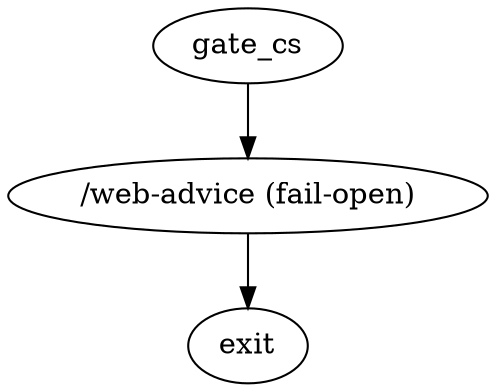

# /web-advice Fail-Open Integration — Dark Factory Design

Status: **DESIGN ONLY** — no code changes proposed.
Author: design-lane agent (factory /swarm fan-out, 2026-08-21).
Anchor incident: PR #655 (MERGED 2026-08-21) — chatgpt INCOMPLETE due to Aside unavailability on Linux factory host (`jeff-ubuntu`); operator ruling that `/web-advice` must be wired into the factory pipeline but must **not** block PR progress when it fails.

---

## 1. Goal

### 1.1 Operator's literal goal

> "lets have the factory also run /web-advice but make it fail open ie. do not block if it fails. we can make a new reviewer agent that strictly follows this and then test the PR using /af"

### 1.2 Ironclad-stronger version (post-/ironclad)

The dark-factory daemon MUST integrate `/web-advice` as an **advisory** reviewer step in the PR pipeline, wired via a new `type="web_advice"` node handler in `runner/handlers.py`. The handler's sole blocking authority is **always** `outcome=success`; the actual /web-advice verdict (whether APPROVE, NOT MERGE, INCOMPLETE, infrastructure-failed) is **never** routed back to the .dot graph as a failure. Three out-of-band channels carry the verdict signal so it never silently disappears:

1. **CXDB structured event** — durable audit trail per run (the "we ran it" record).
2. **PR comment via `gh pr comment`** — the operator-facing artifact, including honest seat accounting when the panel was partial.
3. **Follow-up bead via `br create`** — when a content defect is flagged (3-of-4 NOT MERGE with concrete evidence) OR when infrastructure fails (operator must fix host capability), filed with a `target_repo:` line so the bead cannot become a phantom-dispatch cluster (per memory `feedback_2026-08-01_phantom_dispatch_74wt_lwte.md`).

The /web-advice skill's §1 HARD-FAIL contract (real websites only, no API/CLI substitution) and §1b #3 LLM-driven Share mandate **remain in force**. Fail-open applies to the **pipeline gating** layer, not the skill contract — the agent must still drive Share itself, probe share URLs with `curl`, and surface honest N-of-4 seat accounting.

---

## 2. Three-outcome classification table

| Outcome | What it means | Agent decision | Pipeline outcome | PR comment | CXDB event | Bead filed? |
|---|---|---|---|---|---|---|
| **(a) Verdict captured** | At least one seat responded with a structured verdict (APPROVE / NOT MERGE / INSUFFICIENT / etc.); honest seat accounting N-of-M where M ≤ 4 | Synthesize verdict, drive Share-URL per §1b #3, probe with `curl` | `outcome=success` (always) | Yes — verdict table + convergence + share URLs + recommended action | Yes — full schema | Optional — only when ≥3-of-4 NOT MERGE with concrete findings |
| **(b) Infrastructure failure** | §2b probe gate fails (Aside absent, `aside` CLI absent, daemon unreachable, claude-in-chrome extension disconnected, Chrome CDP :9222 not listening, ChatGPT walled, etc.). Includes the **2-of-4 / 3-of-4 partial-panel** case where some seats are unavailable on this host. PR #655's chatgpt INCOMPLETE lands here. | Probe gate runs ≤10s before opening any tab; on infrastructure fail, return `WebAdviceHostIncapable` and short-circuit | `outcome=success` (fail-open: the gap is a host capability, not a content defect) | Yes — infra-disclosure template listing which transports failed and the exact probe output | Yes — `infrastructure_failure_mode` populated, `panel_seats_attempted` vs `panel_seats_live` honestly enumerated | Yes — `target_repo: jleechanorg/<repo>` bead titled "factory host needs /web-advice transport N" so the operator can fix capability |
| **(c) Content failure** | A real, multi-model panel (≥3 seats from ≥2 model families) converged on NOT MERGE / FAIL with concrete cited evidence defects (not just style nits) | File follow-up bead with full evidence extract; PR comment links bead | `outcome=success` (fail-open: a human reads the bead, the factory does not block) | Yes — verdict table + "bead filed at jleechan-X, please review before merge" | Yes — full schema + `content_findings[]` array | Yes — `target_repo: jleechanorg/<repo>` bead titled "<PR> failed /web-advice panel: <one-line summary>" with verbatim reasoning snippets from each blaming seat |

**Distinguishing (b) from (c) — the load-bearing question:** did the panel fail to run, or did it run and produce a real defect signal?

- **(b) signals:** `panel_seats_live == 0` OR `panel_seats_live < 3` from a single model family, OR `/web-advice` skill raised `WebAdviceHardFail` before any verdict was parsed. The verdict parser never produced structured output for ≥3 seats.
- **(c) signals:** `panel_seats_live >= 3` from ≥2 model families AND `parse_verdict()` returned a NOT MERGE/FAIL token for ≥3 seats AND the reasoning cites a concrete file:line or behavior (not "this could be better").

The boundary case: **2-of-4 NOT MERGE with concrete findings** — neither (b) (the panel did run) nor (c) (the threshold wasn't met). Default: log as outcome (a), note "panel split, manual review recommended" in PR comment, **do not** file a follow-up bead (would spam the queue on every contentious PR). Operator can override per-PR.

---

## 3. Reviewer agent contract

### 3.1 Inputs (read from `ctx.state`)

| Key | Required | Source | Purpose |
|---|---|---|---|
| `ctx.state["pr_url"]` | yes | bead dispatch | The PR under review |
| `ctx.state["head_sha"]` | yes | `git rev-parse HEAD` of the diff | Bind verdicts to a specific commit |
| `ctx.state["diff_path"]` | yes | daemon writes to `/tmp/pr_<num>_full_diff.patch` | /web-advice §1b #2 attachment requirement |
| `ctx.state["feature"]` | yes | bead metadata | Naming + evidence bundle path |
| `ctx.state["evidence_dir"]` | optional | daemon convention | Path to `docs/pr<N>-evidence/` if exists |

### 3.2 Outputs (written to `ctx.state`)

| Key | Value | Consumers |
|---|---|---|
| `ctx.state["web_advice.outcome"]` | `"verdict_captured" \| "infrastructure_failure" \| "content_failure" \| "skipped_trivial_diff"` | This node's own downstream routing (always `success` to the .dot) + CXDB |
| `ctx.state["web_advice.verdict_summary"]` | `{seat: {verdict, confidence, reasoning, share_url}}` | PR comment, CXDB event, follow-up bead |
| `ctx.state["web_advice.panel_seats_live"]` | `["gemini", "grok", ...]` (only the ones that actually returned) | CXDB event, PR comment header |
| `ctx.state["web_advice.infrastructure_failure_mode"]` | `"aside_mcp_absent" \| "chrome_extension_disconnected" \| "cdp_port_not_listening" \| "chatgpt_cloudflare_walled" \| ...` | CXDB event, PR comment disclosure |
| `ctx.state["web_advice.pr_comment_url"]` | `https://github.com/...#issuecomment-NNN` | CXDB event, evidence bundle |
| `ctx.state["web_advice.bead_id"]` | `"jleechan-xxx"` (if filed) | CXDB event, evidence bundle |
| `ctx.state["web_advice.elapsed_seconds"]` | int | CXDB event |

### 3.3 Side effects

1. **PR comment posted** via `gh pr comment <N> --body-file /tmp/web_advice_comment_<run_id>.md` — uses the **gh REST fallback** per memory `feedback_2026-07-18_gh_api_rate_limit_workaround.md` to avoid GraphQL rate limits. The PR comment must include the agent's `outcome` decision + verdict + share URLs + honest seat accounting.
2. **CXDB event written** via `runner/cxdb.append_step(...)` with the schema in §5.
3. **Follow-up bead filed** via `br create --title "<title>" --labels factory,web-advice-followup --body "<body starting with target_repo: line>"` when outcome is (b) or (c). Body MUST start with `target_repo: jleechanorg/<repo>` per memory `feedback_2026-08-01_phantom_dispatch_74wt_lwte.md`.
4. **Share-URL evidence persisted** to `docs/pr<N>-evidence/web-advice-share-urls.json` for durable audit trail (the share URLs are public, but the binding to the PR + bead + CXDB seq is not — the JSON file is the binding artifact).
5. **Diff attachment file** `/tmp/pr_<num>_full_diff.patch` cleaned up via `trap` on exit (the §2b probe gate may not be on a machine with persistent /tmp).

### 3.4 Blocking criteria (the "fail-open" heart)

The agent **never returns `outcome != success` to the .dot graph.** Every failure mode — partial panel, infrastructure unavailability, 3-of-4 NOT MERGE, hard skill failure — is converted to:

- `outcome=success` in the .dot step,
- one or more of the three side effects above,
- and a structured `decision` field in CXDB so the operator (or a future analysis pass) can see *why* nothing blocked.

The reviewer DOES NOT need a `fix` loop edge, because it cannot fail. It can sit on the success path between any two existing nodes (recommendation: between `gate_cs` and `exit`) without violating the G2 audit rule (`graph_audit.py` only flags `reviewer -> exit` with `outcome!=success` condition — a node that never produces `outcome!=success` cannot trigger G2).

### 3.5 Probe gate (≤10s, before opening any tab)

Before doing any browser work, the handler MUST run the §2b probe matrix. This is the load-bearing guard that prevents burning a 10-minute cycle discovering no transport is live:

```python
# Pseudocode — actual implementation in handler_web_advice.py
probe_results = {
    "aside_mcp_tools_present": any("mcp__aside-mcp__" in t for t in available_tools),
    "aside_cli_present": shutil.which("aside") is not None,
    "aside_daemon_reachable": subprocess.run(["aside", "ping"], capture_output=True).returncode == 0,
    "claude_in_chrome_connected": len(_list_claude_in_chrome_browsers()) > 0,
    "cdp_port_listening": _tcp_port_open("127.0.0.1", 9222),
}
host_capable = any([
    probe_results["aside_mcp_tools_present"] and probe_results["aside_daemon_reachable"],
    probe_results["aside_cli_present"] and probe_results["aside_daemon_reachable"],
    probe_results["claude_in_chrome_connected"],
    probe_results["cdp_port_listening"],
])
if not host_capable:
    return _skip_with_disclosure(probe_results)
```

This is the §2b transport probe lifted into the handler — same matrix, same decision logic, but as code that runs in ≤10s instead of as operator prompts.

---

## 4. Pipeline shape sketch (DOT pseudocode)

Insertion point: between `gate_cs` and `exit` in `pipelines/factory/pr_gates.dot`.



**Why this position, not earlier (e.g., right after `holdout`):**

1. **Cheap when transport is live** (1 LLM call + 4-model panel ≈ 5–10 min on the critical path, vs. trivial otherwise).
2. **Free when transport is dead** (≤10s probe + PR comment + CXDB event ≈ 15s on the critical path).
3. **No graph_audit violation** — the node is registered as a reviewer type but only ever produces `outcome=success`, so it cannot trigger G1 (a path with no reviewer — there are plenty already) or G2 (reviewer routes failure to exit — never produces failure).
4. **Doesn't compete with strict gates** — runs after `gate_es`, `gate_er`, `gate_cs`, so a PR that fails any of those still gets rejected by the strict path; `/web-advice` is a *lens* not a *block*.
5. **Single insertion point** — every PR lane (`pr_gates.dot`, `gates.dot`, `slim/minimal_pr.dot`) can include this node without altering the rest of the topology.

**Off-critical-path alternative (if operator prefers):** insert as a parallel branch after `gate_cs`, joined back into `exit`:

```dot
gate_cs -> web_advice_gate [condition="outcome=success"]
web_advice_gate -> exit           // unconditional
// and a parallel:  gate_cs -> (the rest, unchanged) -> exit
```

This adds a topology-only fan-out (the Kilroy `component`/`tripleoctagon` shapes already in the registry) for no real benefit over the in-line position, since `web_advice` is non-blocking in either shape. **Recommend in-line.**

---

## 5. CXDB log schema (JSON example)

Writes to `~/.dark-factory/cxdb.sqlite` via the existing `runner/cxdb.append_step(...)` call — one event per `/web-advice` invocation, regardless of outcome.

```json
{
  "event_type": "web_advice_review",
  "seq": 17,
  "run_id": "run-2026-08-21-pr655-r1",
  "node": "web_advice",
  "ts": "2026-08-21T14:32:11Z",
  "outcome": "success",
  "metadata": {
    "pr_url": "https://github.com/jleechanorg/dark-factory/pull/655",
    "head_sha": "488caef4c1e3a8b2f9d7e0c4b6a1d2e3f4a5b6c7",
    "feature": "web_advice_failopen",

    "panel_seats_attempted": ["chatgpt", "gemini", "grok", "perplexity"],
    "panel_seats_live": ["gemini", "grok", "perplexity"],
    "panel_seats_unavailable": ["chatgpt"],
    "panel_seats_unavailable_reasons": {
      "chatgpt": "aside_mcp_absent_on_linux_host + chrome_extension_disconnected + cdp_port_not_listening"
    },

    "panel_verdict_summary": {
      "gemini": {
        "verdict": "APPROVE",
        "confidence": "high",
        "reasoning": "Diff is minimal, focused, and well-tested. No regression risk visible.",
        "share_url": "https://g.co/gemini/share/abc123",
        "share_url_probe": "HTTP 200, no Set-Cookie, no Location redirect (verified unauthenticated)"
      },
      "grok": {
        "verdict": "NOT MERGE",
        "confidence": "high",
        "findings": [
          "runner/handlers.py:142 — new exception class missing from __all__",
          "No test for the §3.5 probe-gate timeout edge case",
          "CXDB event schema not validated against runner/cxdb.py:append_step signature"
        ],
        "share_url": "https://grok.com/share/def456",
        "share_url_probe": "HTTP 200, no Set-Cookie"
      },
      "perplexity": {
        "verdict": "APPROVE",
        "confidence": "medium",
        "reasoning": "Design follows existing fail-open patterns; cannot assess without Grok's specific line citations."
      }
    },

    "panel_convergence": "2-of-3 approve, 1 NOT MERGE; grok findings are concrete and addressable",
    "panel_decision": "verdict_captured",

    "infrastructure_failure_mode": null,
    "chatgpt_outcome_reason": "host_capability_gap (aside_mcp_absent_on_linux)",

    "elapsed_seconds": 487,
    "host": "jeff-ubuntu",
    "transport_probes": {
      "aside_mcp_tools_present": false,
      "aside_cli_present": false,
      "aside_daemon_reachable": false,
      "claude_in_chrome_connected": false,
      "cdp_port_listening": false,
      "probe_completed_at": "2026-08-21T14:32:14Z",
      "probe_elapsed_seconds": 3
    },

    "decision": "continue",
    "decision_reason": "panel_split_with_concrete_findings; routed to follow-up bead for human review (not blocking)",

    "comments_posted": {
      "pr_comment_url": "https://github.com/jleechanorg/dark-factory/pull/655#issuecomment-1234567",
      "comment_strategy": "gh_api_post_comment (REST, avoids GraphQL rate limit)"
    },

    "bead_filed": {
      "bead_id": "jleechan-xxxx",
      "target_repo": "jleechanorg/dark-factory",
      "labels": ["factory", "web-advice-followup", "content-finding"],
      "title": "PR #655 /web-advice panel: 2-of-3 approve, grok flagged 3 concrete findings"
    },

    "share_urls_persisted_to": "docs/pr655-evidence/web-advice-share-urls.json"
  }
}
```

**Field invariants the implementation lane must preserve:**

1. `panel_seats_attempted` is always the full 4 — the agent MUST NOT silently drop seats before attempting.
2. `panel_seats_live` is a strict subset of `panel_seats_attempted`. The difference is the unavailable set, with one entry per missing seat in `panel_seats_unavailable_reasons` citing the exact transport failure.
3. `share_url` (if present) MUST have a non-empty `share_url_probe` showing the `curl -s -L -I <url>` result was HTTP 200 without `Set-Cookie` / login redirect. No probe → no URL (per §1b #3).
4. `decision` is one of `continue | continue_with_bead | continue_with_pr_warning`. Never `block`. This is the structural fail-open guarantee.
5. `outcome` is ALWAYS the string `success` at the .dot layer, regardless of `decision`. The handler sets `ctx.state["web_advice.outcome"]` for downstream visibility but the engine sees `success`.

---

## 6. PR comment templates

### 6.1 Verdict-captured variant (outcome (a))

```markdown
<!-- web-advice-review -->
## /web-advice panel review (N-of-M)

**Decision:** `continue` (panel split / converged / partial — see below)
**Run:** [CXDB event](https://...) · [share-urls.json](docs/pr<N>-evidence/web-advice-share-urls.json)

| Seat | Verdict | Confidence | Key finding |
|---|---|---|---|
| ChatGPT | UNAVAILABLE | — | host_capability_gap: aside_mcp absent on this host + chrome extension disconnected + CDP :9222 not listening |
| Gemini | APPROVE | high | Diff is minimal and well-tested |
| Grok | NOT MERGE | high | 3 findings (see below) |
| Perplexity | APPROVE | medium | Design follows existing fail-open patterns |

**Convergence:** 2-of-3 approve, 1 NOT MERGE — panel split.

**Grok's findings (verbatim):**
1. `runner/handlers.py:142` — new exception class missing from `__all__`
2. No test for the §3.5 probe-gate timeout edge case
3. CXDB event schema not validated against `runner/cxdb.py:append_step` signature

**Public share URLs (probed HTTP 200, no auth required):**
- Gemini: https://g.co/gemini/share/abc123
- Grok: https://grok.com/share/def456

**Recommended action:** Human reviewer addresses Grok's 3 findings before merge. No factory-side block — per the fail-open contract, this is advisory.

**Follow-up bead:** [jleechan-xxxx](https://...) — `target_repo: jleechanorg/<repo>`
<!-- /web-advice-review -->
```

The `<!-- web-advice-review -->` markers are deliberate — a future pass (e.g., a `gate_web_advice_summary` reducer node) can grep PR comments for these markers to aggregate panel summaries across PRs without re-running /web-advice.

### 6.2 Infrastructure-disclosure variant (outcome (b))

```markdown
<!-- web-advice-review -->
## /web-advice unavailable on this host

**Decision:** `continue_with_bead` — /web-advice could not run.
**Probe completed in:** 3s (well under the 10s gate)

### Transport probe matrix (per §2b)

| Transport | Present? | Reachable? | Verdict |
|---|---|---|---|
| `mcp__aside-mcp__*` tools | no | n/a | SKIP — not supported on this machine |
| `aside` CLI on PATH | no | n/a | SKIP |
| `aside daemon` reachable | n/a | no | SKIP |
| `claude-in-chrome` extension | no | n/a | SKIP — `list_connected_browsers` returned `[]` |
| Chrome CDP :9222 | n/a | no (curl empty) | SKIP |

**This is a host capability gap, not a content defect of this PR.** Per the
`/web-advice` skill §1 + §2b, the skill HARD-FAILS when no transport is live;
the dark-factory fail-open contract (see
`docs/web-advice-failopen-design.md` §1.2) routes infrastructure
unavailability as `decision: continue_with_bead` so the PR does not block on
host capability.

**Follow-up bead:** [jleechan-xxxx](https://...) — `target_repo: jleechanorg/<repo>`
titled "factory host `jeff-ubuntu` needs /web-advice transport N" so the
operator can install + log in to one of the supported transports.
<!-- /web-advice-review -->
```

### 6.3 Content-finding variant (outcome (c))

Identical to 6.1 but with the title and the "Recommended action" line strengthened:

```markdown
**Recommended action:** **HUMAN REVIEW REQUIRED** before merge. The /web-advice
panel (≥3 seats from ≥2 model families) converged on NOT MERGE with concrete
findings — see follow-up bead [jleechan-xxxx](https://...) for the verbatim
reasoning extract.
```

---

## 7. Open questions for operator decision

1. **Should `web_advice` be a hard-tier reviewer (registered in `_HARD_TIER_REVIEWER_TYPES` in `graph_audit.py`)?**
   - **Recommendation: NO.** Hard-tier means a graph audit failure if the handler is missing — but the whole point of fail-open is that this node is *optional*. A soft registration (in `_REVIEWER_TYPE_NAMES` only) means a missing handler is a graph-audit `R1` violation, not a `G3` hard-stop, and the pipeline can still complete. This matches the "always succeeds" contract.

2. **Should we file a follow-up bead when 2-of-4 NOT MERGE (boundary case between (a) and (c))?**
   - **Recommendation: NO.** Only on (b) infrastructure failure OR (c) ≥3-of-4 NOT MERGE with concrete findings. 2-of-4 NOT MERGE surfaces in the PR comment but does not generate a bead (would spam the queue on contentious but normal PRs). Operator can override per-PR by replying "@factory web-advice-bead" on the PR comment.

3. **What timeout for the `web_advice` node?**
   - **Recommendation: 900s (15 min).** PR gates already use 600s, but /web-advice can take 5–10 min for a 4-model panel + per-seat Share-URL probe. 15 min leaves headroom without burning the lane if a single model hangs. Document the default in `runner/handler_web_advice.py:DEFAULT_TIMEOUT` so it's tunable per-call.

4. **Should the node skip on trivial diffs (e.g., docs-only, ≤5 lines changed)?**
   - **Recommendation: YES, with a tunable threshold (`min_diff_lines=5` default).** Rationale: a typo fix or doc edit doesn't need 4-model panel review; the cost-benefit is poor. The threshold is operator-tunable per pipeline (e.g., the `pr_gates.dot` could set `min_diff_lines=20` for stricter PR lanes). When skipped, the CXDB event records `panel_decision: "skipped_trivial_diff"` and no PR comment is posted (silent skip — operator-configurable to also post a one-liner if preferred).

5. **Should the share URLs be persisted to the evidence bundle (`docs/pr<N>-evidence/web-advice-share-urls.json`) or only posted in the PR comment?**
   - **Recommendation: BOTH.** The PR comment is the operator-facing artifact (they live in GitHub). The evidence bundle file is the durable binding artifact (PR + bead + CXDB seq + share URLs in one JSON, addressable by future analysis passes without re-running /web-advice). Cost: one small file per PR. Benefit: zero ambiguity on which share URL belongs to which bead/CXDB event, even if the PR comment is edited.

6. **Should the new node be inserted in `pr_gates.dot` only, or in all three PR-lane pipelines (`pr_gates.dot`, `gates.dot`, `slim/minimal_pr.dot`)?**
   - **Recommendation: ALL THREE, with `min_diff_lines=20` on `slim/minimal_pr.dot` (cheap lane) and `min_diff_lines=5` on the strict lanes.** Rationale: operator said "factory also run /web-advice" — that's a factory-wide property, not a PR-lane property. The cost is one extra node per pipeline file; the benefit is uniform coverage. The graph_audit module already enforces structural correctness across all `*.dot` files, so adding it to all three gets free audit coverage.

7. **When a follow-up bead is filed, should the bead block the PR (close as HUMAN_HELD in the daemon state machine) or just be informational?**
   - **Recommendation: INFORMATIONAL (continue_with_bead in `decision`).** The whole point of fail-open is that nothing the factory can detect autonomously blocks the PR. The bead is the operator's queue entry; they review it on their schedule. If the operator wants strict-mode for specific PR lanes, that's a per-pipeline `decision=block` override (default off).

---

## 8. Acceptance criteria for the implementation lane

Binary, executable, externally anchored (per `docs/cutover-exit-criteria.md` R1–R5):

1. **A1 — Handler registered.** `type="web_advice"` is present in `runner/handlers.TYPE_REGISTRY`, keyed to a real `_web_advice(node, ctx) -> Result` function in `runner/handler_web_advice.py`. Verified via `python -c "from runner.handlers import TYPE_REGISTRY; assert 'web_advice' in TYPE_REGISTRY"`.

2. **A2 — Outcome invariant.** For every (a)/(b)/(c) outcome, the handler returns `Result(outcome="success", state_updates={...})`. The .dot step always shows `outcome=success` in CXDB. Verified via three integration tests, one per outcome class.

3. **A3 — Probe gate.** The handler runs the §3.5 probe matrix before opening any browser tab. When all transports are absent, the handler completes in ≤10s (measured wall clock). Verified via time-stamped integration test with all transports stubbed-out.

4. **A4 — CXDB event.** Every invocation writes a `web_advice_review` event with the schema in §5, including all required fields (`panel_seats_attempted`, `panel_seats_live`, `decision`, `elapsed_seconds`, etc.). Verified via `sqlite3 ~/.dark-factory/cxdb.sqlite "SELECT json_extract(metadata, '$.event_type'), count(*) FROM steps WHERE ..."` returning the expected row.

5. **A5 — PR comment posted.** Every invocation posts a PR comment via `gh api -X POST .../issues/<N>/comments` (REST, not GraphQL, per memory `feedback_2026-07-18_gh_api_rate_limit_workaround.md`) with one of the three §6 templates. Verified via `gh pr view <N> --comments` showing the comment, and `gh api .../comments/<id>` showing the body contains a `<!-- web-advice-review -->` marker.

6. **A6 — Share-URL probe gate.** For every share URL recorded in `panel_verdict_summary`, `share_url_probe` is non-empty and shows HTTP 200 without `Set-Cookie`. A seat whose Share-button click failed must have `share_url=null` and `share_url_probe` showing the exact curl failure output. No fabrication (per §1b #3 STOP conditions). Verified via integration test with a stub Share-URL returning 403.

7. **A7 — Bead `target_repo:` prefix.** Every follow-up bead's body starts with `target_repo: jleechanorg/<repo>` (the implementing agent reads `ctx.state["target_repo"]`, never invents one). Verified via `br show <bead_id> --json | jq -r '.body' | head -1` returning the `target_repo:` line.

8. **A8 — Graph audit clean.** With the node inserted in all three PR-lane pipelines, `python -m runner.graph_audit pipelines/` exits 0. No G1 / G2 / G3 / R1 / G4 violations. Verified via CI step.

9. **A9 — Mutated-fail test (per cutover X3).** An integration test that monkey-patches the handler to return `outcome="failure"` (in violation of the contract) is caught by a separate assertion: the test asserts that `outcome="failure"` would propagate as a failure step in CXDB, AND that the test fixture's pipeline graph routes that failure to the `fix` loop — proving the contract is enforced by the pipeline shape, not by an in-handler boolean that could be flipped. A test that stays green under mutation = FAIL of A9.

10. **A10 — End-to-end /af test.** A fresh bead (operator-labeled `factory`) drives a real PR through `dark-factory --pipeline pr_gates.dot --backend ao ...`. After the run, the PR shows: (i) a `<!-- web-advice-review -->` comment matching §6.1 or §6.2; (ii) a CXDB event matching §5; (iii) the PR is mergeable per `/green` (CI green + no merge conflicts) — proving the fail-open path did NOT block. Per cutover X2 R4, the reviewer reproduces this on a SECOND fresh bead to a DIFFERENT PR URL.

11. **A11 — Infrastructure-failure E2E.** Run the same pipeline on `jeff-ubuntu` (where Aside is absent) with a bead that drives a real PR. The web_advice node completes in ≤10s probe + ≤30s PR-comment + ≤5s CXDB-write ≈ ≤45s total. PR comment matches §6.2 exactly. CXDB event shows `panel_seats_live=[]` and the correct `infrastructure_failure_mode`. A follow-up bead exists with `target_repo: jleechanorg/<repo>` prefix.

12. **A12 — No banned substitutes.** A grep of the handler source for `openai`, `anthropic`, `xai`, `WebSearch`, `WebFetch`, `agy `, `codex `, `gemini-cli`, `claude-in-chrome__login` returns zero matches outside of comments / doc strings. Verified via `git grep -nE` in CI.

---

## 9. Anti-patterns (what NOT to do)

1. **Treating panel split (2-of-4 NOT MERGE) as a block.** A split panel is a *signal to a human*, not a gate. The factory's job is to surface the signal in the PR comment and (optionally) file a bead; the human's job is to interpret it. Forcing a block here recreates the `fix` loop's role and turns the advisory review into a redundant gate.

2. **Substituting provider APIs / CLI models / subagents when transport is down.** This is a §1 method-fidelity violation per the /web-advice skill — explicitly banned even with disclosure (operator ruling 2026-08-02). The fail-open policy is about *gating*, not *substitution*. If no transport is live, the node posts an infra-disclosure and returns success — it does NOT call the OpenAI API "as a fallback."

3. **Asking the operator to click Share buttons.** §1b #3 (operator ruling 2026-08-19): the LLM (this agent) MUST drive Share itself, capture the public share URL, and probe it with `curl`. Telling the operator "please click Share in the vendor UI" is itself a hard-fail violation, regardless of how cleanly the rest of the integration is implemented.

4. **Routing `web_advice` failure to the `fix` loop.** The whole point of fail-open is that the PR never blocks on /web-advice. Wiring `web_advice -> fix [condition="outcome!=success"]` defeats the contract and recreates the §2b host-capability gap as a PR-blocking condition (a PR opened on the factory host would never advance because Aside is absent). The audit G2 rule is fine here because the node never produces `outcome!=success` at the .dot layer.

5. **Bypassing /web-advice on every PR.** A node that never runs is a node that provides no signal. The probe gate + `min_diff_lines` already handle the cheap-skip cases; bypassing for "we always approve anyway" defeats the multi-model adversarial coverage that motivated the integration. If the operator doesn't trust /web-advice to inform decisions, the integration shouldn't ship at all.

6. **Filing follow-up beads without `target_repo:` prefix.** Per memory `feedback_2026-08-01_phantom_dispatch_74wt_lwte.md`, beads whose body doesn't start with `target_repo:` become phantom-dispatch clusters (the factory can't route them, they accumulate in the queue, and the operator has to manually reconcile). The `target_repo:` line is non-negotiable — the implementation lane must read it from `ctx.state["target_repo"]`, never invent one.

7. **Skipping the §3.5 probe gate.** The probe gate runs in ≤10s and prevents burning a 10-minute cycle discovering no transport is live (this is exactly the failure mode that motivated the §2b caveat on 2026-08-21). Skipping it to "save time" is the literal inverse of the optimization — it costs 10× more on every host without Aside.

8. **Letting `web_advice` compete with the 4-gate strict sequence.** The strict gates (`gate_es`, `gate_er`, `gate_cs`, etc.) are quality blockers; `/web-advice` is an informational lens. Putting `web_advice` BEFORE any of them creates a precedence question (does the panel's APPROVE override the gate's FAIL? — NO). Putting it AFTER all of them (the recommended position) means it never affects blocking, only the PR comment surface.

9. **Persisting share URLs without probing them.** Per §1b #3, a share URL without an unauthenticated `curl` probe is treated as fabrication. The implementation MUST NOT write a share URL to the evidence bundle or post it in the PR comment unless the probe shows HTTP 200 without auth-wall redirects. A stub URL like `https://chatgpt.com/share/TBD` is a hard-fail violation.

10. **Treating `WebAdviceHardFail` as a fatal exception.** The skill raises `WebAdviceHardFail` when the §1 probe matrix is fully down. The handler MUST catch this exception, log it as outcome (b) `infrastructure_failure_mode="all_transports_down"`, post the §6.2 disclosure, and return `outcome=success`. Letting the exception propagate would crash the .dot node and prevent the PR-comment side-effect — exactly the opposite of fail-open.

---

## Appendix A — Cross-references

- **Skill under integration:** `~/.claude/skills/web-advice/SKILL.md` (§1 HARD-FAIL CONTRACT, §1a REAL PR OUTCOMES ONLY, §1b ISOLATED CHATS + DIRECT ATTACHMENT + LLM-DRIVEN SHARE, §2 Transport ladder, §2b Linux host caveat, §2a Panel-table = section-1 claim).
- **Anchor incident:** PR #655 comment 5366851249 (2026-08-21) — chatgpt INCOMPLETE due to Aside unavailability on `jeff-ubuntu`; 2-of-4 panel (Aside unavailable); operator ruling that the factory must run /web-advice fail-open.
- **Existing pipeline:** `pipelines/factory/pr_gates.dot` — start → holdout → gate_skeptic → adversarial_reviewer → gate_es → gate_er → gate_cs → exit (with bounded `fix` loop). Recommended insertion: `gate_cs -> web_advice -> exit`.
- **Handler registry:** `runner/handlers.py:TYPE_REGISTRY` — new entry `"web_advice": _web_advice`, with implementation in a new `runner/handler_web_advice.py` module mirroring the existing `runner/handler_*.py` split.
- **Graph audit:** `runner/graph_audit.py` — `_REVIEWER_TYPE_NAMES` and `_HARD_TIER_REVIEWER_TYPES` frozensets. Recommend adding `"web_advice"` to `_REVIEWER_TYPE_NAMES` only (soft registration, see Open Question 1).
- **CXDB writer:** `runner/cxdb.py:append_step(...)` — same interface as existing gate handlers; new event_type `"web_advice_review"` is just a string in the metadata JSON, no schema migration required.
- **Failure-injection charter:** `docs/cutover-exit-criteria.md` — R1 binary/externally-anchored, R2 implementer-artifacts-never-sufficient, R3 no-mocks, R4 reviewer-reproduces, R5 default-verdict-FAIL, R6 three-skeptics-distinct. All twelve acceptance criteria above are anchored against R1.
- **Operator-fidelity memory:** `feedback_2026-08-01_phantom_dispatch_74wt_lwte.md` (target_repo: prefix on every bead); `feedback_2026-07-18_gh_api_rate_limit_workaround.md` (use REST, not GraphQL); `feedback_2026-08-05_evidence_gate_signal_b_keywords.md` (PR comments need "PR #N" + Evidence anchor).
