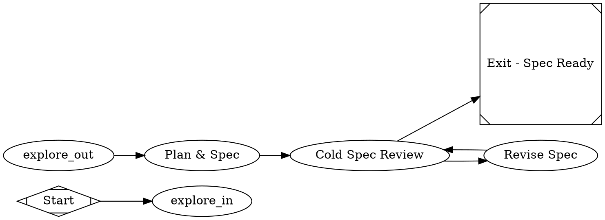

# Spec-generation pipeline (`/fs` as a dark-factory lane) — 2026-06-09

**Beads:** `jleechan-6a6` (spec_gen.dot + spec_review prompt), `jleechan-86d` (/fs rewire), `jleechan-hv1` (plan.md lane-independence).

## Problem

`/fs` is documented as "create or review a Dark Factory spec" but it is an
**in-session markdown workflow** — it never invokes the `dark-factory` binary.
Meanwhile the repo's Phase-1 machinery (explore fanout + `plan` node that
writes `spec.md`) exists only **fused into feature lanes**
(`pipelines/slim/minimal_feature.dot`, `minimal_pr.dot`, …), and the cold
codex reviewer exists only in **implementation-review** lanes
(`review_slim.dot` / `review_full.dot`, which review a diff against a spec —
not the spec itself). Net effect: there is no way to produce a *reviewed*
spec without also running an implement node. Superpowers planning is wired
nowhere (one doc note only).

Motivating incident (worldarchitect.ai, 2026-06-09): a 6-PR stacked plan put
the same new module in every PR; parallel lanes each patched their own copy →
7 divergent blobs of `mvp_site/level_up_session.py`, fully serialized merge
train. A spec reviewer enforcing lane independence would have rejected that
plan at spec time.

## Work items

### 1. `pipelines/slim/spec_gen.dot` (jleechan-6a6)

Standalone Phase-1 lane: explore → plan → cold spec review → fix loop → exit.
**No implement node.** Sketch (implementer owns final details):



- `_base.dot` include gives the 4-way explore fanout; lane wires
  `start -> explore_in` / `explore_out -> plan` (base must not declare
  start/exit).
- The reviewer must be **cold** (cross-vendor adversarial, same
  priority-queue machinery as the gates: codex > minimax > agy >
  claude-sonnet). Implementer choice: `class="review"` role routing vs a
  `gate_er`-style node; pick whichever reaches a non-coder vendor.
- `prompts/slim/spec_review.md` reviews the **spec**, not code: acceptance
  criteria testable? deterministic test command present? non-goals stated?
  brownfield Step-0 classification done? **lane-independence section present
  if the spec proposes parallel lanes** (see item 3)? Verdict contract
  matches other goal_gate prompts (success/fail + reasons).
- `prompts/slim/fix_spec.md` revises spec.md per review findings.
- Add a `pipeline-selection.md` row + conformance validation
  (`bin/conformance validate`) + tests mirroring existing lane tests.

### 2. `/fs` rewire (jleechan-86d)

Create-mode must **run the pipeline**, not draft in-session:

```bash
dark-factory --pipeline slim/spec_gen.dot --goal "<description>" ...
```

Files (both scopes; keep repo copies canonical):
- repo: `.claude/commands/fs.md`, `.claude/commands/factory-spec.md`,
  `.claude/skills/factory-spec/SKILL.md`
- user scope: `~/.claude/commands/fs.md`, `~/.claude/commands/factory-spec.md`,
  `~/.claude/skills/factory-spec/SKILL.md` — **note:** edited 2026-06-09 to
  describe create-mode as in-session drafting; that wording is now superseded
  and must be replaced by the pipeline invocation.

Keep `--review` (existing spec) and `--show` (graph reference) modes; Step-0
brownfield classification stays, feeding the goal/context passed to the lane.

### 3. `prompts/slim/plan.md` lane-independence (jleechan-hv1)

Add a hard requirement: when the spec proposes **parallel lanes / stacked
PRs**, it must include a **file-ownership matrix** — every touched file maps
to exactly ONE owning lane/PR; any file shared by two lanes forces either
serialization or restructuring (single-writer rule). Spec must state the
overlap pre-flight (`git diff --name-only <base>...<branch>` per lane, or
pairwise `git merge-tree --write-tree`). `spec_review.md` (item 1) enforces
presence of this section.

## Acceptance (whole feature)

- `dark-factory --pipeline slim/spec_gen.dot --goal "<x>"` with a mock/echo
  backend completes explore → plan → spec_review → exit and leaves
  `spec.md` + review verdict in CXDB; no implement node ran.
- A spec proposing two lanes that both touch the same file is **rejected**
  by spec_review (test with a seeded bad spec).
- `/fs <description>` invokes the pipeline (command files in both scopes).
- 272+ tests stay green; `bin/conformance validate` clean.
