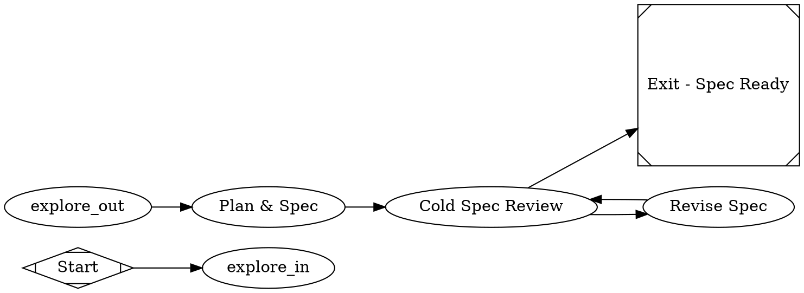

# Spec-generation pipeline (`/fs` as a dark-factory lane) — 2026-06-09

**Beads:** `jleechan-6a6` (spec_gen.dot + spec_review prompt), `jleechan-86d` (/fs rewire), `jleechan-hv1` (plan.md lane-independence).

## Problem

`/fs` is documented as "create or review a Dark Factory spec" but it is an
**in-session markdown workflow** — it never invokes the `dark-factory` binary.
Meanwhile the repo's Phase-1 machinery (explore fanout + `plan` node that
writes `spec.md`) exists only **fused into feature lanes**
(`pipelines/slim/minimal_feature.dot`, `minimal_pr.dot`, …), and the cold
codex reviewer exists only in **implementation-review** lanes
(`review_slim.dot` / `review_full.dot`, which review a diff against a spec —
not the spec itself). Net effect: there is no way to produce a *reviewed*
spec without also running an implement node. Superpowers planning is wired
nowhere (one doc note only).

Motivating incident (worldarchitect.ai, 2026-06-09): a 6-PR stacked plan put
the same new module in every PR; parallel lanes each patched their own copy →
7 divergent blobs of `mvp_site/level_up_session.py`, fully serialized merge
train. A spec reviewer enforcing lane independence would have rejected that
plan at spec time.

## Work items

### 1. `pipelines/slim/spec_gen.dot` (jleechan-6a6)

Standalone Phase-1 lane: explore → plan → cold spec review → fix loop → exit.
**No implement node.** Sketch (implementer owns final details):



- `_base.dot` include gives the 4-way explore fanout; lane wires
  `start -> explore_in` / `explore_out -> plan` (base must not declare
  start/exit).
- The reviewer must be **cold** (cross-vendor adversarial, same
  priority-queue machinery as the gates: codex > minimax > agy >
  claude-sonnet). Implementer choice: `class="review"` role routing vs a
  `gate_er`-style node; pick whichever reaches a non-coder vendor.
- `prompts/slim/spec_review.md` reviews the **spec**, not code: acceptance
  criteria testable? deterministic test command present? non-goals stated?
  brownfield Step-0 classification done? **lane-independence section present
  if the spec proposes parallel lanes** (see item 3)? Verdict contract
  matches other goal_gate prompts (success/fail + reasons).
- `prompts/slim/fix_spec.md` revises spec.md per review findings.
- Add a `pipeline-selection.md` row + conformance validation
  (`bin/conformance validate`) + tests mirroring existing lane tests.

### 2. `/fs` rewire (jleechan-86d)

Create-mode must **run the pipeline**, not draft in-session:

```bash
dark-factory --pipeline slim/spec_gen.dot --goal "<description>" ...
```

Files (both scopes; keep repo copies canonical):
- repo: `.claude/commands/fs.md`, `.claude/commands/factory-spec.md`,
  `.claude/skills/factory-spec/SKILL.md`
- user scope: `~/.claude/commands/fs.md`, `~/.claude/commands/factory-spec.md`,
  `~/.claude/skills/factory-spec/SKILL.md` — **note:** edited 2026-06-09 to
  describe create-mode as in-session drafting; that wording is now superseded
  and must be replaced by the pipeline invocation.

Keep `--review` (existing spec) and `--show` (graph reference) modes; Step-0
brownfield classification stays, feeding the goal/context passed to the lane.

### 3. `prompts/slim/plan.md` lane-independence (jleechan-hv1)

Add a hard requirement: when the spec proposes **parallel lanes / stacked
PRs**, it must include a **file-ownership matrix** — every touched file maps
to exactly ONE owning lane/PR; any file shared by two lanes forces either
serialization or restructuring (single-writer rule). Spec must state the
overlap pre-flight (`git diff --name-only <base>...<branch>` per lane, or
pairwise `git merge-tree --write-tree`). `spec_review.md` (item 1) enforces
presence of this section.

## Acceptance (whole feature)

- `dark-factory --pipeline slim/spec_gen.dot --goal "<x>"` with a mock/echo
  backend completes explore → plan → spec_review → exit and leaves
  `spec.md` + review verdict in CXDB; no implement node ran.
- A spec proposing two lanes that both touch the same file is **rejected**
  by spec_review (test with a seeded bad spec).
- `/fs <description>` invokes the pipeline (command files in both scopes).
- 272+ tests stay green; `bin/conformance validate` clean.
## Amendment: two-phase spec generation (main + attractor) — 2026-06-13

**Beads:** (open at write time — file a `jleechan-*` bead to track this amendment).
**PR:** [#70](https://github.com/jleechanorg/dark-factory/pull/70) — landed on
`main` at `728719fd8600` via admin-merge.
**Beads on the PR:** `jleechan-xsg`, `jleechan-x89`.

### Why the original single-phase design was insufficient

The 2026-06-09 lane (above) produces a single `spec.md` describing the
**implementation path** — how the work gets done. That's necessary but not
sufficient for a Level-5 dark factory. A spec is also a *contract against
regression*: it must describe the **stable end state** the work is moving
toward AND the failure modes the work must NOT end up in. Without that, a
later implementer (human or agent) can produce a diff that satisfies the
letter of the path spec while drifting the system into an unacceptable
state.

### The two outputs

`spec_gen.dot` now produces two artifacts instead of one, each codex-cold-reviewed:

| File | Role | Prompt that writes it | Prompt that reviews it |
|------|------|----------------------|------------------------|
| `spec.md` | **Path** — how we get there (implementation steps, file-ownership matrix, lane-independence) | `prompts/slim/plan.md` (existing) | `prompts/slim/spec_review.md` (existing) |
| `attractor_spec.md` | **Goal-state** — what "done" looks like as a stable end state, AND what we must NOT end up as (anti-attractors) | `prompts/slim/plan_attractor.md` (new, 88L) | `prompts/slim/spec_review_attractor.md` (new, 89L) |

### Topology change

`spec_gen.dot` was extended from one review/fix loop to two sequential ones,
sharing the explore fanout and the `_base.dot` include but otherwise
mirrored:

```
explore → plan_main → review_main ⇄ fix_main → plan_attractor
                                                    → review_attractor ⇄ fix_attractor → exit
```

Each `review_*` node is `type="gate_er"` with the same adversarial-review
priority queue (`codex > minimax > agy > claude-sonnet` via
`backend_priority=` + `prefer_adversarial="true"`), `goal_gate=true`, and
`retry_target=` pointing back at its own `fix_*` node. The exit node is only
reached when **both** reviews report `outcome=success`. The fix loop in each
phase is bounded by `max_retries=2` (matches the original single-phase
bead).

### Consistency requirement (the new blocking rule)

The attractor spec MUST be consistent with the main spec — they are reviewed
in dependency order precisely so the second reviewer can read the first
artifact. `spec_review_attractor.md` rejects a draft that:

- contradicts any acceptance criterion in `spec.md`
- permits a behavior `spec.md` lists as out-of-scope or anti-goal
- defines success criteria `spec.md` already declared non-deterministic or
  untestable
- uses a different file-ownership matrix than `spec.md`

The reverse direction (main spec changing after the attractor review starts)
is prevented structurally — Phase 2 only runs after Phase 1's
`review_main` returns `success`, and there is no edge back from
`plan_attractor` to any `plan_main` node.

### New prompts (and their roles)

| Prompt | Lines | Role |
|--------|-------|------|
| `prompts/slim/plan_attractor.md` | 88 | Produce the attractor spec from `spec.md` + explore context. Must NOT re-derive the path; must surface anti-attractors concretely (each named, each testable). |
| `prompts/slim/spec_review_attractor.md` | 89 | Adversarial review of the attractor spec against `spec.md`. Same gate_er machinery + same verdict contract as `spec_review.md`. |
| `prompts/slim/fix_attractor.md` | 46 | Revise the attractor spec per the reviewer's findings. Mirrors `fix_spec.md`. |

The 3 new prompts + the `pipelines/slim/spec_gen.dot` change + the
consistency requirement are the whole user-visible delta. The cold-reviewer
machinery (`gate_er` + adversarial priority queue) and the explore fanout
(`_base.dot`) are reused unchanged.

### Acceptance

Adds to the original 2026-06-09 acceptance criteria:

- `dark-factory --pipeline slim/spec_gen.dot --goal "<x>"` (echo backend)
  leaves BOTH `spec.md` AND `attractor_spec.md`, each with a codex-signed-off
  verdict in CXDB.
- A seeded bad attractor (contradicts `spec.md` acceptance criterion) is
  rejected by `review_attractor`; a `fix_attractor` pass with a corrected
  draft is accepted; exit reached.
- A seeded attractor that admits a behavior `spec.md` declared out-of-scope
  is rejected; coverage in `tests/test_spec_gen.py` (`test_spec_gen_*`).
- `bin/conformance validate` clean on `spec_gen.dot`; `pipelines/slim/*`
  walk in the validator still passes (the new `pipelines/slim/_base.dot`
  `@include` fallback is verified by `tests/test_parser_include_fallback.py`).
- 555+ tests stay green (was 272+ at the original 2026-06-09 acceptance);
  PR #70 measured 555 passed / 1 skipped / 1 xfailed on the post-merge
  head.

### Known limits (filed as a followup gate, not blockers)

- The fix loops are bounded at `max_retries=2` per phase; a spec that
  needs more than 2 fix rounds per phase is a hand-off, not a loop.
  Documented in the spec_gen.dot comment block; not auto-escalated.
- The two reviewers are sequential, not parallel. Running them in parallel
  is structurally possible (both `review_*` nodes are independent of
  each other once `spec.md` is fixed) but is not currently wired; doing
  so would require duplicating the explore_out → plan_main/plan_attractor
  fanout and is out of scope for this amendment.
